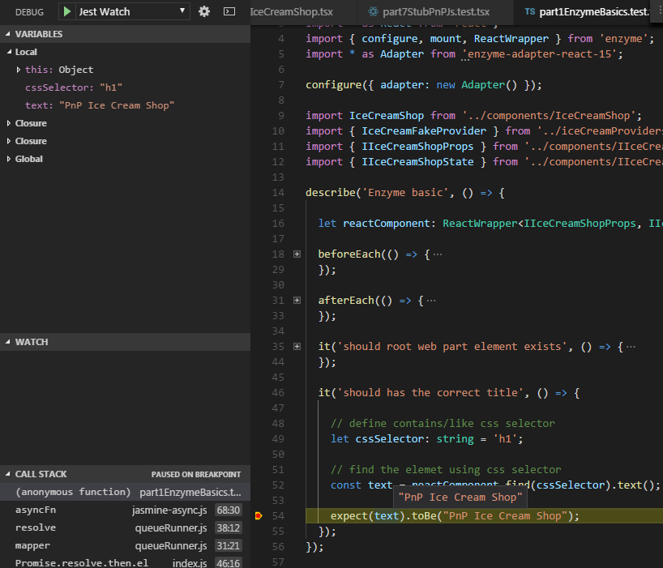
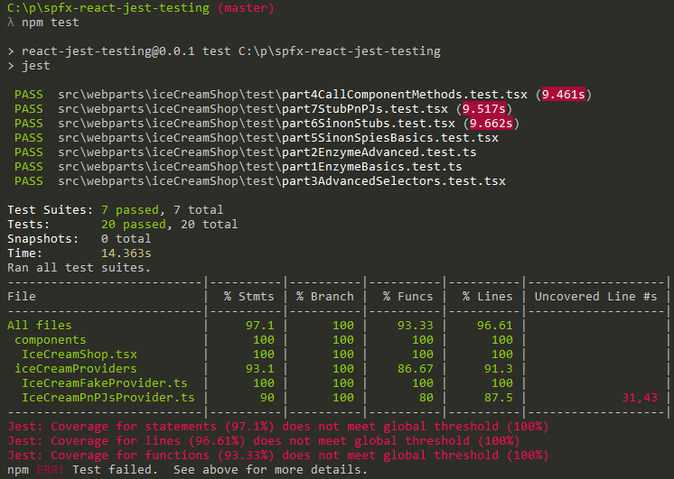

# SharePoint Framework React Jest Testing sample #

## SPFx-Jest-Enzyme-Sinon unit testing starter kit

## Summary

This sample uses the popular [Jest Testing Framework](https://facebook.github.io/jest/) with a SPFx client side solution. It is a SPFx-Jest-Enzyme-Sinon starter kit so you can start writing and debugging unit tests in typescript for your SPFx solution.
The setup includes unit tests examples, code coverage reports in different formats, visual studio code unit test debug configurations for typescript, setting a coverage threshold (gates) for continuous integration and continuous deployment scenarios.

## Visual Studio Code Typescript debugging support for the Jest unit tests

The Visual Studio Code launch.json has all the debug configurations needed to start debugging the unit tests for your SPFx solution. 
There is a _Jest All_ configuration that will execute all the tests on demand. 
There is also a _Jest Watch_ (watcher) configuration that **will let live execution or debugging only on the affected by a change unit tests** (if the solution is part of hg/git repo) and will provide immediate feedback if a test passes or fails on component code change. This is good option for Test Driven Development scenarios.



### Important: The debug configurations should be placed in the .vscode -> launch.json file to make the debugging work

The sample has folder named `vscode` where the `launch.json` configuration for debuggind jest is stored. The configurations should be copied to your `.vscode` folder -> `launch.json` file. Once copied into your launch.json, then they will appear in your visual studio code debugging tab.

## Sinonjs is included as mocking framework for the SPFx solution

The solution also includes [Sinonjs](http://sinonjs.org/) that can be used to spawn spies, stubs and mocks.

## Enzyme is included to extend to unit tests support for React Components

Enzyme is a testing utility for React that makes it easier to assert, manipulate, and traverse your React Components' output.

## Basic unit tests scenarios included to demonstrate how Jest, Sinon and Enzyme can be used to test the SPFx React components

I wrote several unit tests to demonstrate how all testing libraries can be used together to test a React component with business logic and external dependencies included. Examples for mocking promises, pnpjs calls, https calls and spying on methods included for a quick start in unit testing your SPFx solution.

## Built-in Jest code coverage

Jest uses [Istanbul](https://github.com/gotwarlost/istanbul) under the hood to produce various code coverage reports including live VS code terminal output. Such reports can be integrated in CI tools like VSTS (Visual Studio Team Services) or Jenkins.



### Jest coverage threshold for continuous deployment pipeline setups

Jest coverage thresholds are set to yield error and potentially fail a build or pre-build if there isn't 100% coverage on branches, functions, lines and statements together. The thresholds can be changed by altering the solution packages.json file where the Jest configuration is.

```JavaScript
"coverageThreshold": {
  "global": {
    "branches": 100,
    "functions": 100,
    "lines": 100,
    "statements": 100
  }
}
```

### Generates summary report in JUnit xml format so it can be integrated with VSTS and Jenkins

After the execution of the unit tests a summary report will be generated under the `./jest/summary-jest-junit.xml` path. Because it uses junit xml formatting most of the CI tools can show the summary on a dashboard. Having that is useful for reporting. That summary is generated by [jest-junit (npm module)](https://www.npmjs.com/package/jest-junit).

## Unit tests support for SPFx extensions

The sample uses SPFx web part, but the same setup applies for SPFx extensions and they can simply be added to the solution and unit tested the same way.


## Used SharePoint Framework Version 


## Applies to

* [SharePoint Framework](https://docs.microsoft.com/sharepoint/dev/spfx/sharepoint-framework-overview)
* [Office 365 developer tenant](https://docs.microsoft.com/sharepoint/dev/spfx/set-up-your-developer-tenant)

## Prerequisites

- Office 365 subscription with SharePoint Online.
- SharePoint Framework [development environment](https://docs.microsoft.com/sharepoint/dev/spfx/set-up-your-development-environment) already set up.

## Solution

Solution|Author(s)
--------|---------
react-jest-testing | Velin Georgiev ( [@VelinGeorgiev](https://twitter.com/velingeorgiev) )

## Version history

Version|Date|Comments
-------|----|--------
0.0.1|May 9, 2018 | Initial commit
0.0.2|June 12, 2018 | Update to 1.5.0, missing launch.json added
0.0.3|September 27, 2018 | Update to 1.6.0
0.0.4|December 10, 2018 | Update to 1.7.0
0.0.5|June 23, 2019 | Update to 1.8.2

## Disclaimer
**THIS CODE IS PROVIDED *AS IS* WITHOUT WARRANTY OF ANY KIND, EITHER EXPRESS OR IMPLIED, INCLUDING ANY IMPLIED WARRANTIES OF FITNESS FOR A PARTICULAR PURPOSE, MERCHANTABILITY, OR NON-INFRINGEMENT.**

---

## Minimal Path to Awesome

- Clone this repository.
- Open the command line, navigate to the web part folder and execute:
    - `npm i`
    - `npm test` **(NOT gulp test)**

Note: You might want to switch to a test fake offline provider to use the full functionality of the web part when on local workbench. You can do so by replacing the real pnpjs provider in IceCreamShopWebPart.ts with its fake one at line 37. Just replace IceCreamPnPJsProvider() with IceCreamFakeProvider().
``` 
iceCreamProvider: new IceCreamPnPJsProvider(sp), //new IceCreamFakeProvider() // replace with Fake provider when offline workbench.
```

## Features

This Web Part illustrates the following concepts on top of the SharePoint Framework:

- Using React for building SharePoint Framework client-side web parts.
- Using Jest Testing Framework for SPFx unit tests.
- Unit tests included to demonstrate how spies, mocks can be used.
- The use of Enzyme to speed up React unit test productivity.
- The use of [SharePoint Patterns and Practices Reusable Client-side Libraries (PnP Js)](https://github.com/pnp/pnpjs).
- Generating unit test code coverage reports for continious integreation tools such as VSTS
- Generating unit test summary reports for continious integreation tools such as VSTS

## Usefull links

- [Jest](https://facebook.github.io/jest/)
- [Jest cheatsheet](https://devhints.io/jest)
- [Sinonjs](http://sinonjs.org/)
- [Enzyme](http://airbnb.io/enzyme/)


