# Azure DevOps Pipelines example guide #

## Summary

This "devops" folder contains scripts that can be used to create fully automated devops pipeline that can pickup the SPFx code from the source control, build it and deploy it to SharePoint Online without any user intervention.

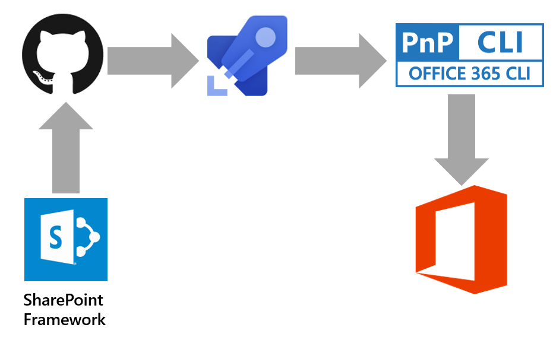

## The example uses Github, but the same pipeline can be used with Azure DevOps git repos.

The example has build and release scripts that can be used with Github as well as with Azure DevOps git repos. I will use the Github since it is free and can be tested by everyone.

## Build definition

The build folder has two build definitions. The PRE-BUILD definition ("azure-pipelines-pre-build.yml") is to be run before the code goes to the main branch to verify that the code will not break the existing branch. The BUILD definition ("azure-pipelines-build.yaml") is to be run after the new code is merged into the main branch.

## Release definitions

The release pipeline includes office-365-CLI-add-app.sh script and will be using Nodejs and Office 365 CLI to deploy the built artifacts to SharePoint app catalog.


## How to enable Azure DevOps Pipelines with Github

There is a good article on how to do that here:  https://blog.github.com/2018-09-10-azure-pipelines-now-available-in-github-marketplace/

## Build pipeline and running the build 

1. Install the Azure Pipelines to your Github account https://github.com/marketplace/azure-pipelines
2. Create new repository or attach the pipelines to existing repository here: https://github.com/settings/installations

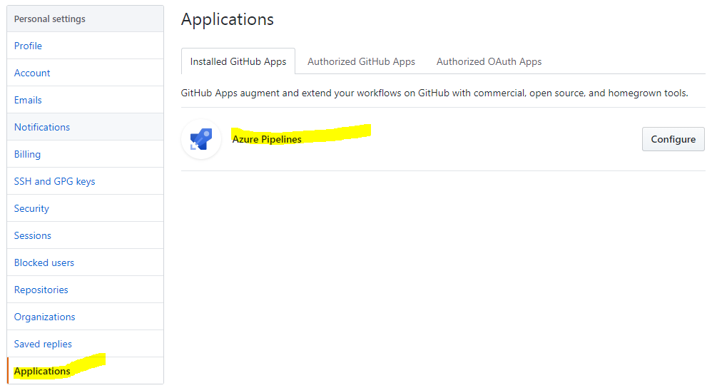

3. Click the configure button and set it up to run with all repositories or specific one

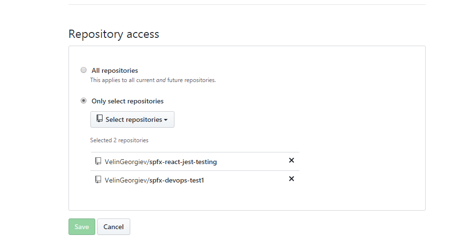

4. Go to the repo you configured to work with Azure Pipelines

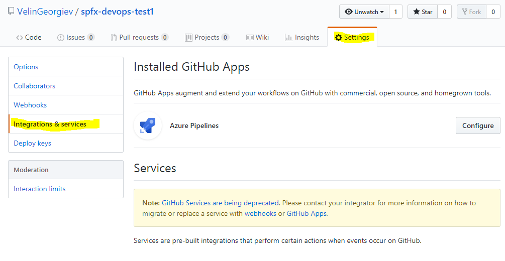

5. Once you click on the Save button you will be redirected to Azure Pipelines to create your new project 

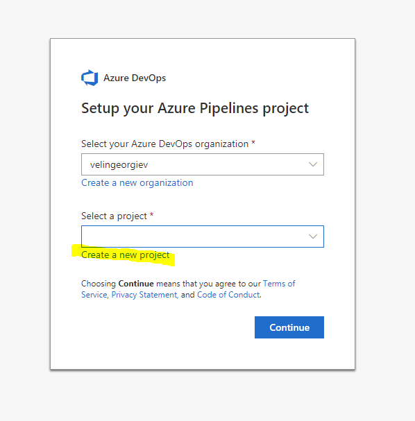

6. Select the repository to the new pipeline

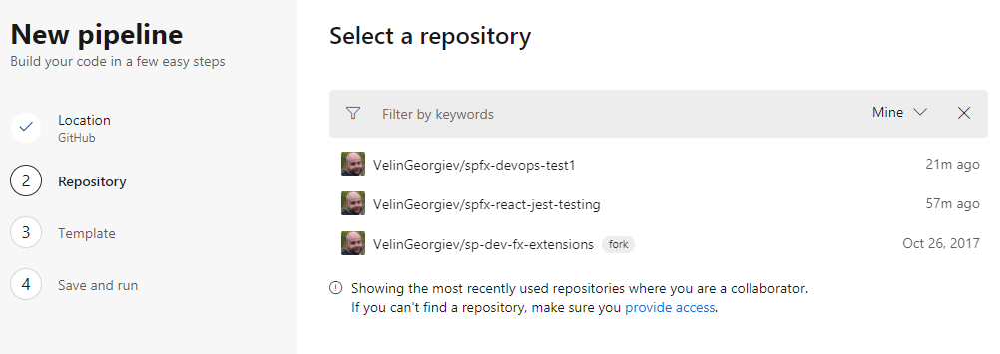


7. The pipelines will try to smart guess the project type and suggest a build definition for you. Select the node option (since we do not have choice to skip), but bear in mind we will change that with our existing template from the example.

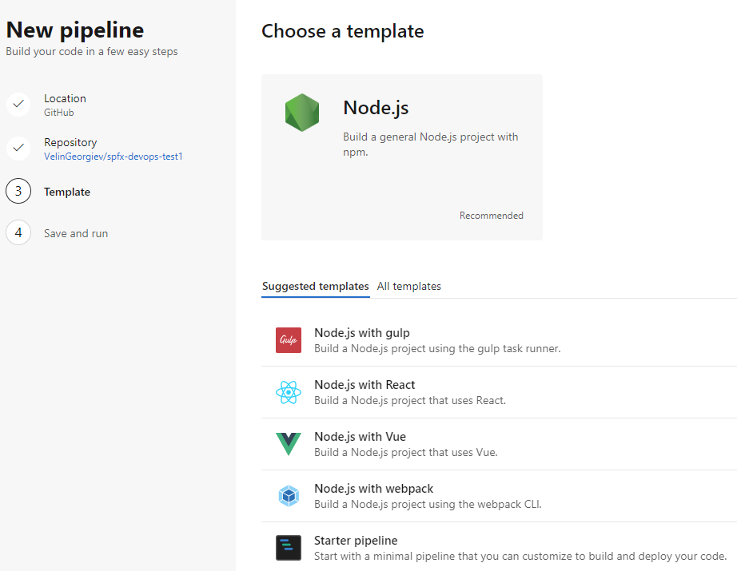

8. Click save and run to test the template using the main branch.

Note: We will replace the default suggested template with one that already exists in the sample to speed up the guide.

9. Click on the Builds. Then select the build definition and click the EDIT button

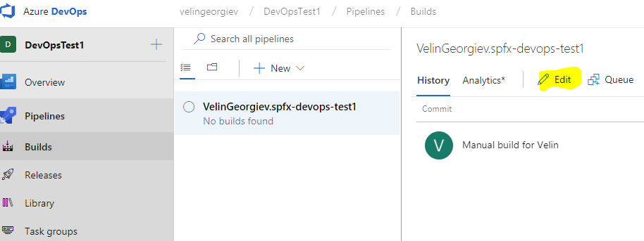

10. Change the name of your build to something more meaningfull for you.
11. Change the host agents to Ubuntu or Linux

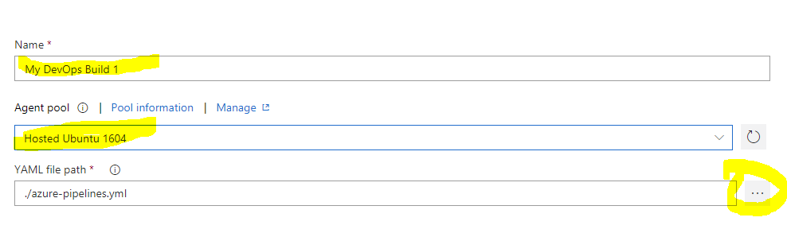

12. Click on the YAML file path far right button. Replace the defult template by template we already have in this source code example

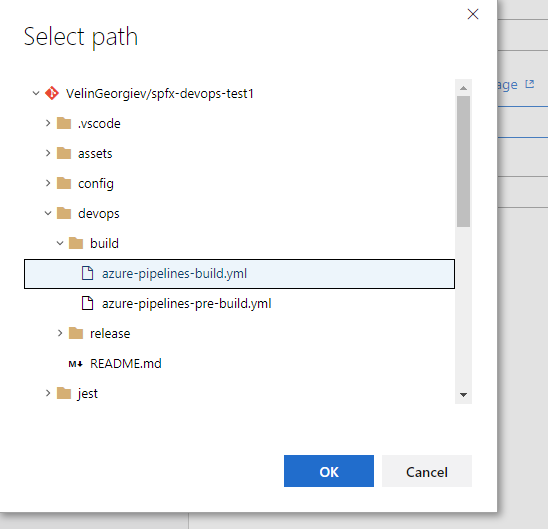

13. This will change the build definition with the one we have from the source control.
14. Save and Queue then click on the build link to see how the tasks are performed


15. All tasks from the build shoudl execute successfully and two artifact items should be created out of the build

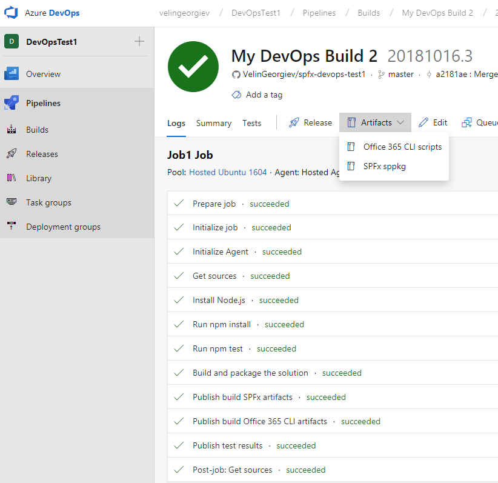

## Congrats! The build is done! 

### The build will generate two artifacts 
- SPFx sppkg that will be deployed using release pipeline
- Office 365 CLI scripts that will used as task in the release pipeline

## Release pipeline and automation of the full pipeline all the way to SharePoint Online site

### Authenticate the Office 365 CLI to automate processes on your tenant

If you have not used the Office 365 CLI tool on your tenant you have to agree with concent that the CLI tool can execute actions so you have to

```
npm i -g @pnp/office365-cli
o365 spo login https://contoso.sharepoint.com
```

Once you agree with the consent you can use it in the Release pipeline.

## Create the release pipeline

1. Select release on the left menu then new release pipeline

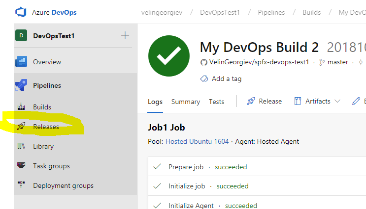

2. Add the artifacts built from the build

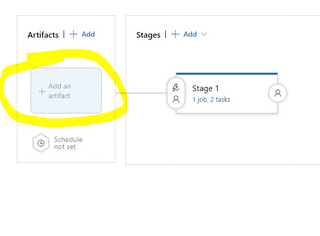

3. Select your project, source (build pipeline) and rename the source alias to "_SPFx build" for this example.

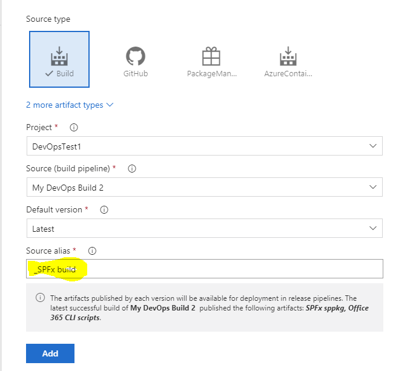
Note: The source alias ("_SPFx build") can be changed to any name, but the bash script later is using that one this is why for this specific example we use that specific name.

4. Enable the releace pipeline to be triggered every time new code is pushed to the main branch.

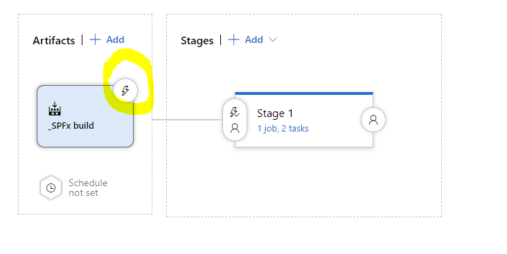
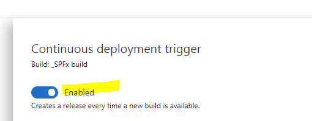 

5. Click empty job since the tasks we want are not in the quick select list. Click on the tasks link as on the picture below

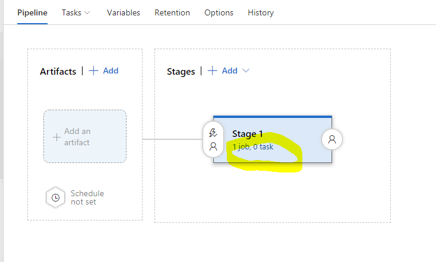

6. Click on the job agent first and change the agent pool to Hosted Ubuntu 1604 or linux

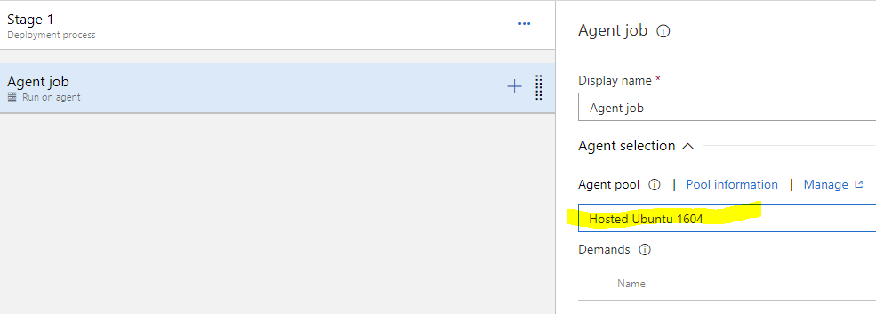

7. Use the plus sign on the Agent job task to add another task


8. Search for node in the search box on the far right


9. Add it. Click on the new task and change the version from 6.x to 8.x

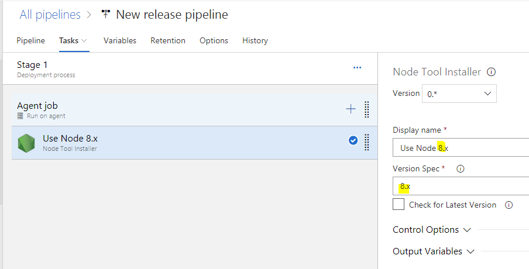

10. Use the same Agent job plus sign to add another task this time search for bash

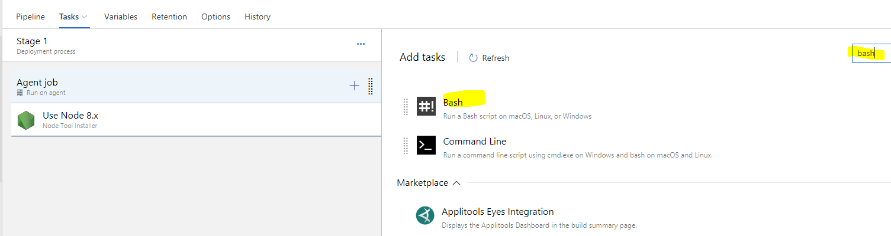

11. Add the Office 365 CLI bash script from our repo.


The script is very simple, but it will connect to your SharePoint online app catalog and upload the sppkg.

```sh
SITE_URL=$1
EMAIL=$2
PASS=$3

npm i -g @pnp/office365-cli
o365 version

o365 spo login $SITE_URL --authType password --userName $EMAIL --password $PASS

o365 spo app add --filePath "./_SPFx build/SPFx sppkg/react-jest-testing.sppkg" --overwrite --verbose
```

As we can see the script requires three params and this is the last step in that tutorial before we run the release

12. Set release pipeline secure variables. Since the script requires 3 arguments to be passed we have to use the arguments input to pass them. So for now just type `$(siteurl) $(email) $(password)` in the input field and we will set them up after.

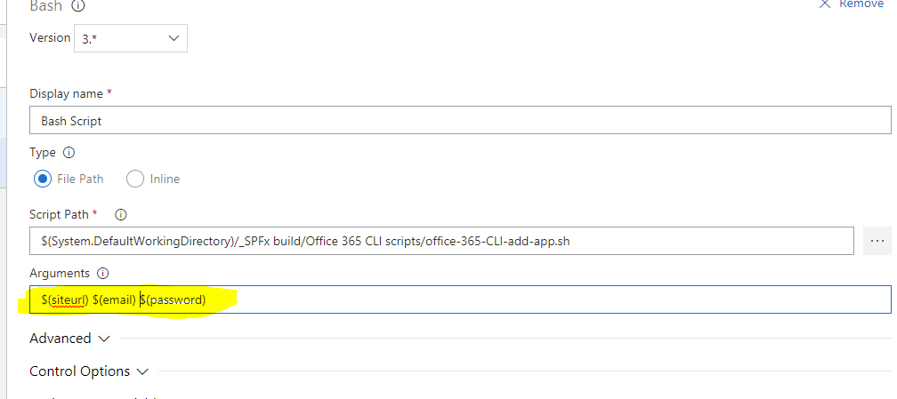

13. Set the variables that will be used by the script under the release pipeline variables as on the picture below

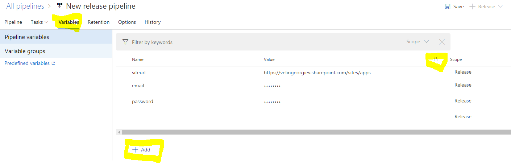
Note: You can use password like fields to hide sensitive or secret values.

## Now we should be good to go

The next code merged with the main branch in Github should trigger the fully automated devops pipeline and deploy that built package all the way to the SharePoint online app catalog.

Here is the release pipeline executed successfully and also the sppkg file deployed to the app catalog.

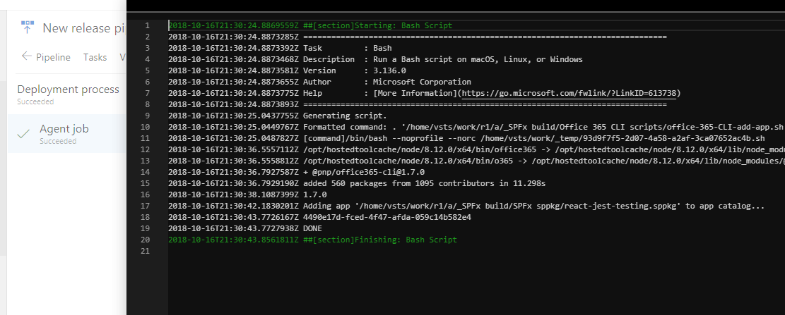
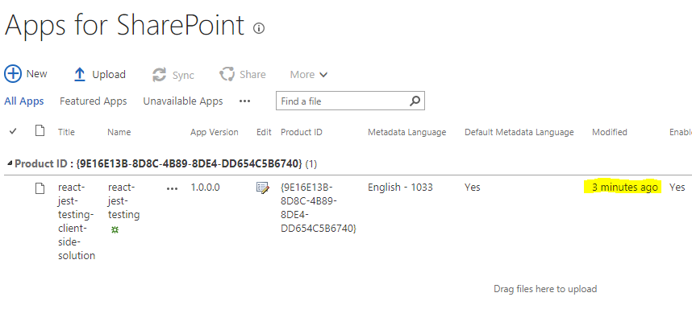


