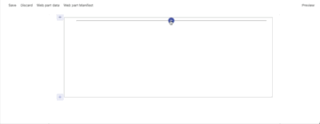
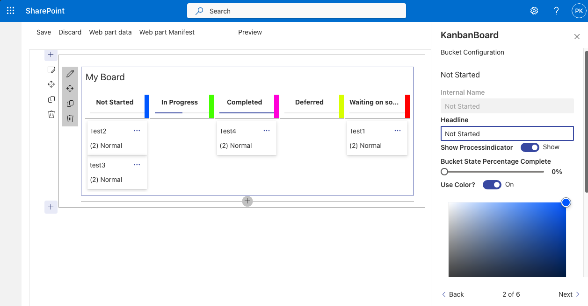
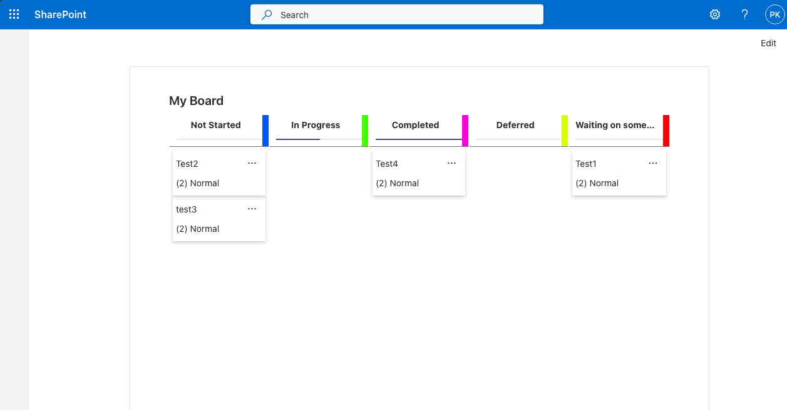
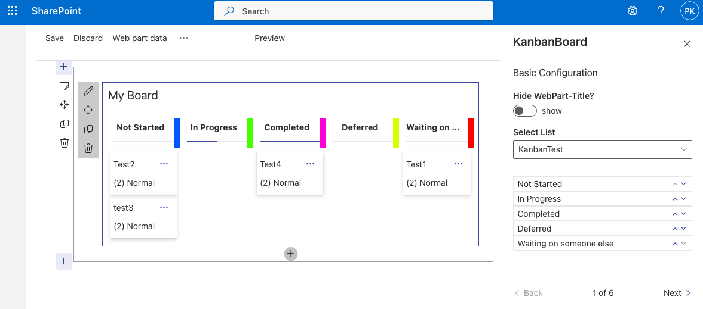

# Kanban Board

## Summary

This solution contains an SPFx web part that shows a kanban board using Office UI Fabric components ([Office UI Fabric](https://developer.microsoft.com/fluentui/)).
The web part uses the default columns of the SharePoint Tasks list for showing the board's columns and the tasks.

## Compatibility

| :warning: Important          |
|:---------------------------|
| Every SPFx version is only compatible with specific version(s) of Node.js. In order to be able to build this sample, please ensure that the version of Node on your workstation matches one of the versions listed in this section. This sample will not work on a different version of Node.|
|Refer to <https://aka.ms/spfx-matrix> for more information on SPFx compatibility.   |

 

-Incompatible-red.svg "SharePoint Server 2016 Feature Pack 2 requires SPFx 1.1")

## Applies to

* [SharePoint Framework](https://learn.microsoft.com/sharepoint/dev/spfx/sharepoint-framework-overview)
* [Microsoft 365 tenant](https://learn.microsoft.com/sharepoint/dev/spfx/set-up-your-development-environment)

## Prerequisites

This web part reads the information from a Tasks list and uses the following OOB columns

* Task Name
* Assigned To
* % Complete
* Description
* Priority
* Task Status

The Task list can be chosen using the web part properties (BaseTemplate 171 or 107)

## Contributors

* [Ram Prasad Meenavalli](https://github.com/RamPrasadMeenavalli) 
* [Daniel Westerdale](https://github.com/westerdaled) 
* [Peter Paul Kirschner](https://github.com/petkir) 
* [Alex Terentiev](https://github.com/AJIXuMuK)

## Version history

Version|Date|Comments
-------|----|--------
1.0.0.0|July 17, 2019|Initial release
1.0.1.0|April 21, 2020|Added support for Teams hosts
2.0.0.0|July 10, 2020| jqwidgets replaced with a custom Kanban Board based on Office UI Component and IE11 Support
3.0.0.0|October 29, 2021| SPFx 1.13, PnPJS v2, PnP Controls v3
4.0.0.0|Jun 1, 2024| SPFx 1.19, PnPJS v4, Node 18 (Property-ListPicker and Property-Order not used from @pnp/spfx-property-controls because of an issue )

[Read More about the implementation of this Board](./src/kanban/README.md)

## Usage

* PNP Placeholder control if not Configured
* PNP WebpartTitle control  (toggle Show/Hide in property pane)
* PNP OrderPropertyPane control  (change position of buckets)
* PNP ListSelectionPropertyPane control  (including filtering on BaseTemplateId)
* Usage of BucketEdit in Pane (Use a component in property pane (custom field))
* Office UI Fabric
* PNP JS DataConnection to SharePoint

<!---Thanks from @petkir to: -->
<!--- -->
<!---* [Daniel Westerdale](https://github.com/westerdaled) for Testing and inspiration (everytime again)-->
<!---* [Hugo Bernier](https://github.com/hugoabernier) for Inspiration to use Office UI Fabric -->
<!---* [Jean-Philippe CIVADE](https://github.com/ewidance) for Bug Report IE11 (initiator of rewrite of this sample)-->
<!---* [RamPrasadMeenavalli](https://github.com/RamPrasadMeenavalli) for the initial Idea-->

## Minimal Path to Awesome

- Clone this repository (or [download this solution as a .ZIP file](https://pnp.github.io/download-partial/?url=https://github.com/pnp/sp-dev-fx-webparts/tree/main/samples/react-kanban-board) then unzip it)
* in the command line run:
  * `npm install`
  * `gulp serve`

>  This sample can also be opened with [VS Code Remote Development](https://code.visualstudio.com/docs/remote/remote-overview). Visit https://aka.ms/spfx-devcontainer for further instructions.

## Features

This sample highlights the following concepts
* Binding SharePoint list data to a custom Kanban-Control
* Updating SharePoint List Items based on events from the custom Kanban-Control

When a task is moved to different columns in the Kanban Board, the status of the respective SharePoint list item is updated using PnP JS

## Help

We do not support samples, but we this community is always willing to help, and we want to improve these samples. We use GitHub to track issues, which makes it easy for  community members to volunteer their time and help resolve issues.

You can try looking at [issues related to this sample](https://github.com/pnp/sp-dev-fx-webparts/labels/react-kanban-board) to see if anybody else is having the same issues.

You can also try looking at [discussions related to this sample](https://github.com/pnp/sp-dev-fx-webparts/discussions?discussions_q=label%3Areact-kanban-board) and see what the community is saying

If you encounter any issues while using this sample, [create a new issue](https://github.com/pnp/sp-dev-fx-webparts/issues/new?assignees=&labels=Needs%3A+Triage+%3Amag%3A%2Ctype%3Abug-suspected%2Csample%3A%20react-kanban-board&template=bug-report.yml&sample=react-kanban-board&authors=@RamPrasadMeenavalli%20@westerdaled%20@petkir%20@AJIXuMuK&title=react-kanban-board%20-%20).

For questions regarding this sample, [create a new question](https://github.com/pnp/sp-dev-fx-webparts/issues/new?assignees=&labels=Needs%3A+Triage+%3Amag%3A%2Ctype%3Aquestion%2Csample%3A%20react-kanban-board&template=question.yml&sample=react-kanban-board&authors=@RamPrasadMeenavalli%20@westerdaled%20@petkir%20@AJIXuMuK&title=react-kanban-board%20-%20).

Finally, if you have an idea for improvement, [make a suggestion](https://github.com/pnp/sp-dev-fx-webparts/issues/new?assignees=&labels=Needs%3A+Triage+%3Amag%3A%2Ctype%3Aenhancement%2Csample%3A%20react-kanban-board&template=question.yml&sample=react-kanban-board&authors=@RamPrasadMeenavalli%20@westerdaled%20@petkir%20@AJIXuMuK&title=react-kanban-board%20-%20).

## Disclaimer

**THIS CODE IS PROVIDED *AS IS* WITHOUT WARRANTY OF ANY KIND, EITHER EXPRESS OR IMPLIED, INCLUDING ANY IMPLIED WARRANTIES OF FITNESS FOR A PARTICULAR PURPOSE, MERCHANTABILITY, OR NON-INFRINGEMENT.**

