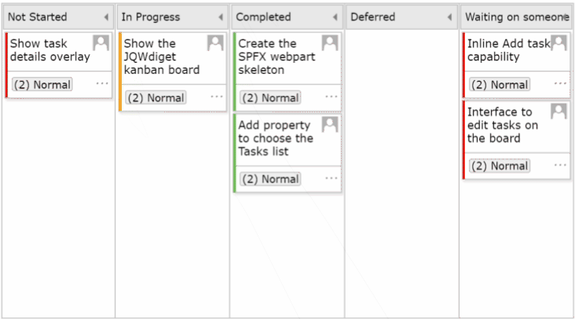

# React Kanban Board Webpart

## Summary

This solution contains an SPFx webpart which shows a Kanban board using jqxKanban ReactJS component (from [JQWidgets](https://www.jqwidgets.com/jquery-widgets-documentation/documentation/jqxkanban/jquery-kanban-getting-started.htm?search=kanban)).
The webpart uses the default columns of the SharePoint Tasks list for showing the board's columns and the tasks.

## Used SharePoint Framework Version

## Applies to

* [SharePoint Framework](https:/dev.office.com/sharepoint)
* [Office 365 tenant](https://dev.office.com/sharepoint/docs/spfx/set-up-your-development-environment)

## Prerequisites

This webpart reads the information from a Tasks list and uses the following OOB columns
* Task Name
* Assigned To
* % Complete
* Description
* Priority
* Task Status

The Task list can be chosen using the webpart properties

## Solution

Solution|Author(s)
--------|---------
react-kanban-board | [Ram](https://twitter.com/ram_meenavalli)
react-kanban-board | Daniel Westerdale ([Westerdale Solutions Ltd.](https://westerdale.blog), [@westerdaled](https://twitter.com/westerdaled?s=20))

## Version history

Version|Date|Comments
-------|----|--------
1.0.0.0|July 17, 2019|Initial release
1.0.1.0|April 21, 2020|Added support for Teams hosts

## Disclaimer

**THIS CODE IS PROVIDED *AS IS* WITHOUT WARRANTY OF ANY KIND, EITHER EXPRESS OR IMPLIED, INCLUDING ANY IMPLIED WARRANTIES OF FITNESS FOR A PARTICULAR PURPOSE, MERCHANTABILITY, OR NON-INFRINGEMENT.**

**THIS WEBPART USES jQWidgets FOR SHOWING THE KANBAN BOARD. jQWidgets IS FREE TO USE UNDER THE CREATIVE COMMONS ATTRIBUTION-NONCOMMERCIAL 3.0 LICENSE. FOR COMMERCIAL USE, PLEASE CHECK THE [LICENSING TERMS](https://www.jqwidgets.com/license/) FOR jQWidgets**

---

## Minimal Path to Awesome

* Clone this repository
* in the command line run:
  * `npm install`
  * `gulp serve`

## Features

This sample highlights the following concepts
* Binding SharePoint list data to jqxKanban React Component
* Updating SharePoint List Items based on events from the jqxKanban board

When a task is moved to different columns in the Kanban Board, the status of the respective SharePoint list item is updated using PnP JS

