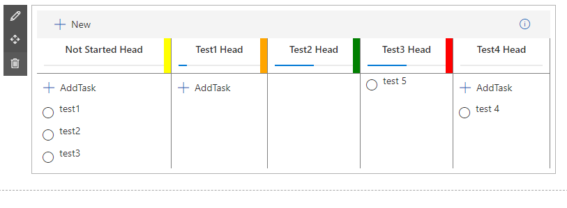
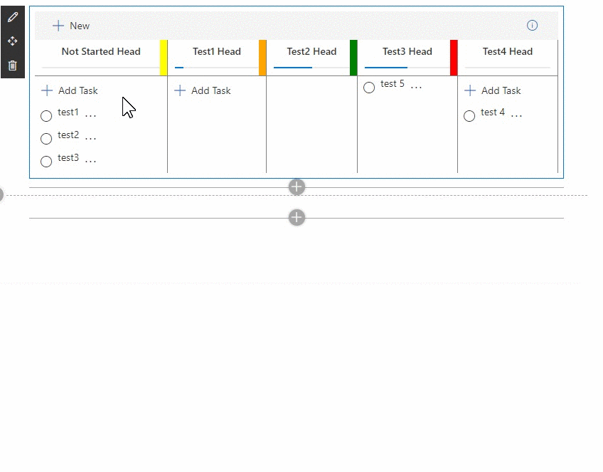

# its only Prototyping

Thinking about Kanban component with Fluent Ui Components

# current
allowMove from one Bucket to the Other tested
move task to other Bucket works

playing with drag visibility

Bucket
```
  buckets:[
                {bucket:'Not Started', bucketheadline:'Not Started Head',percentageComplete:0, color:'yellow' ,allowAddTask:true},
                {bucket:'Test1', bucketheadline:'Test1 Head',percentageComplete:10, color:'orange',allowAddTask:true },
                {bucket:'Test2', bucketheadline:'Test2 Head',percentageComplete:50, color:'green' },
                {bucket:'Test3', bucketheadline:'Test3 Head',percentageComplete:50, color:'#FF0000' },
                {bucket:'Test4', bucketheadline:'Test4 Head',percentageComplete:0 ,allowAddTask:true }
            ],

```
with such a structure its possible to use 
PropertyFieldOrder 
PropertyFieldColorPicker
or a wrapper to warp  PropertyFieldColorPicker with some other in a Custom Control

Task
```
{taskId: 1, title:'test1',bucket:'Not Started'},
{taskId: 2, title:'test2',bucket:'Not Started'},
{taskId: 3, title:'test3',bucket:'Not Started'},
{taskId: '4', title:'test 4',bucket:'Test4'},
{taskId: '5', title:'test 5',bucket:'Test3'},
```
Something like this sould come out, but styling is currently bad


Something like this sould come out, but styling is currently bad
