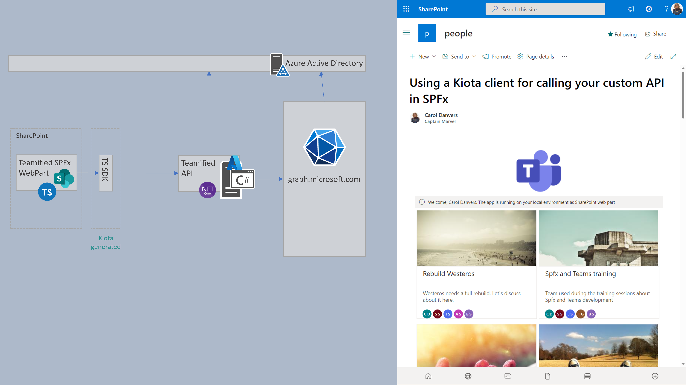

# Using Kiota to generate a client to your AzureAd API and use it from a SPFx webpart

## Summary

This sample shows how you can generate a client for your custom API using Kiota, and how to use that client in an SPFx webpart. The sample contains a custom API that is secured by Azure AD and interacts with Microsoft Graph API to do some basic operations with the Teams endpoint (it allows to list all the Teams in the tenant, to get detailed info for a given Team, and to Provision a new Team with some preconfigured channels).



### About Kiota

Kiota is a tool created by Microsoft, that allows you to generate a client/SDK for any given API that is described using OpenAPI. It supports different languages, and provides some abstractions, so you can customise several things, like Auth providers, JSON serialisation, HTTP Request adapter, etc.

In this sample, in the folder ```/teamified-client/src/webparts/client``` is included the code generated by Kiota. We executed the following command:

```
kiota generate --openapi "my-api-swagger.yaml" --language typescript --namespace-name TeamifiedApiClient --class-name TeamifiedApiClient --output generated --log-level debug
```

## Used SharePoint Framework Version


## Applies to

- [SharePoint Framework](https://aka.ms/spfx)
- [Microsoft 365 tenant](https://docs.microsoft.com/en-us/sharepoint/dev/spfx/set-up-your-developer-tenant)

> Get your own free development tenant by subscribing to [Microsoft 365 developer program](http://aka.ms/m365devprogram)

## Prerequisites

The API must be registered in your Azure Active Directory tenant. You can find more information on how to do it in these articles:
  - https://learn.microsoft.com/en-us/sharepoint/dev/spfx/use-aadhttpclient-enterpriseapi
  - https://learn.microsoft.com/en-us/sharepoint/dev/spfx/use-aadhttpclient

The API uses a ClientSecret to connect to MS Graph API, so create a Secret from Azure portal (this is not the recommended approach, but works for the demo. For production, I recommend you to use a certificate).
The API needs the following permissions to __Microsoft Graph API__:

| Scope    | Type                                               |
| ----------- | ----------------------- |
| Group.ReadWrite.All | Delegated |  
| Directory.Read.All | Delegated |  

Also, the API needs to be configured in the __Expose an API__ section, and configure a new scope named: __Teams.Manage__.

Once the API is registered in Azure AD, we must configure permissions for SPFx to access the API. This can be done in different ways. I suggest you to use the M365 CLI, with the following command:

```
m365 spo serviceprincipal grant add --resource 'Teamified_Services' --scope 'Teams.Manage'
```

## Contributors

* [Luis Mañez](https://github.com/luismanez) 

## Version history

| Version | Date             | Comments        |
| ------- | ---------------- | --------------- |
| 1.0     | November 1, 2022 | Initial release |

## Minimal Path to Awesome

- Clone this repository
- Edit the file __TeamifiedApi/appsettings.json__ with your Azure Active Directory API registration data (ClientId, TenantId, etc)
- Edit the file __teamified-client/src/webparts/teamsList/components/TeamsList.tsx__ and set the proper values in the following code:
```typescript
  // #region ******************** UPDATE WITH YOUR TENANT DATA ********************
  private readonly azureAdApplicationIdUri: string = "api://{AZURE_AD_CLIENT_ID}";
  private readonly apiHost: string = "{YOUR_API}.azurewebsites.net";
  // #endregion
```
- Ensure the API is up and running (you can run your API in localhost, using Visual Studio or the dotnet CLI, no need to publish it to Azure or any other hosting)
- Ensure that you are at the solution folder
- in the command-line run:
  - **npm install**
  - **gulp serve**

## Features

This extension illustrates the following concepts:

- using Kiota tool to generate a client for any API described by OpenAPI standard.
- using Kiota SPFx Authentication library, to provide Authentication to the Kiota client
- protecting a dotnet webapi using Azure AD and Microsoft.Identity.Web library
- calling MS Graph API from a dotnet webapi

## References

- [Kiota official documentation](https://microsoft.github.io/kiota/)
- [Kiota TypeScript library](https://github.com/microsoft/kiota-typescript)
- [Getting started with SharePoint Framework](https://docs.microsoft.com/en-us/sharepoint/dev/spfx/set-up-your-developer-tenant)
- [Building for Microsoft teams](https://docs.microsoft.com/en-us/sharepoint/dev/spfx/build-for-teams-overview)
- [Use Microsoft Graph in your solution](https://docs.microsoft.com/en-us/sharepoint/dev/spfx/web-parts/get-started/using-microsoft-graph-apis)
- [Publish SharePoint Framework applications to the Marketplace](https://docs.microsoft.com/en-us/sharepoint/dev/spfx/publish-to-marketplace-overview)
- [Microsoft 365 Patterns and Practices](https://aka.ms/m365pnp) - Guidance, tooling, samples and open-source controls for your Microsoft 365 development

## Help
We do not support samples, but this community is always willing to help, and we want to improve these samples. We use GitHub to track issues, which makes it easy for community members to volunteer their time and help resolve issues.

If you're having issues building the solution, please run spfx doctor from within the solution folder to diagnose incompatibility issues with your environment.

You can try looking at issues related to this sample to see if anybody else is having the same issues.

You can also try looking at discussions related to this sample and see what the community is saying.

If you encounter any issues using this sample, create a new issue.

For questions regarding this sample, create a new question.

Finally, if you have an idea for improvement, make a suggestion.

## Disclaimer
THIS CODE IS PROVIDED AS IS WITHOUT WARRANTY OF ANY KIND, EITHER EXPRESS OR IMPLIED, INCLUDING ANY IMPLIED WARRANTIES OF FITNESS FOR A PARTICULAR PURPOSE, MERCHANTABILITY, OR NON-INFRINGEMENT.