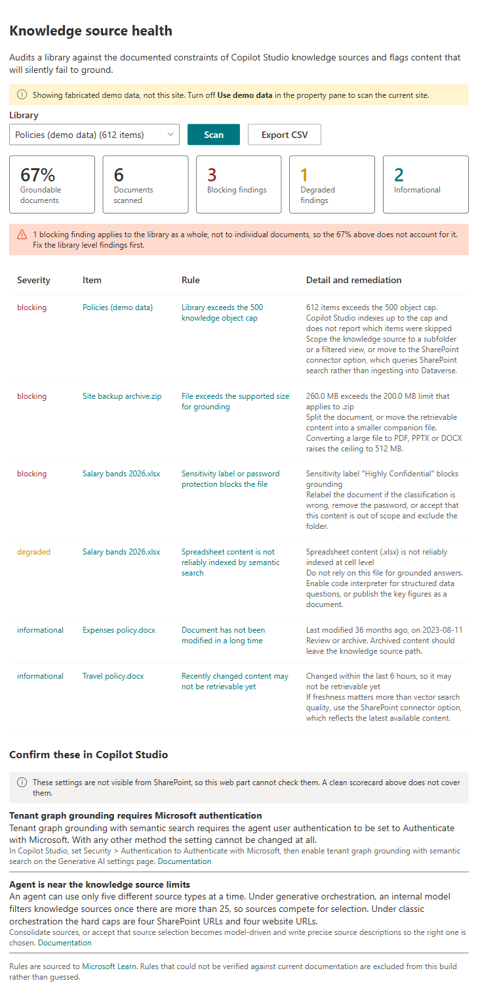
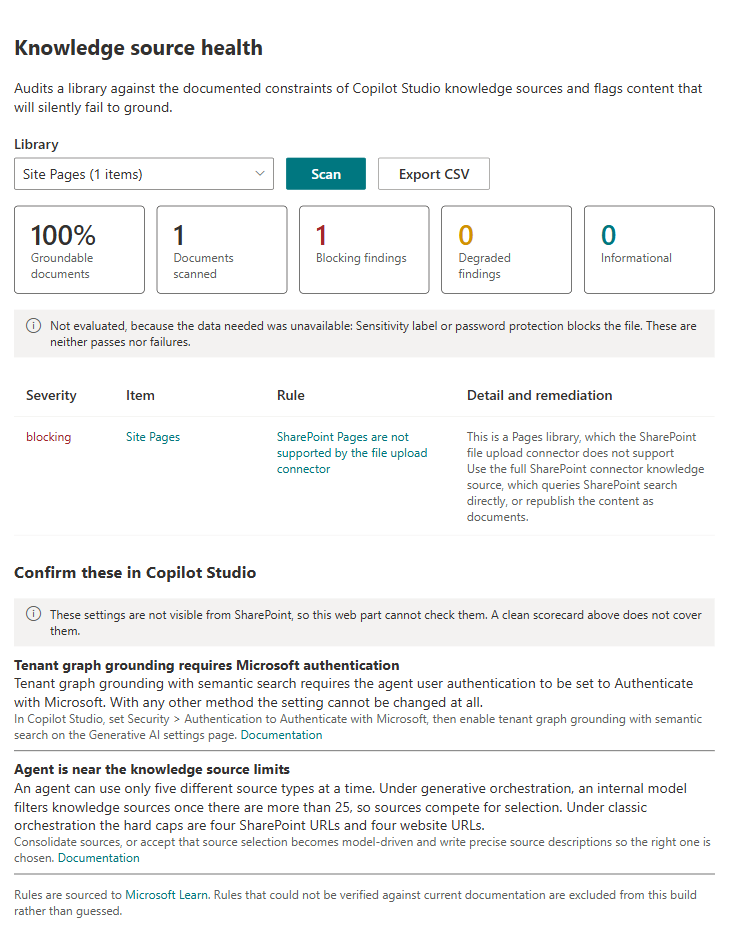

# Knowledge Source Health

## Summary

A SharePoint Framework web part that audits a site's document libraries against the documented constraints of Copilot Studio knowledge sources, and flags the content that will silently fail to ground.

The failure mode this addresses is specific. A maker points an agent at a SharePoint site, the agent answers confidently, and nobody notices that a slice of the library was never retrievable in the first place: files over the size limit, spreadsheets that semantic search cannot index at cell level, documents whose sensitivity label blocks them, a folder past the 500 object cap where Copilot Studio indexed part of it and told nobody which part. Microsoft Learn is explicit that when a folder exceeds the maximum, the platform "doesn't process the remaining items, and it doesn't indicate which items are or aren't processed."

There is no error message for any of this. The agent just answers from less than the maker thinks it has.

This is a diagnostic tool, not a demo. It tells a maker what to fix before the agent goes live, and it re-runs after every content change.



## Features

- Pick any document library or Pages library on the current site and scan it
- Rule-based checks with severity levels: blocking, degraded, informational
- Per-document result grid with the failing rule, the instance detail, the remediation, and a link to the Microsoft Learn page that justifies the rule
- Summary scorecard: percentage of scanned documents with no blocking finding
- Explicit "not evaluated" reporting, so a clean scorecard is never mistaken for an all-clear
- Export findings to CSV
- Demo data mode, so the sample runs with no tenant setup
- Rules defined as data in `src/rules`, so they can be extended as the platform changes

## What the web part can and cannot see

This distinction is built into the rule data as a `checkable` field, and the UI must respect it.

**Checkable from list metadata.** File size, extension, sensitivity label, last modified date, item count, whether the library holds Pages. These the web part evaluates itself.

**Not checkable.** The agent's authentication method, whether tenant graph grounding with semantic search is on, how many knowledge sources the agent has, and whether each source has a description. These live in Copilot Studio, not in SharePoint. The web part surfaces them as a short maker checklist with the Learn link, and never claims to have verified them.

A tool that blurs the two is worse than no tool, because a maker will read a green scorecard as an all-clear it never earned.

## Rules

The starting rule set is in `src/rules/groundingRules.ts`. Every rule carries a `docsUrl` pointing at the Microsoft Learn page that justifies it, and a `verified` flag. Anything not yet re-checked against current docs stays `verified: false` and is excluded from release builds by `releaseRules()`.

Do not invent limits. If a threshold cannot be sourced to Learn, either verify it in a tenant and label it as observed behaviour, or leave it out.

Two live examples of why that rule exists:

- The file size limit is **not** a flat 200 MB. It is 200 MB for SharePoint and connector content when tenant graph grounding is on and the maker holds a Microsoft 365 licence in the same tenant, and **512 MB for PDF, PPTX and DOCX**. A flat check produces false positives on exactly the large documents makers care most about.
- The unsupported file type and unsupported filename character rules ship `verified: false`. The failure modes are documented; the exact extension list and character set are not. They stay out of the release build until confirmed.

## Compatibility

| | |
| --- | --- |
| SPFx | 1.23.2 |
| Node.js | `>=22.14.0 <23.0.0`, built and tested on v22.23.2 |
| React | 17.0.1 |
| TypeScript | 5.8 |
| Toolchain | Heft |
| Hosts | SharePoint Online, Teams tab, Teams personal app, SharePoint full page |
| Permissions | None beyond the signed-in user's own access |

Check [aka.ms/spfx-matrix](https://aka.ms/spfx-matrix) before publishing.

## Prerequisites

None beyond a SharePoint Online site. The scan runs as the signed-in user through `SPHttpClient` against the site's own REST API, so there is no app registration to create and no tenant API access request to approve. A user only ever sees libraries they can already read.

## Minimal path to awesome

```bash
git clone https://github.com/pnp/sp-dev-fx-webparts.git
cd sp-dev-fx-webparts/samples/react-knowledge-source-health
npm install
npm run build
```

The web part ships with **Use demo data** turned on, so it renders a full audit with fabricated content the moment it is added to a page. Every demo document exists to make one rule fire, which makes it the fastest way to see what the rules do.

To scan a real site, open the property pane and turn **Use demo data** off, then pick a library and select **Scan**.



That second screenshot is the design principle in action. The scanned library has no sensitivity label column, so rather than quietly passing that rule, the web part reports it as **not evaluated**, and says that is neither a pass nor a failure.

To debug against a tenant:

```bash
npm run start
```

SPFx 1.23 has no local workbench. `npm run start` serves to the tenant workbench, and the first run needs `npx heft trust-dev-cert` to install a development certificate.

`config/serve.json` ships with the scaffold's `{tenantDomain}` placeholder. Heft only substitutes it from an environment variable, so set that first or the console prints the literal placeholder, which is not a usable URL:

```bash
# PowerShell
$env:SPFX_SERVE_TENANT_DOMAIN = "contoso.sharepoint.com"
```

Otherwise open the workbench yourself and append the query string heft prints:

```
https://<tenant>.sharepoint.com/_layouts/workbench.aspx?debugManifestsFile=https%3A%2F%2Flocalhost%3A4321%2Ftemp%2Fbuild%2Fmanifests.js&debug=true&noredir=true
``` Note that the hosted workbench retires on 1 December 2026; after that, use the [SPFx Debug Toolbar](https://learn.microsoft.com/sharepoint/dev/spfx/debug-toolbar) on a real page.

## Tests

```bash
npm run build
```

`npm run build` runs the Jest suite as part of the build. 29 tests cover the rule engine (including the two tier size limit and the not-evaluated path), the demo data, and rendering of the component itself.

## Contributors

- Elliot Margot

## Version history

| Version | Date | Comments |
| --- | --- | --- |
| 1.0 | TBD | Initial release |

## Disclaimer

**THIS CODE IS PROVIDED _AS IS_ WITHOUT WARRANTY OF ANY KIND, EITHER EXPRESS OR IMPLIED, INCLUDING ANY IMPLIED WARRANTIES OF FITNESS FOR A PARTICULAR PURPOSE, MERCHANTABILITY, OR NON-INFRINGEMENT.**

<!-- Required by PnP validation. Must be an HTML img tag, not Markdown. -->

