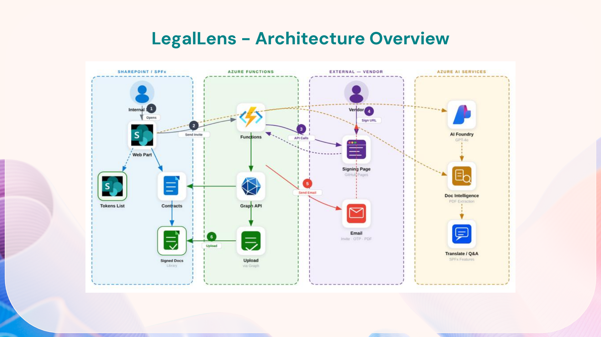
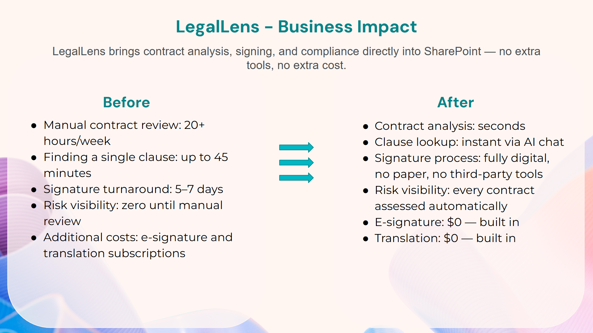

# LegalLens — SharePoint-Integrated AI Assistant for Legal Teams

LegalLens is a SharePoint Framework web part that brings AI-powered contract intelligence directly into SharePoint Online. Legal teams can upload, analyse, classify, chat with, and sign contracts without leaving their Microsoft 365 environment — and external vendors can sign documents via a secure one-time link with no SharePoint account needed.

Built with **SPFx (React, TypeScript, Fluent UI)**, **Azure Functions**, **Azure AI Foundry**, and **Azure Document Intelligence**. Fully responsive, including mobile.

### Demo Video

[Watch the full demo](https://www.youtube.com/watch?v=-k96wyi92x4)

---

## The Problem It Solves

Legal contract workflows in most organisations are a patchwork: contracts are emailed around as attachments, risk review is manual and inconsistent, e-signature means paying for DocuSign or Adobe Sign per user per month, and translation means copy-pasting into a browser. None of it lives in the same place.

LegalLens replaces that patchwork with a single SharePoint web part. Everything happens inside the Microsoft 365 tenant the organisation already has — no new vendors, no new per-user licences, no data leaving the building.

---

## Features

### Contract Library

A dashboard view of the entire contract library pulled directly from a SharePoint document library. Each contract card displays:

- **Risk score** (0–100) computed by GPT-4o across all clauses
- **Status badge** — Compliant, Warning, or Critical — colour-coded at a glance
- **Contract type**, parties, jurisdiction, expiry date, and tags
- **Duplicate flag** — if the upload pipeline detected a semantically similar contract already in the library
- **Dangerous clause flag** — if known high-risk clause patterns were found during analysis

Clicking any contract opens a detail panel with a full document preview and an AI-powered Q&A chat scoped to that specific contract. Ask "what is the liability cap?" and get a cited answer in seconds.

### Upload and Analyze

Upload a contract in any format — PDF, Word, plain text, or a scanned image — and the analysis pipeline runs automatically:

1. **OCR and text extraction** via Azure Document Intelligence — works on scanned documents, not just native PDFs
2. **Clause segmentation** — GPT identifies and labels every clause: indemnification, termination, payment terms, SLA, data processing obligations, IP ownership, liability caps, auto-renewal, and more
3. **Risk scoring** — each clause receives an individual risk flag; an aggregate score (0–100) is computed with a plain-English summary of the most significant risks
4. **Duplicate detection** — semantic similarity search across all existing contracts flags potential duplicates before the file is saved, preventing version confusion
5. **Dangerous clause highlighting** — known problematic patterns (uncapped liability, one-sided termination, silent auto-renewal, inadequate data breach notice windows) are surfaced explicitly in the UI
6. **Metadata enrichment** — SharePoint columns are populated automatically: ContractType, Parties, Jurisdiction, ExpiryDate, Tags, RiskScore, Status, Analysis Date

The analysis results are shown inline for review. The contract was saved after the analysis results were finalized.

### Classification

Targeted assessments that can be run on any contract in the library, independently of the full upload-and-analyse flow:

| Assessment | What it produces |
|---|---|
| **Contract Type** | Category label (Vendor Agreement, NDA, SLA, DPA, etc.) with a confidence score |
| **Risk Assessment** | Per-clause risk flags, an overall risk score, and a prioritised list of concerns |
| **Compliance Check** | Gap analysis against GDPR, CCPA, SOC 2, and HIPAA requirements |
| **Entity Extraction** | Parties, effective dates, expiry dates, monetary values, and key obligations pulled from the document |

All results are written back to the corresponding SharePoint list item so the metadata stays current.

### TranslatePro — Multilingual Q&A Agent

A chat interface backed by GPT-4o that lets users ask questions about any contract in any configured language. English is always available; additional languages are added in the web part property pane without any code changes. Every answer includes citations — the model quotes the specific clause it is referencing — so users can verify responses directly against the source document.

Practical use case: a legal team in Toronto reviewing a contract written for a German counterparty can ask questions in English and get answers grounded in the German-language clauses, with citations to the original text.

### E-Signature

A complete multi-signer digital signature workflow built directly into the web part — no DocuSign, no Adobe Sign.

**Internal signers** use a draw canvas or typed signature inside the web part itself.

**External vendors** receive a signing invitation email containing:
- A one-time signing URL (token expires after 7 days by default)
- An inline QR code for signing on a mobile device (embedded as a CID attachment so it renders correctly in Gmail, Outlook, and Apple Mail)
- The contract name and expiry date

The vendor signing page (`sign.html`) is a standalone static file. It requires no SharePoint account, no Microsoft login, no app installation. The flow:

1. Vendor opens the link and sees the contract details
2. The PDF document loads in the background (blurred) while identity verification completes
3. Vendor enters their email address — it must match the invitation recipient exactly
4. Email verified via OTP— document unlocks, signature panel appears
5. Vendor chooses Draw, Theme (styled text), or Upload
6. Vendor ticks the consent checkbox and submits
7. Azure Function merges the signature into the PDF and uploads the signed document to the SharePoint Signed Documents library automatically
8. The token is marked as used — the link cannot be replayed

**Document preview** on the signing page: PDFs render page-by-page natively in the browser. Plain text files display inline. Word documents are offered as a download before signing. Vendors always review the actual document content before committing.

**Audit trail:** every event — invitation sent, email verified, document viewed, signature submitted — is timestamped, logged, and accessible via Application Insights.

[Signed Documents](/assets/signed-documents/5-HIGH-RISK-Outsourcing-Agreement_signed_1772641292539.pdf)

### Alerts

Continuously monitors the contract library and compiles a prioritised, actionable list of items requiring attention:

- Contracts with risk scores above configurable thresholds
- Contracts expiring within 30, 60, or 90 days
- Potential duplicate contracts detected during upload
- Contracts containing dangerous clause patterns

Every alert links directly to the relevant contract panel.

---

## Architecture

The solution is built across three tiers:

**Frontend:** SPFx web part with React, TypeScript, and Fluent UI, deployed to SharePoint. Communicates with SharePoint via Microsoft Graph and with Azure Functions over HTTPS.

**Backend:** Serverless Azure Functions (Node.js 22, Consumption plan) handle all external operations — token validation, document download/upload, signature merging into PDF, and email delivery via Gmail (nodemailer). No server to manage.

**AI:** Azure AI Foundry (GPT-4o) performs all natural language reasoning: clause segmentation, risk assessment, classification, compliance checking, entity extraction, and Q&A. Azure Document Intelligence handles text extraction from PDFs and scanned images.

**Data:** Everything stays within the customer's Microsoft 365 tenant and Azure subscription. Contracts, signed documents, and signature tokens are stored in SharePoint. AI processing occurs in the customer's own Azure AI Foundry instance. No data is sent to third-party services.

## Business Impact

LegalLens replaces several manual processes and third-party tools. Contract analysis that previously took hours happens in seconds. Clause lookup is instant via AI chat. The built-in e-signature removes the need for separate signing subscriptions, and multilingual chat replaces external translation services. Everything runs on infrastructure the organization already has, no additional licensing costs.

## Configuration

For setup and configuration details, see the [README](https://github.com/saiiiiiii/LegalLens/blob/main/README.md).