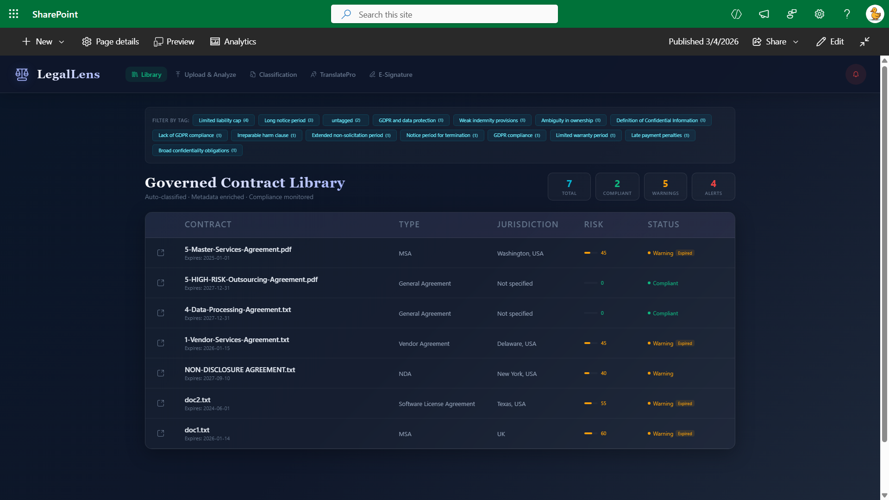

# LegalLens SPFx Solution

AI-powered contract management and e-signature platform built on SharePoint Online. Includes an SPFx web part for internal users and a vendor-facing signing flow backed by Azure Functions — no SharePoint access required for external signers.

---




---

## Authors

| Name | GitHub |
|------|--------|
| Sai Siva Ram Bandaru | [@saiiiiiii](https://github.com/saiiiiiii) |
| Antanina Druzhkina | [@Ateina](https://github.com/Ateina) |

---

## Features

- **SharePoint Integration:** Reads contracts directly from SharePoint document libraries
- **Contract Library View and Document Overview:** Browse all uploaded contracts in one place; open any contract to view its metadata, status, and AI-powered insights such as risk score and key clause highlights
- **Contract Classification and Analysis:** AI-powered classification of uploaded contracts with risk scoring, clause extraction, and metadata enrichment
- **Q&A Agent:** Chat-like AI-powered tool for asking questions about contracts in your preferred language. Always includes English; additional languages are configurable via web part properties
- **E-Signature:** Multi-signer workflow; internal staff sign via the web part, external vendors sign via a secure one-time link (no SharePoint login required)
  - **Document Preview:** PDF rendered page-by-page; plain-text files displayed inline; Word documents offered as download before signing
  - **Audit Trail:** All signing events timestamped and logged; Application Insights monitoring

## SharePoint Document Library Setup

> **Quick setup:** Run the included PowerShell script to create all libraries, lists, and columns automatically:
> ```powershell
> .\assets\Setup-LegalLens-SharePoint.ps1 -SiteUrl "https://contoso.sharepoint.com/sites/YourSite" -ClientId "your-client-id"
> ```
> The script creates the **Contracts** library, **Signed Documents** library, and **Signature Tokens** list with all required columns and views. Manual setup is described below for reference.

<details>
<summary>Create SharePoint Libraries and Lists manually</summary>

### 1. Create Contract Library

1. Navigate to your SharePoint site
2. Create a new Document Library named "Contracts" (or your preferred name)
3. Add the following columns to the library:

#### Required Columns

| Column Name | Type | Description |
|------------|------|-------------|
| Title | Single line of text | Contract name (default) |
| ContractType | Choice | Options: Vendor Agreement, NDA, SLA, DPA, General Agreement |
| Jurisdiction | Single line of text | Legal jurisdiction (e.g., Delaware, California, EU (GDPR)) |
| Status | Choice | Options: Compliant, Warning, Critical |
| Parties | Multiple lines of text | Semicolon-separated party names |
| ExpiryDate | Date | Contract expiration date |
| Tags | Multiple lines of text | Semicolon-separated tags (e.g., GDPR;SOC2;CCPA) |
| RiskScore | Number | Risk score from 0-100 |
| AI Analysis Complete | Yes/No | AI Analysis Completed or Not |
| Analysis Date | Date | Analysis date |
| Effective Date | Date | Effective Date date |

### 2. Create "Signed Documents" Documents Library

1. Navigate to your SharePoint site
2. Create a new Document Library named "Signed Documents"
3. Add the following columns to the library:

#### Required Columns

| Column Name | Type | Description |
|------------|------|-------------|
| Title | Single line of text | Contract name (default) |
| ContractType | Single line of text | Contract Type |
| Status | Single line of text | Completed or In-Progress of Contract E-Signature |
| Parties | Single line of text | Parties involved in Documents E-Signatures |
| Tags | Single line of text | Tags of E-Signature |
| RiskScore | Number | Risk score from 0-100 |

### 3. Signature Tokens List

Create a **List** named **Signature Tokens** and add these columns:

| Column Name | Type | Notes |
|-------------|------|-------|
| Title | Single line of text | Token ID (used as display label) |
| TokenID | Single line of text | Cryptographic token (48 hex chars) |
| ContractID | Number | SharePoint list item ID of the contract |
| ContractName | Single line of text | Display name of the contract |
| FileName | Single line of text | Filename in the Contracts library (e.g. `agreement.pdf`) |
| SignerEmail | Single line of text | Recipient email — verified before signing |
| SignerName | Single line of text | Recipient display name |
| SignerID | Single line of text | Internal signer identifier |
| DriveItemID | Single line of text | Graph drive item ID (populated automatically) |
| Expires | Date and Time | Token expiry (default: 7 days from creation) |
| Used | Yes/No | Marked `true` after the vendor signs |
| SignedDate | Date and Time | Timestamp of signature submission |

---

</details>

## Configure Web Part Properties

After deploying the `.sppkg` to your App Catalog, edit the web part properties in SharePoint:

| Property | Description |
|----------|-------------|
| Contract Library | Dropdown — select the SharePoint document library containing your contracts |
| Azure AI Foundry Endpoint | e.g. `https://your-project.openai.azure.com` |
| Azure AI Foundry API Key | API key for your AI Foundry deployment |
| Azure AI Foundry Deployment | Model name, e.g. `gpt-4o` |
| Enable Document Analysis | Toggle — enables Azure Document Intelligence for PDF text extraction |
| Document Intelligence Endpoint | e.g. `https://your-di.cognitiveservices.azure.com` |
| Document Intelligence Key | API key for Document Intelligence |
| Translation Languages | Configure additional languages for the Q&A Agent (English is always included) |
| Show Translate Tab | Toggle — show or hide the Q&A Agent tab |
| Show E-Signature Tab | Toggle — show or hide the E-Signature tab |
| Color Scheme | Choose between Dark, Light, or inherit from site theme |

### Build & Deploy

```bash
cd LegalLensWebPart
npm install
gulp build
gulp bundle --ship
gulp package-solution --ship
```

## E-Signature Configuration

### Azure Functions Setup

#### Prerequisites

- Azure subscription with a Function App (Node.js 22, Linux, Consumption plan)
- Entra ID (Azure AD) app registration with the following **Application** permissions (admin consent required):

| Permission | Type | Purpose |
|-----------|------|---------|
| `Sites.ReadWrite.All` | Application | Read/write SharePoint sites |
| `Files.ReadWrite.All` | Application | Download and upload documents |
| `Mail.Send` | Application | Send invitation emails via Microsoft Graph |

> **Note:** The solution uses Gmail (nodemailer) for email delivery by default, which avoids new-tenant reputation issues. `Mail.Send` is only needed if you switch to Microsoft Graph mail.

#### Environment Variables

Set these in `local.settings.json` (local) or **Function App → Settings → Environment Variables** (Azure):

```json
{
  "TENANT_ID":               "your-entra-tenant-id",
  "CLIENT_ID":               "your-app-registration-client-id",
  "SHAREPOINT_SITE_URL":     "https://tenant.sharepoint.com/sites/YourSite",
  "CLIENT_SECRET":           "your-app-client-secret",
  "SHAREPOINT_SITE_ID":      "tenant.sharepoint.com,CONTRACTS_LIBRARY_ID,SIGNED_DOCS_LIBRARY_ID",
  "CONTRACTS_LIBRARY_ID":    "",
  "SIGNED_DOCS_LIBRARY_ID":  "",
  "TOKENS_LIST_ID":          "",
  "GMAIL_USER":              "youremail@gmail.com",
  "GMAIL_APP_PASSWORD":      "xxxx xxxx xxxx xxxx"
}
```

**Gmail App Password:** Go to [myaccount.google.com/apppasswords](https://myaccount.google.com/apppasswords), create an app password named "LegalLens", and paste the 16-character code (no spaces) into `GMAIL_APP_PASSWORD`. Requires 2-Step Verification to be enabled on the Gmail account.

**SharePoint IDs:** Run the helper script `AzureFunctions/get-drive-ids.js` after filling in the other variables to retrieve the correct list/library GUIDs.

### Deploy

```bash
cd AzureFunctions
npm install
npm run build
func azure functionapp publish
```

### Monitoring

Application Insights is automatically configured for Azure Functions.

### API Reference

#### GET `/api/validate/{tokenId}`

Validates a signing token. Called by [sign.html](./legallens-signatures/sign.html)  on load.

**Response:**
```json
{
  "token": {
    "tokenId": "a3f9...",
    "contractName": "Vendor Agreement 2026",
    "signerName": "Sai Bandaru",
    "signerEmail": "sai@vendor.com",
    "expires": "2026-03-01T00:00:00Z"
  },
  "document": {
    "name": "vendor-agreement.pdf",
    "size": 524288,
    "webUrl": "..."
  }
}
```

#### GET `/api/document/{tokenId}`

Downloads the contract file. Serves the correct `Content-Type` per file extension:

| Extension | Content-Type | Browser behaviour |
|-----------|-------------|-------------------|
| `.pdf` | `application/pdf` | Rendered inline by browser |
| `.txt` | `text/plain; charset=utf-8` | Rendered as text in the viewer |
| `.docx` | `application/vnd.openxmlformats-officedocument.wordprocessingml.document` | Download prompt |
| `.doc` | `application/msword` | Download prompt |


#### POST `/api/sign`

Submits the vendor's signature.

**Request body:**
```json
{
  "tokenId": "a3f9...",
  "email": "sai@vendor.com",
  "signature": "data:image/png;base64,iVBOR..."
}
```

**Response:**
```json
{
  "success": true,
  "message": "Signature submitted successfully",
  "signedDocument": "vendor-agreement_signed_1740000000000.pdf",
  "signedAt": "2026-02-24T10:30:00Z"
}
```

#### POST `/api/invite` *(internal — called by the web part)*

Sends a signing invitation email via Gmail. Called automatically when an internal user creates a signature request in the web part.

#### POST `/api/sendOTP` *(internal — called by the web part)*

Send OTP confirmation before signing

### Vendor Signing Flow (`sign.html`)

The standalone signing page lives at [sign.html](./legallens-signatures/sign.html) and is hosted as a static file.

**Signing URL format:**
```
https://yourdomain.com/sign.html?token=<tokenId>
```

**Step-by-step flow:**

1. Page loads → `GET /api/validate/{tokenId}` → shows document details
2. PDF panel loads in background (blurred) while vendor is on identity verification step
3. Vendor enters their email address — must match the invitation recipient
4. Email verified → PDF/TXT panel unlocks and signature panel appears
5. Vendor chooses signature method: Draw, Theme (styled text), or Upload image
6. Vendor ticks consent checkbox and clicks **Sign Document**
7. `POST /api/sign` → Azure Function merges signature into PDF → uploads signed PDF to SharePoint → marks token as used
8. Success screen shown

### Security

- **Vendors never access SharePoint** — all document operations go through Azure Functions using Application permissions (Client Credentials flow)
- **One-time tokens** — each signing link works exactly once; the token is marked `Used = true` after submission
- **Email verification** — vendor must enter the invited email address before the document unlocks
- **Time-limited** — tokens expire after 7 days by default
- **No user credentials stored** — the Function App authenticates as a service principal via client secret

### Cost Estimate

| Service | Tier | Estimated Cost |
|---------|------|----------------|
| Azure Functions | Consumption | Free up to 1M executions; ~$0.20/M after |
| Azure Storage | LRS | < $1/month |
| Gmail (nodemailer) | Free | $0 |
| **Total** | | **~$5–10/month** for 1,000 signatures |

For comparison: DocuSign costs $25+/user/month.

## Version History

| Version | Date | Changes |
|---------|------|---------|
| 1.0.0 | 2026-04-10 | Initial release with Library, TranslatePro, Alerts, E-Signature and Q&A Agent |

