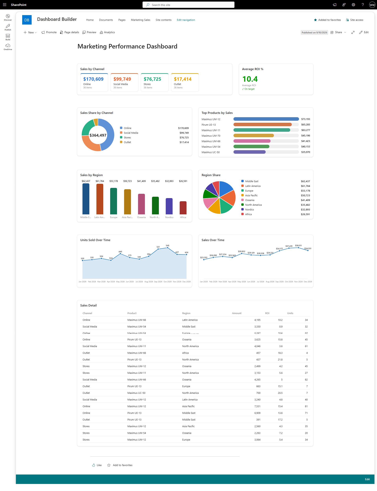

# List Dashboard

## Summary

**List Dashboard** is a single, versatile web part that turns **any SharePoint list or library into a dashboard - with no Power BI and no external chart library.** Pick a list, choose a display type, map a couple of columns, and it renders a stat, chart, or table. Drop it several times on a page - each instance configured differently - to compose a full dashboard from your own data.

Every visual is drawn in plain HTML/CSS or inline SVG, so there is no charting dependency and nothing to license.

### Display types

| Type | Shows |
| --- | --- |
| **Stat** | A single aggregated number (count / sum / average / min / max) |
| **KPI Tiles** | The aggregate broken down by a category column |
| **Bar** | Horizontal bars by category |
| **Column** | Vertical bars by category |
| **Pie / Donut** | Category shares (donut shows the total in the centre) |
| **Line / Area** | A trend over a date column, bucketed by day / week / month |
| **Table** | A sortable table of the items |

### Appearance

- **Colour modes** - Colourful (a distinct hue per category), Single accent, Value gradient (darker = higher), or **Status vs target** (green / amber / red against thresholds you set, each shown with a glyph + label so colour is never the only signal).
- **Palettes** - Vibrant, Soft, Mild, and Deep. Each palette is a full eight-hue spread validated **colourblind-safe** (the categorical hues stay distinguishable under protan / deutan / tritan simulation).
- **Number formats** - Compact (`1.2K`), Number (`1,234`), Currency (with your symbol), or Percent of total. Choose 0-2 decimal places.
- **Data labels** toggle, an optional title, border, and background, and **full-width** (full-bleed) support so the web part can span a full-width section.

It works on **any** list or library: it reads the list's real columns for the property-pane pickers, expands person / lookup fields correctly, and ignores any field that is not on the bound list, so it never breaks when you re-point it at a different list.

It also ships with **built-in demo data** (a small "Projects" list with a date column), so every display type renders the moment you drop it on a page, before you bind a list.

## Compatibility

| :warning: Important |
|:---------------------------|
| Every SPFx version is optimally compatible with specific versions of Node.js. In order to be able to build this sample, make sure to use the version specified below or refer to the [SharePoint Framework compatibility page](https://aka.ms/spfx-matrix). |

This sample is built with **SharePoint Framework 1.21.1**, **React 17**, and **Node.js 22**. It runs in **SharePoint Online**.

## Applies to

- [SharePoint Framework](https://aka.ms/spfx)
- [Microsoft 365 tenant](https://developer.microsoft.com/microsoft-365/dev-program)

> Get your own free development tenant by subscribing to [Microsoft 365 developer program](https://aka.ms/o365devprogram).

## Prerequisites

- A SharePoint Online site collection with an **app catalog** (tenant or site-collection scoped)
- At least one SharePoint **list or library** to visualize (or use the built-in demo data)

## Contributors

- [Vijay Kumar G](https://github.com/gvijaikumar9)

## Version history

| Version | Date | Comments |
| ------- | ---- | -------- |
| 1.0 | September 10, 2026 | Initial release - Stat, KPI Tiles, Bar, Column, Pie, Donut, Line, Area, and Table display types; colour modes and colourblind-safe palettes; status-vs-target colouring; number formatting; date bucketing; full-width support |

## Minimal Path to Awesome

- Clone this repository (or [download the sample](https://pnp.github.io/download-partial/?url=https://github.com/pnp/sp-dev-fx-webparts/tree/main/samples/react-list-dashboard))
- Ensure that you are at the solution folder
- In the command line run:
  - `npm install`
  - `gulp bundle --ship`
  - `gulp package-solution --ship`
- Upload `sharepoint/solution/react-list-dashboard.sppkg` to your **app catalog** and deploy
- On a modern page, **edit the page and add the "List Dashboard" web part** from the toolbox (group **Data visualization**)
- In the property pane, pick a **list**, a **display type**, and the **columns / aggregation** to visualize

## Features

This web part illustrates the following concepts:

- Reading any list or library, its fields, and its items with `SPHttpClient`, and driving the property pane from live list/field dropdowns
- Expanding person and lookup fields correctly (`$expand=Field/Title`) and resolving typed column names case-insensitively, so the query never fails on a field type or letter case
- Aggregating list data (count / sum / average / min / max), grouping by a category column, and bucketing a date column into day / week / month periods - all in pure, testable functions
- Rendering **KPI tiles, bar/column charts, pie/donut, and line/area in pure CSS and inline SVG** (theme-aware, tabular figures, responsive) with no charting dependency
- Applying a **validated colourblind-safe categorical palette** and reserved status colours (paired with glyphs so meaning is never carried by colour alone)
- Composing a dashboard from multiple instances of one configurable web part - **no Power BI required**
- Graceful loading, empty, and soft-error states, plus built-in demo data for a friendly first-drop experience

## Help

We do not support samples, but this community is always willing to help, and we want to improve these samples. We use GitHub to track issues, which makes it easy for community members to volunteer their time and help resolve issues.

## Disclaimer

**THIS CODE IS PROVIDED _AS IS_ WITHOUT WARRANTY OF ANY KIND, EITHER EXPRESS OR IMPLIED, INCLUDING ANY IMPLIED WARRANTIES OF FITNESS FOR A PARTICULAR PURPOSE, MERCHANTABILITY, OR NON-INFRINGEMENT.**

