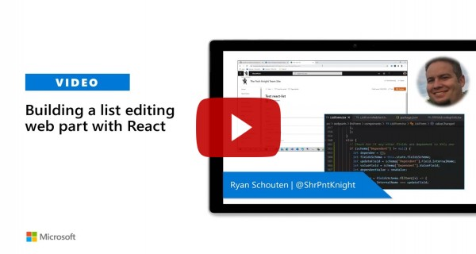

# List Form

## Summary

The List Form web part is a web part for adding a list form to any page. It provides a working example of implementing generic SharePoint list forms using the **SharePoint Framework (SPFx)** and the _React_ and _Office UI Fabric_ libraries.

The web part allows configuring which list to use and if a form for adding a new item, editing or displaying an existing item should be shown. When selecting display or edit form the ID can be defined either as a fixed number or as a query string parameter name. The form fields can be added, ordered using drag-and-drop or removed visually in the web part. A URL including placeholder for the ID can be provided to redirect to after successfully saving the form.

## Compatibility

 
 

-Incompatible-red.svg "SharePoint Server 2016 Feature Pack 2 requires SPFx 1.1")

## Applies to

- [SharePoint Framework](https://docs.microsoft.com/sharepoint/dev/spfx/sharepoint-framework-overview)
- [Office 365 tenant](https://docs.microsoft.com/sharepoint/dev/spfx/set-up-your-development-environment)

## Prerequisites

You'll need to connect to a list before you can use this sample.

## Solution

| Solution        | Author(s)                                                           |
| --------------- | -----------------------------------------------------------------   |
| react-list-form | [Dany Wyss](https://github.com/DanyWyss)                            |
| react-list-form | [Harsha Vardhini](https://github.com/Harshagracy) ([@harshagracy](https://twitter.com/harshagracy))   |
| react-list-form | [Ryan Schouten](https://github.com/sharepointknight) ([@shrpntknight](https://twitter.com/shrpntknight))   |
| react-list-form | [Abderahman Moujahid](https://github.com/Abderahman88)              |
| react-list-form | [Kman1131](https://github.com/Kman1131)                             |
| react-list-form | [Fredrik Thorild](https://github.com/fthorild) [@fthorild](https://twitter.com/fthorild)           |
| react-list-form | [Ari Gunawan](https://github.com/AriGunawan) ([@arigunawan3023](https://twitter.com/arigunawan3023)) |

## Version history

| Version | Date               | Comments                                                                                                  |
| ------- | ------------------ | --------------------------------------------------------------------------------------------------------- |
| 1.0.0   | November 24, 2017  | Initial release                                                                                           |
| 1.0.1   | February 22, 2019  | Updated to SPFx 1.7.1 and dependencies, Added Turkish translation, Added RichText Mode and Tinymce Editor |
| 1.0.2   | October 14, 2019   | Updated to SPFx 1.9.1 and dependencies                                                                    |
| 1.0.3   | July 7, 2020       | Updated to SPFx 1.10.0 and dependencies. Fixed required field validation (Harsha Vardhini)                |
| 1.0.4   | September 12, 2020 | Added support for User, UserMulti, Taxonomy, and TaxonomyMulti field types                                |
| 1.0.5   | September 26, 2020 | Fix date handling problems and redirect after edit                                                        |
| 1.0.6   | October 8, 2020    | Added support for cascading lookup fields                                                                 |
| 1.0.7   | December 11, 2020  | Fix limit of lookup fields                                                                                |
| 1.0.8   | February 7, 2021   | Fixed dragging and dropping fields                                                                        |
| 1.0.9   | February 19, 2021  | Fixed regular expressions for text validation                                                             |
| 1.0.10  | May 6, 2021        | Fixed "attachments are not cleared after submit" issue                                                    |

## Minimal Path to Awesome

- Clone this repository
- in the command line run:
  - `npm install`
  - `gulp serve`

>  This sample can also be opened with [VS Code Remote Development](https://code.visualstudio.com/docs/remote/remote-overview). Visit https://aka.ms/spfx-devcontainer for further instructions.

## Features

This Web Part illustrates the following concepts on top of the SharePoint Framework:

- Using React for building SharePoint Framework client-side web parts.
- Using React controlled components for SharePoint form fields.
- Using SharePoint REST services to retrieve and update schema and data for lists and fields.
- Using Office UI Fabric React components and styles for building user experience consistent with SharePoint and Office.
- Integrating drag and drop to provide better user experience for configuring web parts visually.
- Using custom drop-down property editors in the property pane.

## Video

## Disclaimer

**THIS CODE IS PROVIDED _AS IS_ WITHOUT WARRANTY OF ANY KIND, EITHER EXPRESS OR IMPLIED, INCLUDING ANY IMPLIED WARRANTIES OF FITNESS FOR A PARTICULAR PURPOSE, MERCHANTABILITY, OR NON-INFRINGEMENT.**

## Help

We do not support samples, but we do use GitHub to track issues and constantly want to improve these samples.

You can try looking at [issues related to this sample](https://github.com/pnp/sp-dev-fx-webparts/issues?q=label%3A%22sample%3A%20react-list-form") to see if anybody else is having the same issues.

You can also try looking at [discussions related to this sample](https://github.com/pnp/sp-dev-fx-webparts/discussions?discussions_q=react-list-form) and see what the community is saying.

If you encounter any issues while using this sample, [create a new issue](https://github.com/pnp/sp-dev-fx-webparts/issues/new?assignees=&labels=Needs%3A+Triage+%3Amag%3A%2Ctype%3Abug-suspected%2Csample%3A%20react-list-form&template=bug-report.yml&sample=react-list-form&authors=@DanyWyss%20@Harshagracy%20@sharepointknight%20@Abderahman88,%20@Kman1131%20@fthorild%20@AriGunawan&title=react-list-form%20-%20).

For questions regarding this sample, [create a new question](https://github.com/pnp/sp-dev-fx-webparts/issues/new?assignees=&labels=Needs%3A+Triage+%3Amag%3A%2Ctype%3Aquestion%2Csample%3A%20react-list-form&template=question.yml&sample=react-list-form&authors=@DanyWyss%20@Harshagracy%20@sharepointknight%20@Abderahman88,%20@Kman1131%20@fthorild%20@AriGunawan&title=react-list-form%20-%20).

Finally, if you have an idea for improvement, [make a suggestion](https://github.com/pnp/sp-dev-fx-webparts/issues/new?assignees=&labels=Needs%3A+Triage+%3Amag%3A%2Ctype%3Aenhancement%2Csample%3A%20react-list-form&template=question.yml&sample=react-list-form&authors=@DanyWyss%20@Harshagracy%20@sharepointknight%20@Abderahman88,%20@Kman1131%20@fthorild%20@AriGunawan&title=react-list-form%20-%20).

