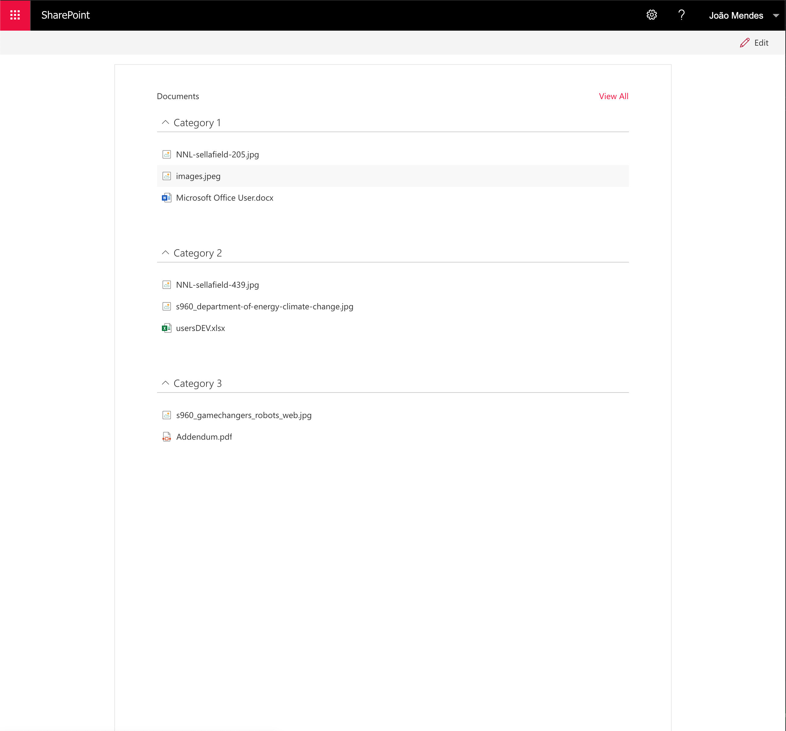
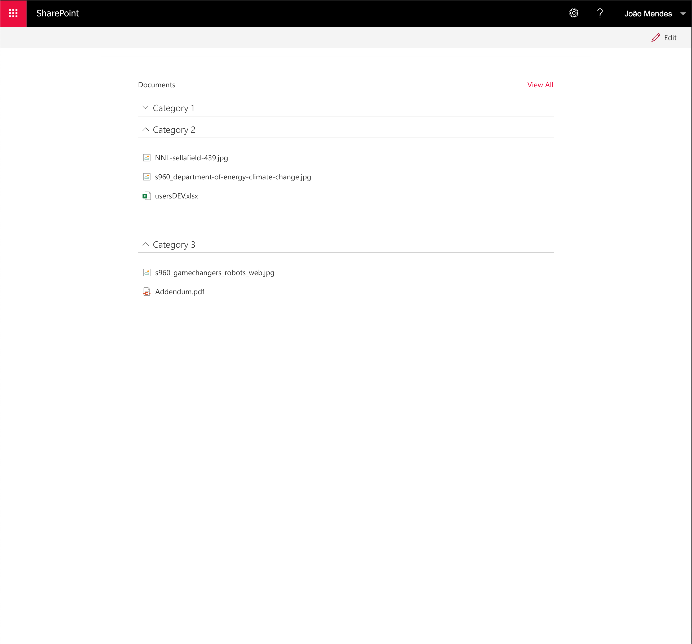

# List Items Menu (SP2019 Version)

## Summary

This web part allows user create a navigation menu , grouped by any column of document library.
When the user clicks on the header it dynamically load documents.

## Screenshots

  

## Compatibility

 

## Applies to

[SharePoint Framework](https://aka.ms/spfx)
 

## Web Part Properties
 
Property |Type|Required| comments
--------------------|----|--------|----------
WebPart Title| Text| no|
Select Document Library| dropdown|yes
Select Field to Group By | dropdown|yes
 

## Solution

The Web Part Use PnPjs library, Fluent-Ui-react components

Solution|Author(s)
--------|---------
React List Items Menu |[João Mendes](https://github.com/joaojmendes) ([@joaojmendes](https://twitter.com/joaojmendes))
 

## Version history

Version|Date|Comments
-------|----|--------
1.0.0|May 7, 2021|Initial release

## Minimal Path to Awesome

- Clone this repository
- Move to sample folder
- in the command line run:
  - `npm install`
  - `gulp build`
  - `gulp bundle --ship`
  - `gulp package-solution --ship`
- Add to AppCatalog and deploy

>  This sample can also be opened with [VS Code Remote Development](https://code.visualstudio.com/docs/remote/remote-overview). Visit https://aka.ms/spfx-devcontainer for further instructions.

## Disclaimer

**THIS CODE IS PROVIDED *AS IS* WITHOUT WARRANTY OF ANY KIND, EITHER EXPRESS OR IMPLIED, INCLUDING ANY IMPLIED WARRANTIES OF FITNESS FOR A PARTICULAR PURPOSE, MERCHANTABILITY, OR NON-INFRINGEMENT.**

## Help

We do not support samples, but this community is always willing to help, and we want to improve these samples. We use GitHub to track issues, which makes it easy for  community members to volunteer their time and help resolve issues.

If you're having issues building the solution, please run [spfx doctor](https://pnp.github.io/cli-microsoft365/cmd/spfx/spfx-doctor/) from within the solution folder to diagnose incompatibility issues with your environment.

You can try looking at [issues related to this sample](https://github.com/pnp/sp-dev-fx-webparts/issues?q=label%3A"sample%3A%20react-list-items-menu-sp2019" ) to see if anybody else is having the same issues.

You can also try looking at [discussions related to this sample](https://github.com/pnp/sp-dev-fx-webparts/discussions?discussions_q=react-list-items-menu-sp2019) and see what the community is saying.

If you encounter any issues while using this sample, [create a new issue](https://github.com/pnp/sp-dev-fx-webparts/issues/new?assignees=&labels=Needs%3A+Triage+%3Amag%3A%2Ctype%3Abug-suspected%2Csample%3A%20react-list-items-menu-sp2019&template=bug-report.yml&sample=react-list-items-menu-sp2019&authors=@joaojmendes&title=react-list-items-menu-sp2019%20-%20).

For questions regarding this sample, [create a new question](https://github.com/pnp/sp-dev-fx-webparts/issues/new?assignees=&labels=Needs%3A+Triage+%3Amag%3A%2Ctype%3Aquestion%2Csample%3A%20react-list-items-menu-sp2019&template=question.yml&sample=react-list-items-menu-sp2019&authors=@joaojmendes&title=react-list-items-menu-sp2019%20-%20).

Finally, if you have an idea for improvement, [make a suggestion](https://github.com/pnp/sp-dev-fx-webparts/issues/new?assignees=&labels=Needs%3A+Triage+%3Amag%3A%2Ctype%3Aenhancement%2Csample%3A%20react-list-items-menu-sp2019&template=question.yml&sample=react-list-items-menu-sp2019&authors=@joaojmendes&title=react-list-items-menu-sp2019%20-%20).

