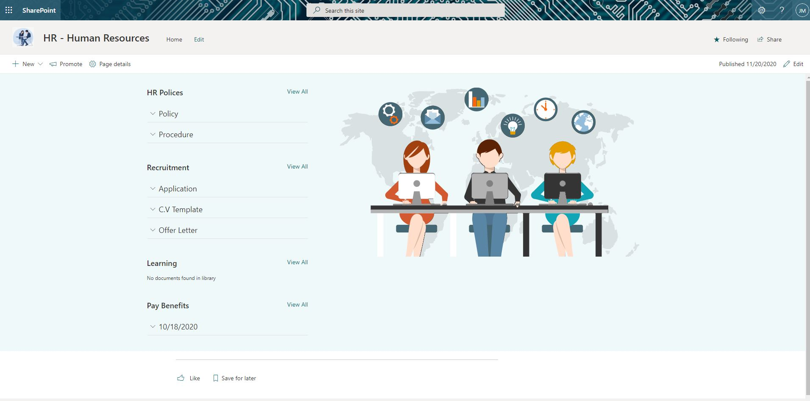
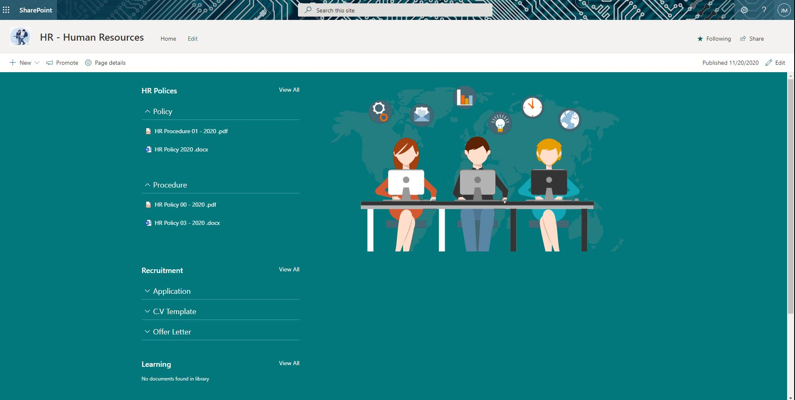

# List Items Menu

## Summary

This web part allows user create a navigation menu , grouped by any column of document library.
When the user clicks on the header it dynamically load documents.

## Screenshots

  

  

## Compatibility

 
 
 

## Applies to

* [SharePoint Framework](https://docs.microsoft.com/sharepoint/dev/spfx/sharepoint-framework-overview)
* [Office 365 tenant](https://docs.microsoft.com/sharepoint/dev/spfx/set-up-your-development-environment)

## WebPart Properties
 
Property |Type|Required| comments
--------------------|----|--------|----------
WebPart Title| Text| no|
Select Document Library| dropdown|yes
Select Field to Group By | dropdown|yes
 

## Solution

The Web Part Use PnPjs library, Fluent-Ui-react components

Solution|Author(s)
--------|---------
React List Items Menu |[João Mendes](https://github.com/joaojmendes) ([@joaojmendes](https://twitter.com/joaojmendes))
React List Items Menu |[Ravi Chandra](https://github.com/Ravikadri)

## Version history

Version|Date|Comments
-------|----|--------
1.0.0|November 20, 2020|Initial release
1.0.1|February 18, 2021|Added support for metadata columns
1.0.2|February 21, 2021|Fixed `gulp build` issues

## Minimal Path to Awesome

- Clone this repository
- Move to sample folder
- in the command line run:
  - `npm install`
  - `gulp build`
  - `gulp bundle --ship`
  - `gulp package-solution --ship`
- Add to AppCatalog and deploy
- go to SharePoint Admin Center and Approve required API Permissions

## Disclaimer

**THIS CODE IS PROVIDED *AS IS* WITHOUT WARRANTY OF ANY KIND, EITHER EXPRESS OR IMPLIED, INCLUDING ANY IMPLIED WARRANTIES OF FITNESS FOR A PARTICULAR PURPOSE, MERCHANTABILITY, OR NON-INFRINGEMENT.**

## Support

We do not support samples, but we do use GitHub to track issues and constantly want to improve these samples.

If you encounter any issues while using this sample, [create a new issue](https://github.com/pnp/sp-dev-fx-webparts/issues/new?assignees=&labels=Needs%3A+Triage+%3Amag%3A%2Ctype%3Abug-suspected&template=bug-report.yml&sample=react-list-items-menu&authors=@joaojmendes%20@Ravikadri&title=react-list-items-menu%20-%20).

For questions regarding this sample, [create a new question](https://github.com/pnp/sp-dev-fx-webparts/issues/new?assignees=&labels=Needs%3A+Triage+%3Amag%3A%2Ctype%3Abug-suspected&template=question.yml&sample=react-list-items-menu&authors=@joaojmendes%20@Ravikadri&title=react-list-items-menu%20-%20).

Finally, if you have an idea for improvement, [make a suggestion](https://github.com/pnp/sp-dev-fx-webparts/issues/new?assignees=&labels=Needs%3A+Triage+%3Amag%3A%2Ctype%3Abug-suspected&template=suggestion.yml&sample=react-list-items-menu&authors=@joaojmendes%20@Ravikadri&title=react-list-items-menu%20-%20).

