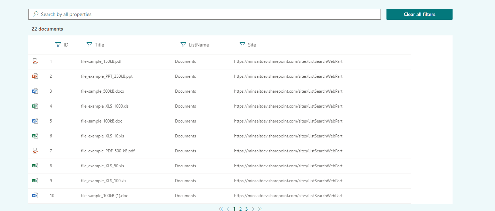
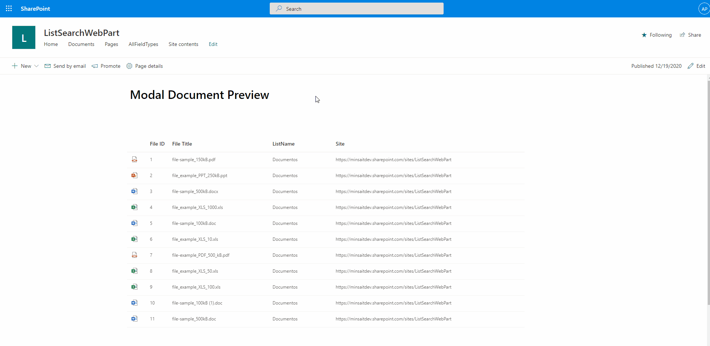
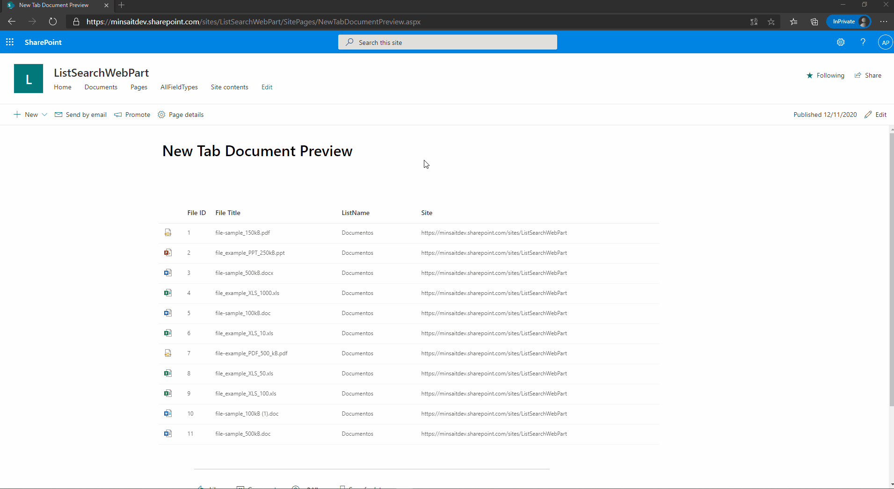
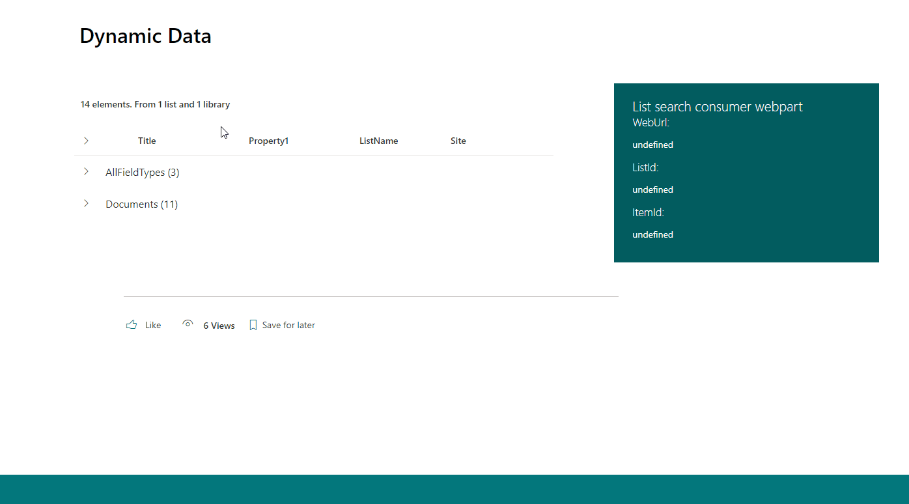
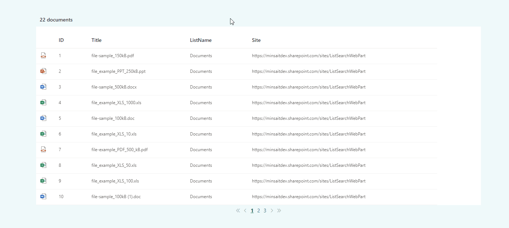
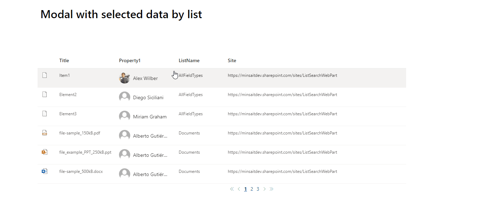
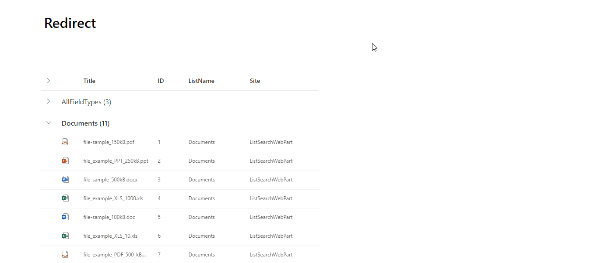
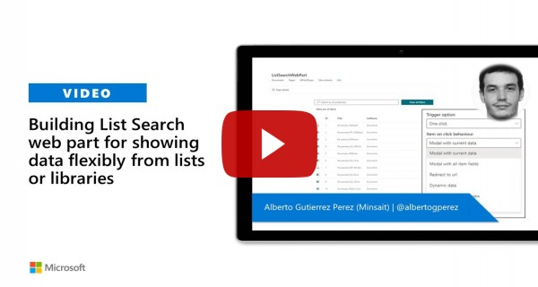

# List Search

## Summary

This list search web part allows the user to show data from lists or libraries. The web part can be used to (for more details see images below):

  * [Show merged items from different lists/libraries](#merge-items-from-different-listslibraries)
  * [Open item data in modal window (same data shown in the table)](#merge-items-from-different-listslibraries)
  * [Select render by field type](#select-render-of-the-selected-fields)
  * [Open item detail in modal window (it allows to select the fields to show by list)](#open-selected-item-with-selected-properties)
  * [Open documents in modal window](#open-documents-in-modal-window)
  * [Open documents in new tab](#open-documents-in-new-tab)
  * [Use of dynamic data](#use-of-dynamic-data)
  * [Redirect to url](#redirect-to-url-depends-on-selected-item)

* Other useful functionalities:
  * List item modern audience support
  * General filter - the user can select which columns are filtered and which not
  * Column filter on each column
  * Item limit to show
  * Item pagination
  * Group items by any field
  * Cache to retrieve the items
  * Get section color
  * Show item count with custom message

### Merge items from different lists/libraries

### Select render of the selected fields

### Open documents in modal window

### Open documents in new tab

### Use of dynamic data

### Open selected item with same data

### Open selected item with selected properties

### Redirect to url depends on selected item

## Compatibility

-Incompatible-red.svg "SharePoint Server 2016 Feature Pack 2 requires SPFx 1.1")

## Applies to

* [SharePoint Framework](https://docs.microsoft.com/sharepoint/dev/spfx/sharepoint-framework-overview)
* [Office 365 tenant](https://docs.microsoft.com/sharepoint/dev/spfx/set-up-your-development-environment)

## Solution

Solution|Author(s)
--------|---------
react-list-search | [Alberto Gutiérrez](https://github.com/albegut) ([@albertogperez](https://twitter.com/albertogperez))

## Version history

Version|Date|Comments
-------|----|--------
1.0.0|December 20, 2020|Initial release
1.1.0|April 25, 2021|List item modern audience support
1.2.0|January 01, 2022|Upgraded for SPFx v1.13.1

## Minimal Path to Awesome

### Dev Mode

>  This sample can also be opened with [VS Code Remote Development](https://code.visualstudio.com/docs/remote/remote-overview). Visit https://aka.ms/spfx-devcontainer for further instructions.

  * Clone this repository
  * In the command line run:
    * Navigate to `list-search-webpart`
    * `npm install`
    * `gulp serve`
    * Open the *workbench* on your Office 365 Developer tenant
    * Test out the web part

### Sppkg

  * Download `.sppkg` files from `sppkg` folder
  * Upload files to **App Catalog**
  * Approve the API permissions in the new SP admin center (only needed if you are going to enable list item modern audience)

## Features

This Web Part illustrates the following concepts on top of the SharePoint Framework:

* Using react for building SharePoint Framework client-side web parts
* Using [PnP Js](https://pnp.github.io/pnpjs) to retrieve SharePoint data
* Using [PnP Js](https://pnp.github.io/pnpjs/odata/caching) to cache SharePoint data
* Connection between SharePoint Framework components using dynamic data
* [Support of section backgrounds color](https://docs.microsoft.com/en-us/sharepoint/dev/spfx/web-parts/guidance/supporting-section-backgrounds)
* [Custom property pane control](https://docs.microsoft.com/en-us/sharepoint/dev/spfx/web-parts/guidance/build-custom-property-pane-controls)
* Use [react-js-pagination](https://www.npmjs.com/package/react-js-pagination) library

## Video

## Help

We do not support samples, but this community is always willing to help, and we want to improve these samples. We use GitHub to track issues, which makes it easy for  community members to volunteer their time and help resolve issues.

If you're having issues building the solution, please run [spfx doctor](https://pnp.github.io/cli-microsoft365/cmd/spfx/spfx-doctor/) from within the solution folder to diagnose incompatibility issues with your environment.

You can try looking at [issues related to this sample](https://github.com/pnp/sp-dev-fx-webparts/issues?q=label%3A%22sample%3A%20react-list-search") to see if anybody else is having the same issues.

You can also try looking at [discussions related to this sample](https://github.com/pnp/sp-dev-fx-webparts/discussions?discussions_q=react-list-search) and see what the community is saying.

If you encounter any issues while using this sample, [create a new issue](https://github.com/pnp/sp-dev-fx-webparts/issues/new?assignees=&labels=Needs%3A+Triage+%3Amag%3A%2Ctype%3Abug-suspected%2Csample%3A%20react-list-search&template=bug-report.yml&sample=react-list-search&authors=@albegut&title=react-list-search%20-%20).

For questions regarding this sample, [create a new question](https://github.com/pnp/sp-dev-fx-webparts/issues/new?assignees=&labels=Needs%3A+Triage+%3Amag%3A%2Ctype%3Aquestion%2Csample%3A%20react-list-search&template=question.yml&sample=react-list-search&authors=@albegut&title=react-list-search%20-%20).

Finally, if you have an idea for improvement, [make a suggestion](https://github.com/pnp/sp-dev-fx-webparts/issues/new?assignees=&labels=Needs%3A+Triage+%3Amag%3A%2Ctype%3Aenhancement%2Csample%3A%20react-list-search&template=question.yml&sample=react-list-search&authors=@albegut&title=react-list-search%20-%20).

## Disclaimer

**THIS CODE IS PROVIDED *AS IS* WITHOUT WARRANTY OF ANY KIND, EITHER EXPRESS OR IMPLIED, INCLUDING ANY IMPLIED WARRANTIES OF FITNESS FOR A PARTICULAR PURPOSE, MERCHANTABILITY, OR NON-INFRINGEMENT.**

