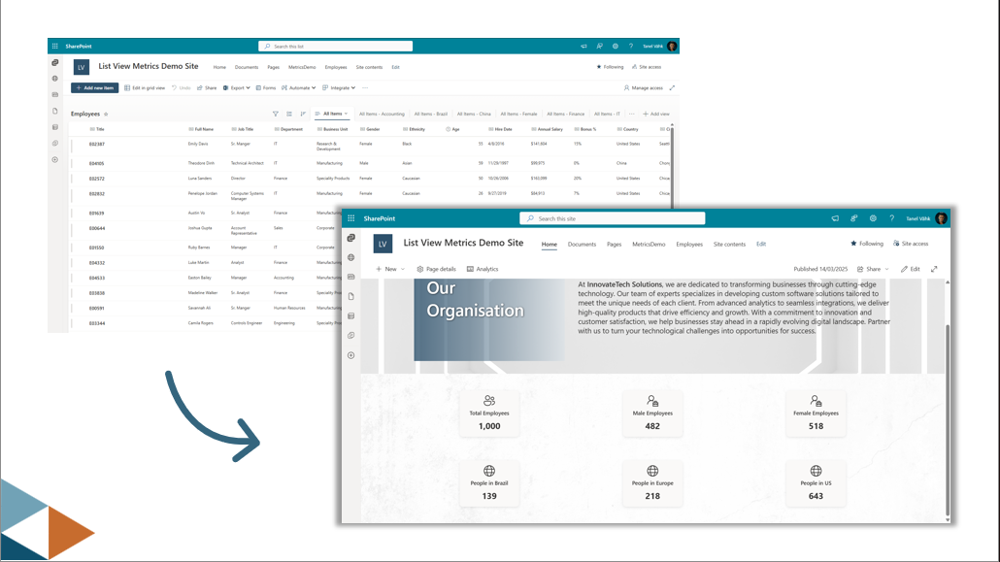
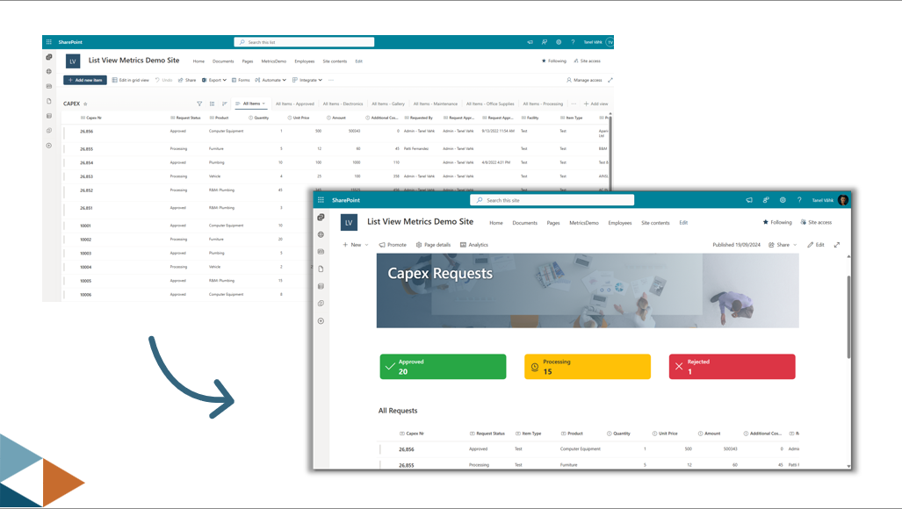
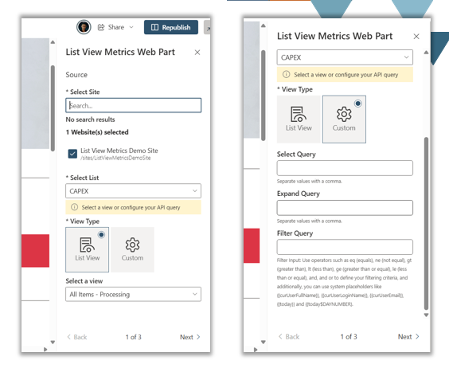
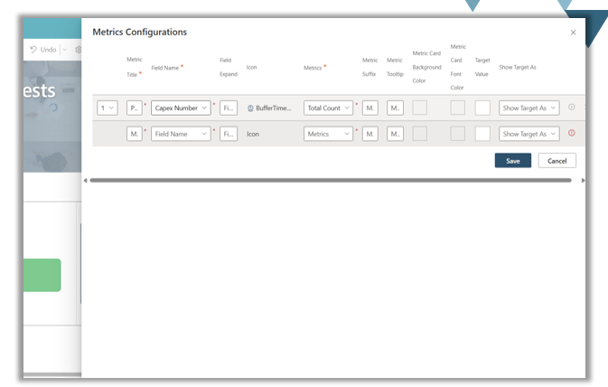
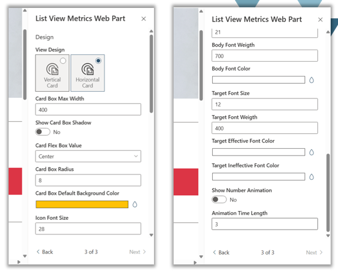

# List View Metrics Web Part

## Summary

This web part displays key metrics from SharePoint Lists and Libraries. It connects to any site, list, and view (or uses custom REST queries) to calculate and visualize metrics like total count, average, sum, min/max values, unique counts, and most popular values. Users can customize which metrics to display, configure visual styling, set target values for performance tracking, and choose between vertical or horizontal card layouts.

\

\

\

\

**Key Features:**
- **Multiple Metric Types**: Total count, unique count, sum, average, min/max values, and most popular value
- **Flexible Data Sources**: Use existing list views or custom REST queries with select, expand, and filter parameters
- **Target Tracking**: Set target values and display variance as numbers or percentages
- **Customizable Design**: Configure colors, fonts, animations, card layouts, and spacing
- **Responsive Layout**: Choose between vertical or horizontal card designs
- **Animation Support**: Optional animated number counting with customizable duration
- **Tooltip Support**: Add informational tooltips to metric cards
- **Multi-language Support**: Built with localization support

## Compatibility

| :warning: Important          |
|:---------------------------|
| Every SPFx version is only compatible with specific version(s) of Node.js. In order to be able to build this sample, please ensure that the version of Node on your workstation matches one of the versions listed in this section. This sample will not work on a different version of Node.|
|Refer to <https://aka.ms/spfx-matrix> for more information on SPFx compatibility.   |

This sample is designed to be used in the following environments:

 
 

-Incompatible-red.svg "SharePoint Server 2016 Feature Pack 2 requires SPFx 1.1")

For more information about SPFx compatibility, please refer to https://aka.ms/spfx-matrix

## Used SharePoint Framework Version

## Applies to

- [SharePoint Framework](https://aka.ms/spfx)
- [Microsoft 365 tenant](https://docs.microsoft.com/en-us/sharepoint/dev/spfx/set-up-your-developer-tenant)

> Get your own free development tenant by subscribing to [Microsoft 365 developer program](http://aka.ms/o365devprogram)

## Prerequisites

None

## Solution

| Solution | Author(s) |
| -------- | --------- |
| listviewmetricswebpart | [tvahk](https://github.com/tvahk) |

## Version history

| Version | Date | Comments |
| ------- | ---- | -------- |
| 1.0 | TBD | Initial release |

## Disclaimer

**THIS CODE IS PROVIDED *AS IS* WITHOUT WARRANTY OF ANY KIND, EITHER EXPRESS OR IMPLIED, INCLUDING ANY IMPLIED WARRANTIES OF FITNESS FOR A PARTICULAR PURPOSE, MERCHANTABILITY, OR NON-INFRINGEMENT.**

## Minimal Path to Awesome

- Clone this repository
- Ensure that you are at the solution folder
- In the command-line run:
  - **npm install**
  - **gulp serve**

>  This sample can also be opened with [VS Code Remote Development](https://code.visualstudio.com/docs/remote/remote-overview). Visit https://aka.ms/spfx-devcontainer for further instructions.

### Package and Deploy

To package and deploy the solution:

- In the command-line run:
  - **gulp bundle --ship**
  - **gulp package-solution --ship**
- Upload the generated .sppkg file (located in sharepoint/solution folder) to your tenant App Catalog
- Install the app in your site collection
- Add the web part to any page in the site collection

## Contributors

- [tvahk](https://github.com/tvahk)

## Disclaimer

**THIS CODE IS PROVIDED *AS IS* WITHOUT WARRANTY OF ANY KIND, EITHER EXPRESS OR IMPLIED, INCLUDING ANY IMPLIED WARRANTIES OF FITNESS FOR A PARTICULAR PURPOSE, MERCHANTABILITY, OR NON-INFRINGEMENT.**

