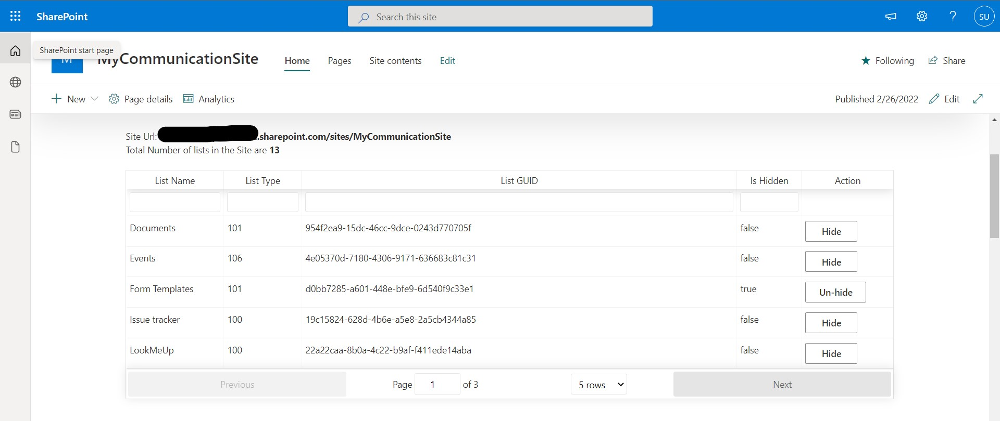
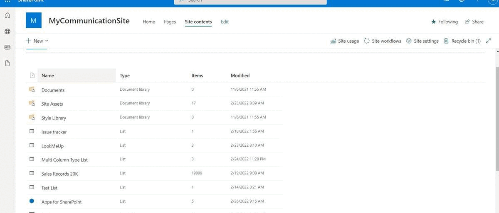

# Hide Lists WebPart

## Summary

SPFx Web part to Hide/UnHide lists in a Site Collection's Site Contents Page.

As Site Admins we may need to hide some lists or libraries in Site Contents from other users who have access to the lists/libraries.

For example: we may have created a PowerApps form and need to hide master lists or Logs list which has to be kept hidden from end users though they have Read permissions or Edit permissions to the lists/libraries.

So that once the list is hidden, users cannot access the list directly from Site Contents or without knowing list name or list URL.

There are multiple ways to do this by using PowerShell Scripts, Rest API & MS Flows.

Here same functionality is achieved using SPFx web part, which we can just be added to a Site Collection and it will list out the lists and libraries in the site and Site Admin can Hide/Unhide lists with a simple button click.

This web part will be accessible only to users with Site Collection Admin access.

PnP JS library to get relevant SharePoint lists and libraries from current Site Collection and use "Hidden" property of lists to hide/Unhide.

## Compatibility

 

-Incompatible-red.svg "SharePoint Server 2016 Feature Pack 2 requires SPFx 1.1")

## Applies to

* [SharePoint Framework](https://docs.microsoft.com/sharepoint/dev/spfx/sharepoint-framework-overview)
* [Microsoft 365 tenant](https://docs.microsoft.com/sharepoint/dev/spfx/set-up-your-development-environment)

> Get your own free development tenant by subscribing to [Microsoft 365 developer program](http://aka.ms/o365devprogram)
## Solution

Solution|Author(s)
--------|---------
react-lists-hide | [Sandeep Unnikrishnan](https://github.com/SandeepDev365/)

## Version history

Version|Date|Comments
-------|----|--------
1.0|February 27, 2022|Initial release

## Prerequisites

Ensure to have Site Collection Admin access to use this web part.

## Minimal path to awesome

* Clone this repository (or [download this solution as a .ZIP file](https://pnp.github.io/download-partial/?url=https://github.com/pnp/sp-dev-fx-webparts/tree/main/samples/react-lists-hide) then unzip it)
* From your command line, change your current directory to the directory containing this sample (`react-lists-hide`, located under `samples`)
* in the command line run:
  * `npm install`
  * **Update your SharePoint Site URL in `serve.json`**
  * `gulp serve`

>  This sample can also be opened with [VS Code Remote Development](https://code.visualstudio.com/docs/remote/remote-overview). Visit https://aka.ms/spfx-devcontainer for further instructions.

## Features

* List Out available Lists and Libraries based on template in current Site Collection
* Hide/Unhide Lists on button click

## Help

We do not support samples, but this community is always willing to help, and we want to improve these samples. We use GitHub to track issues, which makes it easy for  community members to volunteer their time and help resolve issues.

If you're having issues building the solution, please run [spfx doctor](https://pnp.github.io/cli-microsoft365/cmd/spfx/spfx-doctor/) from within the solution folder to diagnose incompatibility issues with your environment.

You can try looking at [issues related to this sample](https://github.com/pnp/sp-dev-fx-webparts/issues?q=label%3A%22sample%3A%20react-lists-hide%22) to see if anybody else is having the same issues.

You can also try looking at [discussions related to this sample](https://github.com/pnp/sp-dev-fx-webparts/discussions?discussions_q=react-lists-hide) and see what the community is saying.

If you encounter any issues while using this sample, [create a new issue](https://github.com/pnp/sp-dev-fx-webparts/issues/new?assignees=&labels=Needs%3A+Triage+%3Amag%3A%2Ctype%3Abug-suspected%2Csample%3A%20react-lists-hide&template=bug-report.yml&sample=react-lists-hide&authors=@SandeepDev365&title=react-lists-hide%20-%20).

For questions regarding this sample, [create a new question](https://github.com/pnp/sp-dev-fx-webparts/issues/new?assignees=&labels=Needs%3A+Triage+%3Amag%3A%2Ctype%3Aquestion%2Csample%3A%20react-lists-hide&template=question.yml&sample=react-lists-hide&authors=@SandeepDev365&title=react-lists-hide%20-%20).

Finally, if you have an idea for improvement, [make a suggestion](https://github.com/pnp/sp-dev-fx-webparts/issues/new?assignees=&labels=Needs%3A+Triage+%3Amag%3A%2Ctype%3Aenhancement%2Csample%3A%20react-lists-hide&template=suggestion.yml&sample=react-lists-hide&authors=@SandeepDev365&title=react-lists-hide%20-%20).

## Disclaimer

**THIS CODE IS PROVIDED *AS IS* WITHOUT WARRANTY OF ANY KIND, EITHER EXPRESS OR IMPLIED, INCLUDING ANY IMPLIED WARRANTIES OF FITNESS FOR A PARTICULAR PURPOSE, MERCHANTABILITY, OR NON-INFRINGEMENT.**

