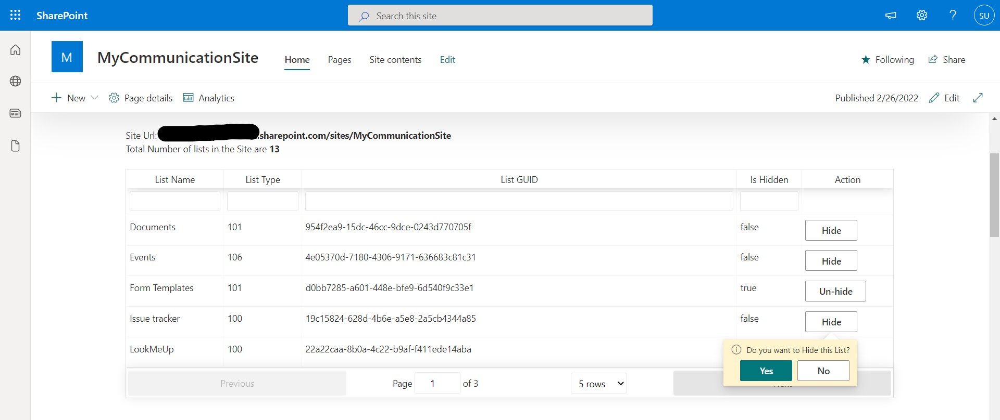

# Hide Lists WebPart

## Summary

SPFx Webpart to Hide/UnHide lists in a Site Collection's Site Contents Page.

As Site Admins we may need to hide some lists or libraries in Site Contents from other users who have access to the lists/libraries.

For example: we may have created a PowerApps form and need to hide master lists or Logs list which has to be kept hidden from end users though they have Read permissions or Edit permissions to the lists/libraries.

So that once the list is hidden, users cannot access the list directly from Site Contents or without knowing list name or list URL.

There are multiple ways to do this by using PowerShell Scripts, Rest Api & MS Flows.

Here same functionality is achieved using SPFx Webpart, which we can just be added to a Site Collection and it will list out the lists and libraries in the site and Site Admin can Hide/Unhide lists with a simple button click.

This Webpart will be accessible only to users with Site Collection Admin access.

PnP Js library to get relevant SharePoint lists and libraries from current Site Collection and use "Hidden" property of lists to hide/Unhide.

## Compatibility

 

-Incompatible-red.svg "SharePoint Server 2016 Feature Pack 2 requires SPFx 1.1")

<!--
  If using SPFx 1.13.1, update the SPFx and Node.js tags accordingly:

  If using SPFx 1.12.1, update the SPFx and Node.js tags accordingly:

 
  If using an older version of SPFx, update the SPFx and Node.js compatibility tag accordingly:
  SPFx 1.11
 
 
 SPFx 1.10
 
 
 SPFx 1.4.1

  If you built this sample specifically for SharePoint 2016, or SharePoint 2019 support, update the SharePoint compatibility tag accordingly:

-Compatible-green.svg)
  If you know your web part only works on the hosted workbench, you can use this for the workbench compatibility tag:

  Otherwise:

  If your web part needs permissions before working in the hosted workbench, let people know;
-yellow.svg "Requires permissions to be granted before this solution can work on the hosted workbench")
  or:

  Otherwise:

 If you specifically built and tested this web part to work with Teams, use this for the Teams compatibility tag:
    
 And if you know for sure that it is NOT compatible with Teams, use this:
    
Don't worry if you're unsure about the compatibility matrix above. We'll verify it when we approve the PR. 
-->

## Applies to

* [SharePoint Framework](https://docs.microsoft.com/sharepoint/dev/spfx/sharepoint-framework-overview)
* [Microsoft 365 tenant](https://docs.microsoft.com/sharepoint/dev/spfx/set-up-your-development-environment)

> Get your own free development tenant by subscribing to [Microsoft 365 developer program](http://aka.ms/o365devprogram)
## Solution
<!--
We use this section to recognize and promote your contributions. Please provide one author per line -- even if you worked together on it.
We'll only use the info you provided here. Make sure to include your full name, not just your GitHub username.
Provide a link to your GitHub profile to help others find more cool things you have done.
If you provide a link to your Twitter profile, we'll promote your contribution on social media.
-->

Solution|Author(s)
--------|---------
react-lists-hide | [Sandeep Unnikrishnan](https://github.com/SandeepDev365/)

## Version history

Version|Date|Comments
-------|----|--------
1.0|February 27, 2022|Initial release

## Prerequisites

Enusre to have Site Collection Admin access to use this WebPart.

<!--
Any special pre-requisites? Include any lists, permissions, offerings to the demo gods, or whatever else needs to be done for this web part to work.
Please describe the steps to configure the pre-requisites. Feel free to add screen shots, but make sure that there is a text description of the steps to perform.
 
-->

## Minimal Path to Awesome

<!-- 
PRO TIP:
For commands, use the `code syntax`
For button labels, page names, dialog names, etc. as they appear on the screen, use **Bold**
Don't use "click", use "select" or "use"
As tempting as it may be, don't just use images to describe the steps. Let's be as inclusive as possible and think about accessibility.
-->

* Clone this repository (or [download this solution as a .ZIP file](https://pnp.github.io/download-partial/?url=https://github.com/pnp/sp-dev-fx-webparts/tree/main/samples/react-lists-hide) then unzip it)
* From your command line, change your current directory to the directory containing this sample (`react-lists-hide`, located under `samples`)
* in the command line run:
  * `npm install`
  * **Update your SharePoint Site Url in serve.json**
  * `gulp serve`

>  This sample can also be opened with [VS Code Remote Development](https://code.visualstudio.com/docs/remote/remote-overview). Visit https://aka.ms/spfx-devcontainer for further instructions.
>  
## Features

* List Out available Lists and Libraries based on template in current Site Collection
* Hide/Unhide Lists on button click

<!--
Note that better pictures and documentation will increase the sample usage and the value you are providing for others. Thanks for your submissions in advance! You rock ❤.
-->

<!--
RESERVED FOR REPO MAINTAINERS
We'll add the video from the community call recording here
## Video

-->

## Help

<!--
You can just search and replace this page with the following values:
Search for:
YOUR-SOLUTION-NAME
Replace with your sample folder name. E.g.: react-my-cool-sample
Search for:
@YOURGITHUBUSERNAME
Replace with your GitHub username, prefixed with an "@". If you have more than one author, use %20 to separate them, making sure to prefix everyone's username individually with an "@".
Example:
@hugoabernier
Or:
@hugoabernier%20@VesaJuvonen%20@PopWarner
-->

We do not support samples, but this community is always willing to help, and we want to improve these samples. We use GitHub to track issues, which makes it easy for  community members to volunteer their time and help resolve issues.

If you're having issues building the solution, please run [spfx doctor](https://pnp.github.io/cli-microsoft365/cmd/spfx/spfx-doctor/) from within the solution folder to diagnose incompatibility issues with your environment.

You can try looking at [issues related to this sample](https://github.com/pnp/sp-dev-fx-webparts/issues?q=label%3A%22sample%3A%20react-lists-hide%22) to see if anybody else is having the same issues.

You can also try looking at [discussions related to this sample](https://github.com/pnp/sp-dev-fx-webparts/discussions?discussions_q=react-lists-hide) and see what the community is saying.

If you encounter any issues while using this sample, [create a new issue](https://github.com/pnp/sp-dev-fx-webparts/issues/new?assignees=&labels=Needs%3A+Triage+%3Amag%3A%2Ctype%3Abug-suspected%2Csample%3A%20react-lists-hide&template=bug-report.yml&sample=react-lists-hide&authors=@SandeepDev365&title=react-lists-hide%20-%20).

For questions regarding this sample, [create a new question](https://github.com/pnp/sp-dev-fx-webparts/issues/new?assignees=&labels=Needs%3A+Triage+%3Amag%3A%2Ctype%3Aquestion%2Csample%3A%20react-lists-hide&template=question.yml&sample=react-lists-hide&authors=@SandeepDev365&title=react-lists-hide%20-%20).

Finally, if you have an idea for improvement, [make a suggestion](https://github.com/pnp/sp-dev-fx-webparts/issues/new?assignees=&labels=Needs%3A+Triage+%3Amag%3A%2Ctype%3Aenhancement%2Csample%3A%20react-lists-hide&template=suggestion.yml&sample=react-lists-hide&authors=@SandeepDev365&title=react-lists-hide%20-%20).

## Disclaimer

**THIS CODE IS PROVIDED *AS IS* WITHOUT WARRANTY OF ANY KIND, EITHER EXPRESS OR IMPLIED, INCLUDING ANY IMPLIED WARRANTIES OF FITNESS FOR A PARTICULAR PURPOSE, MERCHANTABILITY, OR NON-INFRINGEMENT.**

