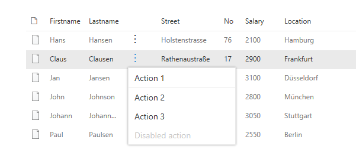
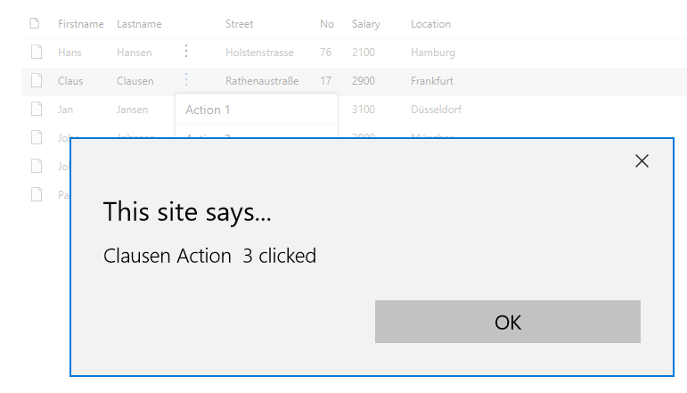

# Employee ListView Contextual Menu

## Summary

This small sample illustrates how to extend the PnP React SPFx ListView control with a contextual menu.

In action this looks like:

Choose a contextual action:

See the result:

For further details see the author's [blog post](https://mmsharepoint.wordpress.com/2018/03/11/extend-pnp-sharepoint-framework-react-listview-control-with-a-context-menu/)

## Compatibility

| :warning: Important          |
|:---------------------------|
| Every SPFx version is only compatible with specific version(s) of Node.js. In order to be able to build this sample, please ensure that the version of Node on your workstation matches one of the versions listed in this section. This sample will not work on a different version of Node.|
|Refer to <https://aka.ms/spfx-matrix> for more information on SPFx compatibility.   |

 

-Incompatible-red.svg "SharePoint Server 2016 Feature Pack 2 requires SPFx 1.1")

## Applies to

- [SharePoint Framework](https://aka.ms/spfx)
- [Microsoft 365 tenant](https://docs.microsoft.com/en-us/sharepoint/dev/spfx/set-up-your-developer-tenant)

## Contributors

* [Markus Moeller](https://github.com/mmsharepoint)

## Version history

Version|Date|Comments
-------|----|--------
1.0|January 1, 2022|Initial release

## Minimal Path to Awesome

- Clone this repository
- Ensure that you are at the solution folder
- in the command-line run:
  - `npm install`
  - `gulp serve`
- With Mockup data you are good to go
- Now you can start to adjust to your own custom list data
  - Uncomment the several blocks inside [EmployeeListView.tsx](src/webparts/emplopyeeListView/components/EmployeeListView.tsx)

## Features

Description of the extension that expands upon high-level summary above.

This extension illustrates the following concepts:

- [PnP React SPFx control ListView](https://pnp.github.io/sp-dev-fx-controls-react/controls/ListView/)
  - [Add contextual menu](https://pnp.github.io/sp-dev-fx-controls-react/controls/ListView.ContextualMenu/)
- [FluentUI Contextual Menu](https://developer.microsoft.com/en-us/fluentui#/controls/web/contextualmenu)

## References

- [Getting started with SharePoint Framework](https://learn.microsoft.com/en-us/sharepoint/dev/spfx/set-up-your-developer-tenant?WT.mc_id=M365-MVP-5004617)
- [Microsoft 365 Patterns and Practices](https://aka.ms/m365pnp) - Guidance, tooling, samples and open-source controls for your Microsoft 365 development

## Help

We do not support samples, but this community is always willing to help, and we want to improve these samples. We use GitHub to track issues, which makes it easy for  community members to volunteer their time and help resolve issues.

If you're having issues building the solution, please run [spfx doctor](https://pnp.github.io/cli-microsoft365/cmd/spfx/spfx-doctor/) from within the solution folder to diagnose incompatibility issues with your environment.

You can try looking at [issues related to this sample](https://github.com/pnp/sp-dev-fx-webparts/issues?q=label%3A%22sample%3A%20react-listview-context-ecb") to see if anybody else is having the same issues.

You can also try looking at [discussions related to this sample](https://github.com/pnp/sp-dev-fx-webparts/discussions?discussions_q=react-listview-context-ecb) and see what the community is saying.

If you encounter any issues while using this sample, [create a new issue](https://github.com/pnp/sp-dev-fx-webparts/issues/new?assignees=&labels=Needs%3A+Triage+%3Amag%3A%2Ctype%3Abug-suspected%2Csample%3A%20react-listview-context-ecb&template=bug-report.yml&sample=react-listview-context-ecb&authors=@mmsharepoint&title=react-listview-context-ecb%20-%20).

For questions regarding this sample, [create a new question](https://github.com/pnp/sp-dev-fx-webparts/issues/new?assignees=&labels=Needs%3A+Triage+%3Amag%3A%2Ctype%3Aquestion%2Csample%3A%20react-listview-context-ecb&template=question.yml&sample=react-listview-context-ecb&authors=@mmsharepoint&title=react-listview-context-ecb%20-%20).

Finally, if you have an idea for improvement, [make a suggestion](https://github.com/pnp/sp-dev-fx-webparts/issues/new?assignees=&labels=Needs%3A+Triage+%3Amag%3A%2Ctype%3Aenhancement%2Csample%3A%20react-listview-context-ecb&template=suggestion.yml&sample=react-listview-context-ecb&authors=@mmsharepoint&title=react-listview-context-ecb%20-%20).

