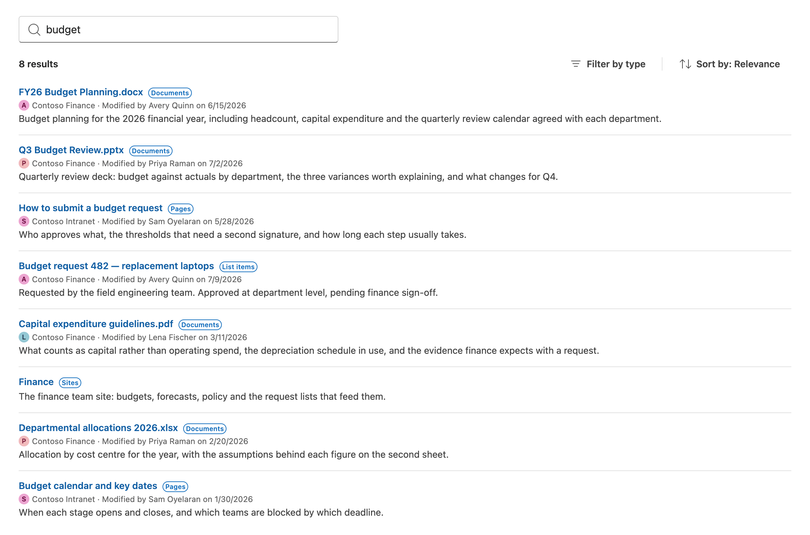

# Microsoft 365 Search Hub

## Summary

**This web part does not demonstrate a feature. It demonstrates an architecture.**

SharePoint already has an excellent search, and this is not trying to replace it. It exists for the case where the search that comes in the box does not fit the problem, somebody has to write code, and the interesting question is how to write it well.

It searches documents, pages, sites and list items through the Microsoft Search API in Microsoft Graph, from one box, on SPFx 1.23.2 with the Heft toolchain and Fluent UI v9.



## When you would write this yourself

Custom search earns its keep when the search has to be part of something else rather than a destination:

* an HR page where searching sits among the other things on the page, instead of sending somebody to a search centre and losing the context they were in
* an engineering portal where only a particular set of sites is worth searching — the **Search scope** property in this sample is that case, narrowed to one site
* a project page where finding the document is a step in the work, not a detour away from it
* an organisation that wants its own metadata, context or actions on a result — this sample shows where the item lives and who last touched it, because that is usually the question behind the search

In each of those the Microsoft Search API gives you the same index SharePoint itself uses, and you build the experience on top.

## What it actually teaches

The search box is the least interesting part. What is worth reading is underneath:

* consuming the Microsoft Search API from a SPFx web part, and what it really returns as opposed to what the documentation lets you assume
* separating a service, a session and a UI, so the concurrency lives in one place instead of being spread through components
* telling a denied permission apart from an expired sign-in, from throttling, from a service having a bad day — and showing each of them differently
* composing Fluent UI v9 rather than assembling controls, and bridging the SharePoint theme onto it so a dark site does not get a light error panel
* debounce, superseded responses, a short cache, paging and state — and testing all of it, races included, without a renderer

If somebody opens this and comes away thinking "I am not going to replace SharePoint search; I now know how to build my own when I need one", it has done its job.

## Scope, and why it stops where it does

This sample searches **content**: documents, pages, sites and list items, in one request, with one permission.

People, Teams messages, mail and calendar are each a separate entity type in the Search API. None of them can be interleaved with content, and each needs its own permission. Adding any one of them means a second request, a second result model and a broader consent — a different sample, not a bigger version of this one. The [Platform notes](#platform-notes) list which permission each would take.

## Compatibility

| :warning: Important          |
|:---------------------------|
| Every SPFx version is optimally compatible with specific versions of Node.js. In order to be able to build this sample, you need to ensure that the version of Node on your workstation matches one of the versions listed in this section. This sample will not work on a different version of Node.|
|Refer to <https://aka.ms/spfx-matrix> for more information on SPFx compatibility.   |

This sample is optimally compatible with the following environment configuration:


-Incompatible-red.svg "SharePoint Server 2016 Feature Pack 2 requires SPFx 1.1")

-yellow.svg "Requires the Sites.Read.All permission to be approved before search returns results")


## Applies to

* [SharePoint Framework](https://learn.microsoft.com/sharepoint/dev/spfx/sharepoint-framework-overview)
* [Microsoft 365 tenant](https://learn.microsoft.com/sharepoint/dev/spfx/set-up-your-development-environment)

> Get your own free development tenant by subscribing to [Microsoft 365 developer program](https://aka.ms/m365/devprogram)

## Contributors

* [João Livio](https://github.com/jtlivio)

## Version history

|Version|Date|Comments|
|-------|----|--------|
|1.0|July 28, 2026|Initial release|

## Prerequisites

The web part reads content through the Microsoft Search API, which needs the **`Sites.Read.All`** delegated permission. One permission covers all of it: `driveItem`, `listItem`, `list` and `site`.

The request is declared in `config/package-solution.json` and an administrator has to approve it after the package is deployed:

1. Go to the SharePoint admin center, **Advanced** > **API access**.
2. Find the pending request for **Microsoft Graph** / **Sites.Read.All**.
3. Select it and choose **Approve**.

**The approval needs a Global Administrator.** Approving a third-party API needs only the application administrator role, but [approving Microsoft Graph requires Global Administrator](https://learn.microsoft.com/sharepoint/api-access), and being a SharePoint administrator [is not sufficient](https://learn.microsoft.com/sharepoint/dev/spfx/web-parts/get-started/using-microsoft-graph-apis#approve-the-requested-microsoft-graph-permissions), because the grant is made against Microsoft Entra ID.

Until that happens the web part still loads and still works as an interface. Searching reports that access was denied and offers a link to the setup instructions, because a tenant that has not approved the permission yet is a normal step in installing this, not a fault.

## Minimal path to awesome

```bash
git clone https://github.com/pnp/sp-dev-fx-webparts.git
cd sp-dev-fx-webparts/samples/react-m365-search-hub
nvm use            # v22.14.0, per .nvmrc
npm install
npm run start      # serve against a hosted workbench
npm run build      # heft test --production && heft package-solution --production
```

`npm run build` runs the tests as part of the build and produces `sharepoint/solution/react-m365-search-hub.sppkg`. Upload it to your app catalog, then approve the permission as described above.

> The SharePoint hosted workbench is deprecated and retires on 1 December 2026. For debugging on a real page, use the [SPFx Debug Toolbar](https://learn.microsoft.com/sharepoint/dev/spfx/debug-toolbar).

## Features

* Search documents, pages, sites and list items in one interleaved Microsoft Graph request
* Scope the search to the whole tenant or to the site the web part sits on
* Filter by content type and sort by relevance or last modified, from a toolbar rather than a form
* Load more results a page at a time, appended rather than replacing
* Where a result lives and who last changed it, shown where Microsoft Graph knows them
* Distinct designed states for loading, no results, denied access, throttling and service errors
* An optional performance panel showing what the last request cost
* Full keyboard operation, `aria-live` announcements, results as a semantic list, no information carried by colour alone
* Every colour from the host theme; every visible and audible string from the localisation files

## How it is put together

```text
src/webparts/m365SearchHub/
├── components/   search box, toolbar, results, states, performance panel
├── hooks/        SearchSession (no React) and the thin useSearch adapter
├── services/     GraphSearchService, SearchCache, error normalisation, theme bridge
├── models/
├── utils/        query building, KQL escaping, result normalisation
└── loc/
```

Query building, result normalisation and the search state machine are plain functions and classes with no React in them. That is what makes the difficult part — debounce racing a superseded response racing an unmount — testable without a renderer, and it is why `useSearch` is a thin adapter with no tests of its own.

## Testing

The tests check behaviour rather than internals, so the code can be rearranged without rewriting them. Each guard has a test that fails when that guard alone is removed, which is a stricter bar than coverage and one this sample failed twice before it passed.

```bash
npm test          # heft test
npm run build     # runs the tests too
```

What is covered:

* query construction, KQL escaping, and the search scope restriction
* cache keys, expiry, eviction, and the rule that failures are never cached
* paging, and starting over when the scope or the sort changes
* result normalisation across the several shapes one response contains
* error mapping: a denied permission, an expired sign-in, throttling and a service error, each told apart
* abandoned requests and the races between debounce, a superseded response and an unmount
* the SharePoint to Fluent UI v9 theme conversion, asserted on the tokens the base actually decides
* the small utilities: formatting, result counts, file names, locations

## Platform notes

A few platform behaviours shaped the design of this sample. Each one is easy to assume wrongly, and each one was measured rather than read.

### Microsoft Graph permissions

This sample requests only `Sites.Read.All`. That is enough to search SharePoint sites, document libraries, pages and list items through Microsoft Graph Search.

Other entity types need a different permission and a different result model, and cannot be interleaved into the same request:

| Entity type | Additional permission |
| ----------- | --------------------- |
| People | `People.Read` |
| Teams messages | `Chat.Read` or `ChannelMessage.Read.All` |
| Mail | `Mail.Read` |
| Calendar | `Calendars.Read` |

Those scenarios are deliberately outside the scope of this sample.

### Graph SDK retries

The Microsoft Graph client that SPFx provides retries transient failures itself — `429`, `503` and `504` — and honours `Retry-After`.

This sample implements no retry policy of its own and never loops. While the Graph client is retrying, the interface stays in its loading state; a `429` carrying `Retry-After: 45` holds it there for that long. The throttled and service error states appear only once the client has given up, and their **Try again** button is the only retry a person can trigger.

### Request cancellation

`MSGraphClientV3` exposes no way to cancel a request: the Graph JavaScript client's signature is `post(content, callback)`, with no `AbortSignal`.

When a newer search supersedes an older one, the earlier response is therefore **abandoned, not aborted**. The request still travels and still costs its round trip; its answer is discarded and never reaches the interface.

### A `403` is a denial, not a diagnosis

A permission still pending approval is the likeliest cause on a fresh install, but conditional access policy and tenant restrictions return the same status. The wording says access was denied and asks an administrator to verify, rather than naming a cause it cannot know.

Per-item access is separate: Microsoft Graph security trims the results, which returns fewer of them and never a `403`.

### SharePoint theming

SharePoint provides a Fluent v8 theme through the SPFx `ThemeProvider` service; Fluent v9 has a palette of its own. `createV9Theme` bridges the two, starting from `webDarkTheme` or `webLightTheme` according to `isInverted`.

That base matters more than it looks. The neutral colours come from the site either way, but the status palette does not: start a dark site from the light base and the error surface comes out near-white on a dark page, in the exact place this web part reports a failed search.

### Fluent UI `Card` and Tabster

The results are composed from Fluent typography and a `Divider` rather than `Card`, and not for taste. `Card` calls `useFocusableGroup` unconditionally, even with `focusMode: 'off'`, which asks Tabster for a groupper. A SharePoint page already owns a Tabster instance, built from an older version whose core has no `attrHandlers`, and asking it for a groupper throws — taking the web part down with it.

### The clear button is not a tab stop

The native Fluent `SearchBox` dismiss button is used as it comes, and Fluent gives it `tabIndex="-1"` deliberately, so <kbd>Tab</kbd> does not reach it. Somebody working from the keyboard clears the box by selecting the text and deleting it.

What this sample does change is its accessible name: Fluent hardcodes the English word "clear", so it is replaced from the localisation files. Focus returns to the input after clearing, which is Fluent's own behaviour and needed no code here.

### What Microsoft Graph returns

Requesting nothing gets you almost nothing. Without an explicit `fields` list, a hit arrives with `@odata.type`, `name`, `webUrl` and `lastModifiedDateTime` and no more, which is why an early version of this sample showed file names as titles and guessed locations from the URL.

Asked properly, and measured across live results: `title`, `siteTitle`, `createdBy` and `lastModifiedBy` come back for every `driveItem` and `listItem`, and none of them for a `site`, which has no author. That is why the person shown beside a result appears only where there is a person to show.

The `summary` is undocumented as to format. In practice it carries `<c0>…</c0>` around matched terms and `<ddd/>` where text was cut out; both are handled and everything else is left exactly as it came, because the summary is rendered as text and stripping markup wholesale would eat content belonging to the document.

## Test the error handling with Dev Proxy

The unit tests model Microsoft Graph's responses. [Dev Proxy](https://github.com/dotnet/dev-proxy) lets you see the real HTTP path instead, with no change to the sample and no dependency added to it.

```bash
devproxy --config-file your-config.json
```

Watch `https://graph.microsoft.com/*/search/query*` and inject a `403`, a `429` with `Retry-After`, a `503`, or several seconds of latency. Two things are worth setting up correctly, because getting either wrong makes the sample look broken when it is not:

* **Match the `POST`, not the `OPTIONS`.** Failing the CORS preflight stops the browser sending the real request at all, so the client reports a network failure rather than the status you injected. The sample correctly classifies that as an unknown failure, which looks like a bug in the error handling until you notice what was actually failed.
* **Include CORS headers on the simulated response.** Microsoft Graph returns them on its error responses. Without `Access-Control-Allow-Origin` the browser hides the response from the caller and, again, the sample sees a network failure instead of your `403`.

Also give the SDK's own retries time to finish before drawing conclusions. A short observation window makes a request that is quietly retrying look like one that is stuck.

## References

* [Use the Microsoft Search API to query data](https://learn.microsoft.com/graph/api/resources/search-api-overview)
* [Search OneDrive and SharePoint content](https://learn.microsoft.com/graph/search-concept-files)
* [Use the MSGraphClientV3 to connect to Microsoft Graph](https://learn.microsoft.com/sharepoint/dev/spfx/use-msgraph)
* [Manage access to Microsoft Entra ID-secured APIs](https://learn.microsoft.com/sharepoint/api-access)
* [Supporting section backgrounds](https://learn.microsoft.com/sharepoint/dev/spfx/web-parts/guidance/supporting-section-backgrounds)
* [Microsoft 365 Patterns and Practices](https://aka.ms/m365pnp) – Community-driven guidance, samples, and open-source tools

## Help

We do not support samples, but this community is always willing to help, and we want to improve these samples. We use GitHub to track issues, which makes it easy for community members to volunteer their time and help resolve issues.

If you're having issues building the solution, please run [spfx doctor](https://pnp.github.io/cli-microsoft365/cmd/spfx/spfx-doctor/) from within the solution folder to diagnose incompatibility issues with your environment.

You can try looking at [issues related to this sample](https://github.com/pnp/sp-dev-fx-webparts/issues?q=label%3A%22sample%3A%20react-m365-search-hub%22) to see if anybody else is having the same issues.

You can also try looking at [discussions related to this sample](https://github.com/pnp/sp-dev-fx-webparts/discussions?discussions_q=react-m365-search-hub) and see what the community is saying.

If you encounter any issues using this sample, [create a new issue](https://github.com/pnp/sp-dev-fx-webparts/issues/new?assignees=&labels=Needs%3A+Triage+%3Amag%3A%2Ctype%3Abug-suspected%2Csample%3A%20react-m365-search-hub&template=bug-report.yml&sample=react-m365-search-hub&authors=@jtlivio&title=react-m365-search-hub%20-%20).

For questions regarding this sample, [create a new question](https://github.com/pnp/sp-dev-fx-webparts/issues/new?assignees=&labels=Needs%3A+Triage+%3Amag%3A%2Ctype%3Aquestion%2Csample%3A%20react-m365-search-hub&template=question.yml&sample=react-m365-search-hub&authors=@jtlivio&title=react-m365-search-hub%20-%20).

Finally, if you have an idea for improvement, [make a suggestion](https://github.com/pnp/sp-dev-fx-webparts/issues/new?assignees=&labels=Needs%3A+Triage+%3Amag%3A%2Ctype%3Aenhancement%2Csample%3A%20react-m365-search-hub&template=suggestion.yml&sample=react-m365-search-hub&authors=@jtlivio&title=react-m365-search-hub%20-%20).

## Disclaimer

**THIS CODE IS PROVIDED *AS IS* WITHOUT WARRANTY OF ANY KIND, EITHER EXPRESS OR IMPLIED, INCLUDING ANY IMPLIED WARRANTIES OF FITNESS FOR A PARTICULAR PURPOSE, MERCHANTABILITY, OR NON-INFRINGEMENT.**


