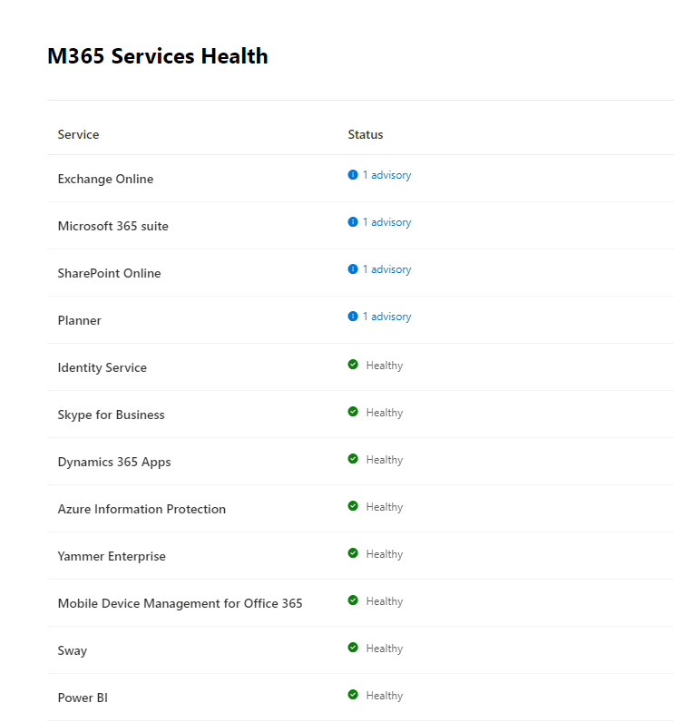
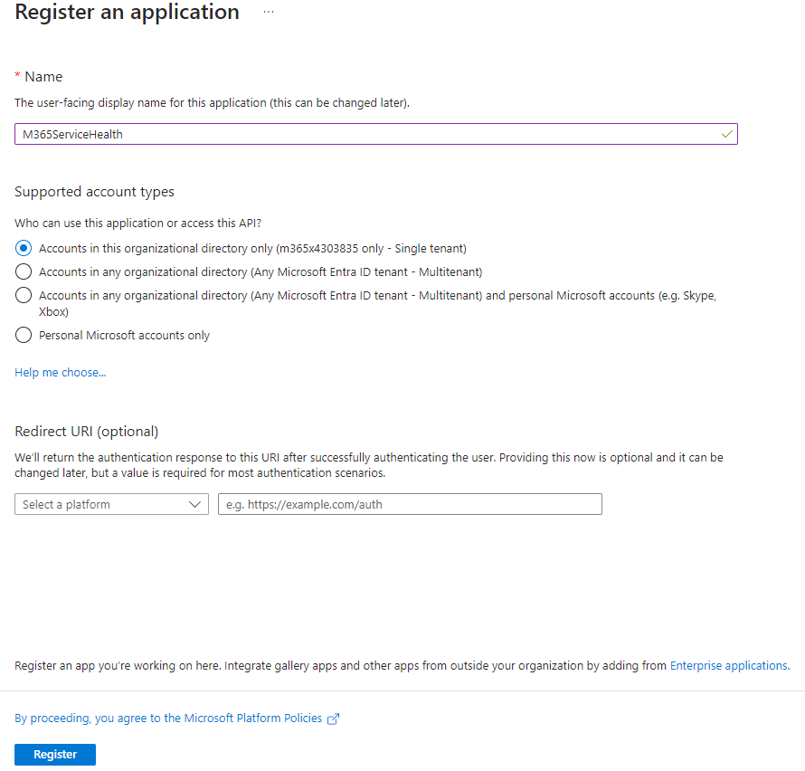
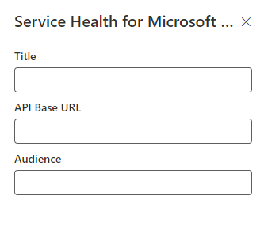

# Service Health for Microsoft 365

## Summary

Contains SPFx web part & Azure Function with below functionalities

1. Azure Function to get the health status of all the M365 services using delegate or application permission.
2. SPFx web part shows the health status for all the M365 services.
3. SPFx web part shows the complete details including all the updates for all the impacted services.




## Compatibility

| :warning: Important                                                                                                                                                                                                                                                                           |
| :-------------------------------------------------------------------------------------------------------------------------------------------------------------------------------------------------------------------------------------------------------------------------------------------- |
| Every SPFx version is only compatible with specific version(s) of Node.js. In order to be able to build this sample, please ensure that the version of Node on your workstation matches one of the versions listed in this section. This sample will not work on a different version of Node. |
| Refer to <https://aka.ms/spfx-matrix> for more information on SPFx compatibility.                                                                                                                                                                                                             |

This sample is optimally compatible with the following environment configuration:


-Incompatible-red.svg> "SharePoint Server 2016 Feature Pack 2 requires SPFx 1.1")


For more information about SPFx compatibility, please refer to <https://aka.ms/spfx-matrix>

## Applies to

- [SharePoint Framework](https://learn.microsoft.com/sharepoint/dev/spfx/sharepoint-framework-overview)
- [Microsoft 365 tenant](https://learn.microsoft.com/sharepoint/dev/spfx/set-up-your-development-environment)

> Get your own free development tenant by subscribing to [Microsoft 365 developer program](http://aka.ms/m365devprogram)

## Prerequisites

- SharePoint Online tenant
- Valid Azure subscription

Steps to follow:

- Entra ID App Registration:

  1. Register new Entra ID App in [Azure portal](https://portal.azure.com/).
  2. Select App registrations.
  3. Select New registration.
  4. For Supported account types, select Accounts in this organization directory only. Leave the other options as is.
  5. Select Register.

  

  6. After registering the application, you can find the application (client) ID and Directory (tenant) ID from the overview menu option of Entra ID App. Make a note of the values for use later.
  7. Select Certificates & Secrets in the manage section of Entra ID app created and select New Client Secret. Select Recommended 6 months in the Expires field. This new secret will be valid for six months. You can also choose different values such as:

     - 03 months
     - 12 months
     - 24 months
     - Custom start date and end date.

  8. Select API Permissions option of Entra ID app created.
  9. Select Add a permission.
  10. Select Microsoft Graph and add permissions as per below:

      - Select Delegate permissions and then select ServiceHealth.Read.All, if you want to run the Service health web part based on user permssions. User must have 'Message center Reader' role to access the service health status.
      - Select Application permissions and then select ServiceHealth.Read.All, if you want to run the Service health web part in elevated permissions mode.

  11. Select Expose an API and Select Add next to Application ID URI. You can use the default value of api://<application-client-id> or another supported [App ID URI pattern](https://learn.microsoft.com/en-us/entra/identity-platform/reference-app-manifest#identifieruris-attribute).Make a note of the applicaiton ID URI for use later.

- Azure Function App Deployment:
  Azure Function can be deployed using Visual Studio or Visual Studio code. Alternatively PowerShell can be used to deploy the Azure Function and to configure the required configuration settings. Below are the steps required to deploy Azure function:

  1. Open [AzureFunctionDeployment.ps1](./PowerShell/AzureFunctionDeployment.ps1).
  2. Update the required variables and execute the PowerShell script. Please note that provided PowerShell use [Azure-CLI](https://learn.microsoft.com/en-us/cli/azure/what-is-azure-cli) commands.

- SPFx configuration

  1. You have to provide permission in SharePoint admin for accessing azure function on behalf of your solution. You can do it before deployment as proactive steps, or after deployment. You can refer to [steps about how to do this post-deployment](https://learn.microsoft.com/sharepoint/dev/spfx/use-aad-tutorial#deploy-the-solution-and-grant-permissions). You have to use API Access Page of SharePoint admin and add below permission for our use case.

  ```
  "webApiPermissionRequests": [
        {
          "resource": <Replace with Application ID URI created during `Expose an API' step>,
          "scope": "ServiceHealth.Read.All"
        }
      ]

  ```

  2. Provide the values in web part properties as per below

     - Provide the Azure function app URL(without /api/m365servicehealth) in API Base URL property
     - Provide Application ID URI(created during 'Expose an API' step) in Audience property

     

## Contributors

[Harminder Singh](https://github.com/HarminderSethi)

## Version history

| Version | Date               | Comments                            |
| ------- | ------------------ | ----------------------------------- |
| 1.0     | February 15, 2023  | Initial release                     |
| 2.0     | February 10, 2024  | Implementation using Azure Function |
| 3.0     | September 05, 2024 | Bug fix and SPFx version upgrade    |
| 3.1     | October 05, 2024   | SPFx version upgrade                |

## Minimal Path to Awesome

- Clone this repository (or [download this solution as a .ZIP file](https://pnp.github.io/download-partial/?url=https://github.com/pnp/sp-dev-fx-webparts/tree/main/samples/react-m365-services-health) then unzip it)
- From your command line, change your current directory to the directory containing this sample (`react-m365-services-health`, located under `samples`)
- in the command line run:
  - `npm install`
  - `gulp serve`

> This sample can also be opened with [VS Code Remote Development](https://code.visualstudio.com/docs/remote/remote-overview). Visit <https://aka.ms/spfx-devcontainer> for further instructions.

## Features

1. Show the health status for all the M365 services
2. Complete details including all the updates for all the impacted services

## References

- [Getting started with SharePoint Framework](https://docs.microsoft.com/en-us/sharepoint/dev/spfx/set-up-your-developer-tenant)
- [Building for Microsoft teams](https://docs.microsoft.com/en-us/sharepoint/dev/spfx/build-for-teams-overview)
- [Use Microsoft Graph in your solution](https://docs.microsoft.com/en-us/sharepoint/dev/spfx/web-parts/get-started/using-microsoft-graph-apis)
- [Publish SharePoint Framework applications to the Marketplace](https://docs.microsoft.com/en-us/sharepoint/dev/spfx/publish-to-marketplace-overview)
- [Microsoft 365 Patterns and Practices](https://aka.ms/m365pnp) - Guidance, tooling, samples and open-source controls for your Microsoft 365 development

## Help

We do not support samples, but this community is always willing to help, and we want to improve these samples. We use GitHub to track issues, which makes it easy for community members to volunteer their time and help resolve issues.

If you're having issues building the solution, please run [spfx doctor](https://pnp.github.io/cli-microsoft365/cmd/spfx/spfx-doctor/) from within the solution folder to diagnose incompatibility issues with your environment.

You can try looking at [issues related to this sample](https://github.com/pnp/sp-dev-fx-webparts/issues?q=label%3A%22sample%3A%20react-m365-services-health%22) to see if anybody else is having the same issues.

You can also try looking at [discussions related to this sample](https://github.com/pnp/sp-dev-fx-webparts/discussions?discussions_q=react-m365-services-health) and see what the community is saying.

If you encounter any issues using this sample, [create a new issue](https://github.com/pnp/sp-dev-fx-webparts/issues/new?assignees=&labels=Needs%3A+Triage+%3Amag%3A%2Ctype%3Abug-suspected%2Csample%3A%20react-m365-services-health&template=bug-report.yml&sample=react-m365-services-health&authors=@HarminderSethi&title=react-m365-services-health%20-%20).

For questions regarding this sample, [create a new question](https://github.com/pnp/sp-dev-fx-webparts/issues/new?assignees=&labels=Needs%3A+Triage+%3Amag%3A%2Ctype%3Aquestion%2Csample%3A%20react-m365-services-health&template=question.yml&sample=react-m365-services-health&authors=@HarminderSethi&title=react-m365-services-health%20-%20).

Finally, if you have an idea for improvement, [make a suggestion](https://github.com/pnp/sp-dev-fx-webparts/issues/new?assignees=&labels=Needs%3A+Triage+%3Amag%3A%2Ctype%3Aenhancement%2Csample%3A%20react-m365-services-health&template=suggestion.yml&sample=react-m365-services-health&authors=@HarminderSethi&title=react-m365-services-health%20-%20).

## Disclaimer

**THIS CODE IS PROVIDED _AS IS_ WITHOUT WARRANTY OF ANY KIND, EITHER EXPRESS OR IMPLIED, INCLUDING ANY IMPLIED WARRANTIES OF FITNESS FOR A PARTICULAR PURPOSE, MERCHANTABILITY, OR NON-INFRINGEMENT.**


---
