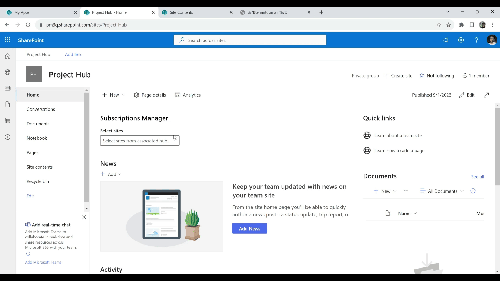

# Subscription Manager

## Summary

This sample web part demonstrates managing the list subscriptions (sharepoint webhooks) and action to renew the webhook expiration date using Rest calls. The webpart is to be added at Hubsite level or the sites associated to the hubsite, on selection of the site, it will list out the lists available. On list/library selection, the available subscriptions is displayed. Depending upon the expiry date of the subscription, 'Renew subscription' action can be performed. The subscription (webhook expiry renewal date) renewal date is set to 179 days, as the default days are 180. 

# Subscription Manager

# Configuring subscription manager webpart

# Renewing webhook subscriptions

# Configuration error while adding the webpart to Non-Hub related sites 

## Compatibility

| :warning: Important          |
|:---------------------------|
| Every SPFx version is only compatible with specific version(s) of Node.js. In order to be able to build this sample, please ensure that the version of Node on your workstation matches one of the versions listed in this section. This sample will not work on a different version of Node.|
|Refer to <https://aka.ms/spfx-matrix> for more information on SPFx compatibility.   |

 

-Incompatible-red.svg "SharePoint Server 2016 Feature Pack 2 requires SPFx 1.1")

## Prerequisites

This web part requires access to lists and libraries to perform renewing the webhook subscription 

## References

*[Get Subscription](https://learn.microsoft.com/en-us/sharepoint/dev/apis/webhooks/lists/get-subscription)
*[Update Subscription](https://learn.microsoft.com/en-us/sharepoint/dev/apis/webhooks/lists/update-subscription)

## Minimal Path to Awesome

- Clone this repository (or [download this solution as a .ZIP file](https://pnp.github.io/download-partial/?url=https://github.com/pnp/sp-dev-fx-webparts/tree/main/samples/react-manage-hublevel-subscriptions) then unzip it)
- From your command line, change your current directory to the directory containing this sample (`react-manage-hublevel-subscriptions`, located under `samples`)
- in the command-line run:
  - `npm install`
  - `gulp serve`

>  This sample can also be opened with [VS Code Remote Development](https://code.visualstudio.com/docs/remote/remote-overview). Visit https://aka.ms/spfx-devcontainer for further instructions.

## Contributors

* [Nishkalank Bezawada](https://github.com/NishkalankBezawada)

## Version history

Version|Date|Comments
-------|----|--------
1.0|September 9, 2023|Initial release

## Help

We do not support samples, but this community is always willing to help, and we want to improve these samples. We use GitHub to track issues, which makes it easy for  community members to volunteer their time and help resolve issues.

If you're having issues building the solution, please run [spfx doctor](https://pnp.github.io/cli-microsoft365/cmd/spfx/spfx-doctor/) from within the solution folder to diagnose incompatibility issues with your environment.

You can try looking at [issues related to this sample](https://github.com/pnp/sp-dev-fx-webparts/issues?q=label%3A%22sample%3A%20react-manage-hublevel-subscriptions%22) to see if anybody else is having the same issues.

You can also try looking at [discussions related to this sample](https://github.com/pnp/sp-dev-fx-webparts/discussions?discussions_q=react-manage-hublevel-subscriptions) and see what the community is saying.

If you encounter any issues while using this sample, [create a new issue](https://github.com/pnp/sp-dev-fx-webparts/issues/new?assignees=&labels=Needs%3A+Triage+%3Amag%3A%2Ctype%3Abug-suspected%2Csample%3A%20react-manage-hublevel-subscriptions&template=bug-report.yml&sample=react-manage-hublevel-subscriptions&authors=@NishkalankBezawada&title=react-manage-hublevel-subscriptions%20-%20).

For questions regarding this sample, [create a new question](https://github.com/pnp/sp-dev-fx-webparts/issues/new?assignees=&labels=Needs%3A+Triage+%3Amag%3A%2Ctype%3Aquestion%2Csample%3A%20react-manage-hublevel-subscriptions&template=question.yml&sample=react-manage-hublevel-subscriptions&authors=@NishkalankBezawada&title=react-manage-hublevel-subscriptions%20-%20).

Finally, if you have an idea for improvement, [make a suggestion](https://github.com/pnp/sp-dev-fx-webparts/issues/new?assignees=&labels=Needs%3A+Triage+%3Amag%3A%2Ctype%3Aenhancement%2Csample%3A%20react-manage-hublevel-subscriptions&template=suggestion.yml&sample=react-manage-hublevel-subscriptions&authors=@NishkalankBezawada&title=react-manage-hublevel-subscriptions%20-%20).

## Disclaimer

**THIS CODE IS PROVIDED *AS IS* WITHOUT WARRANTY OF ANY KIND, EITHER EXPRESS OR IMPLIED, INCLUDING ANY IMPLIED WARRANTIES OF FITNESS FOR A PARTICULAR PURPOSE, MERCHANTABILITY, OR NON-INFRINGEMENT.**

