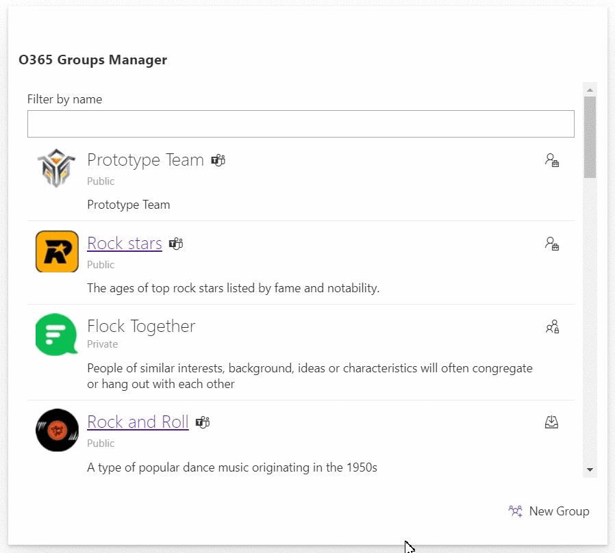
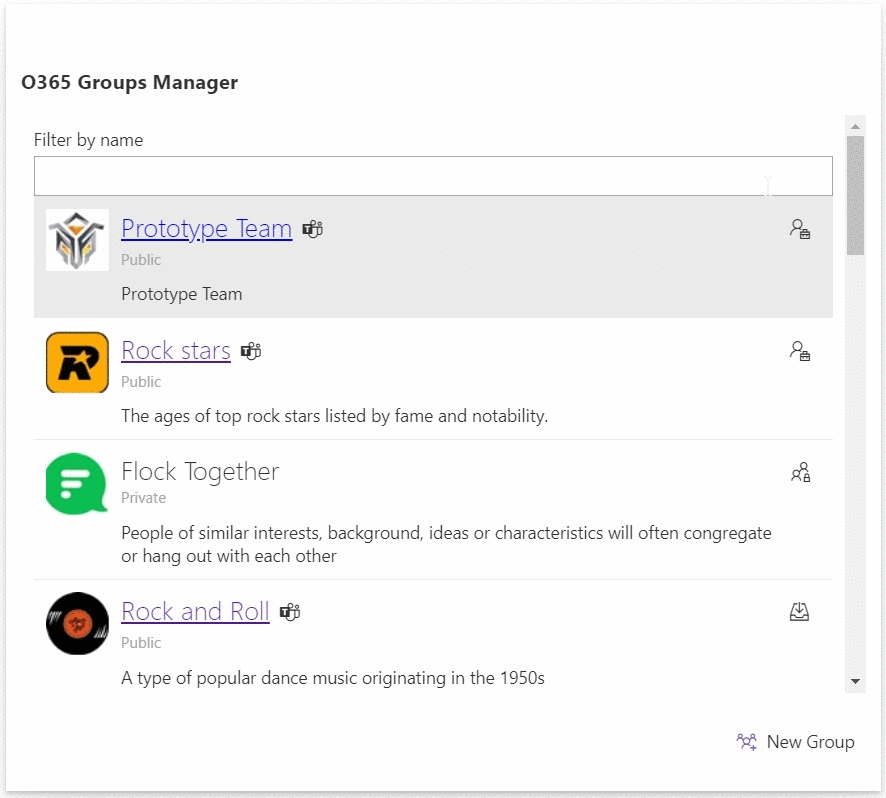
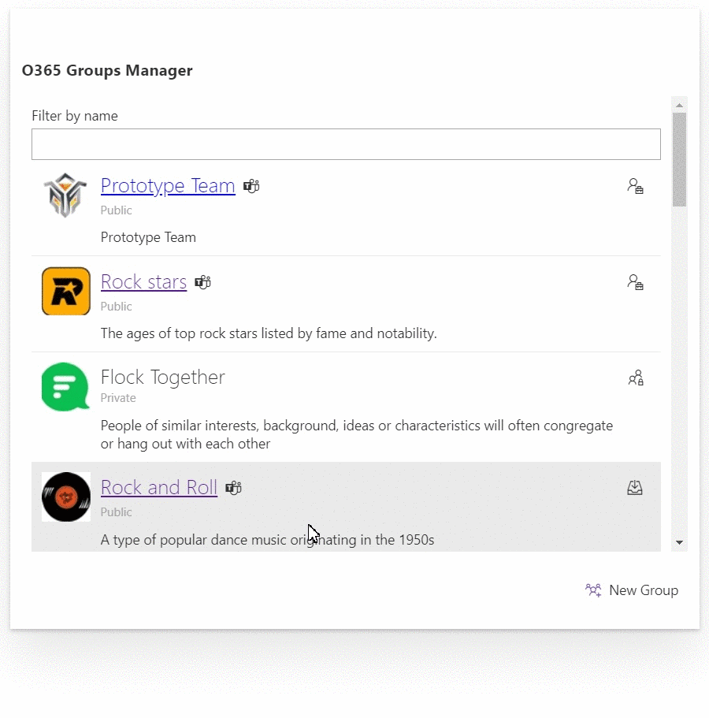
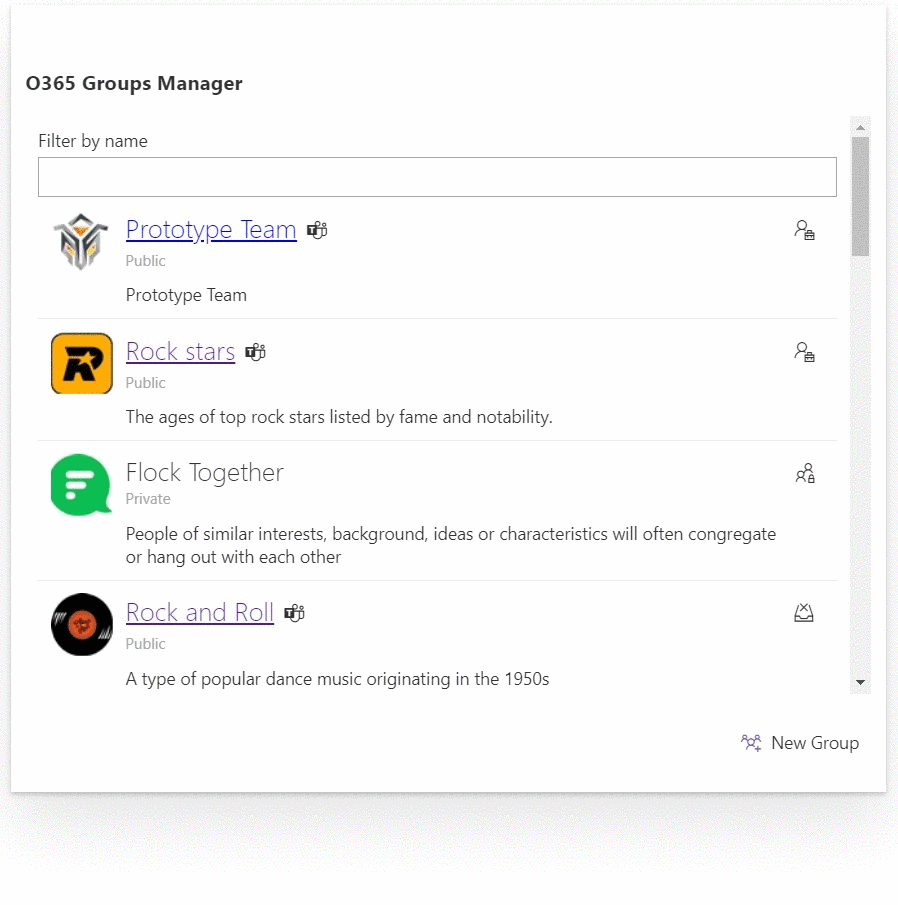
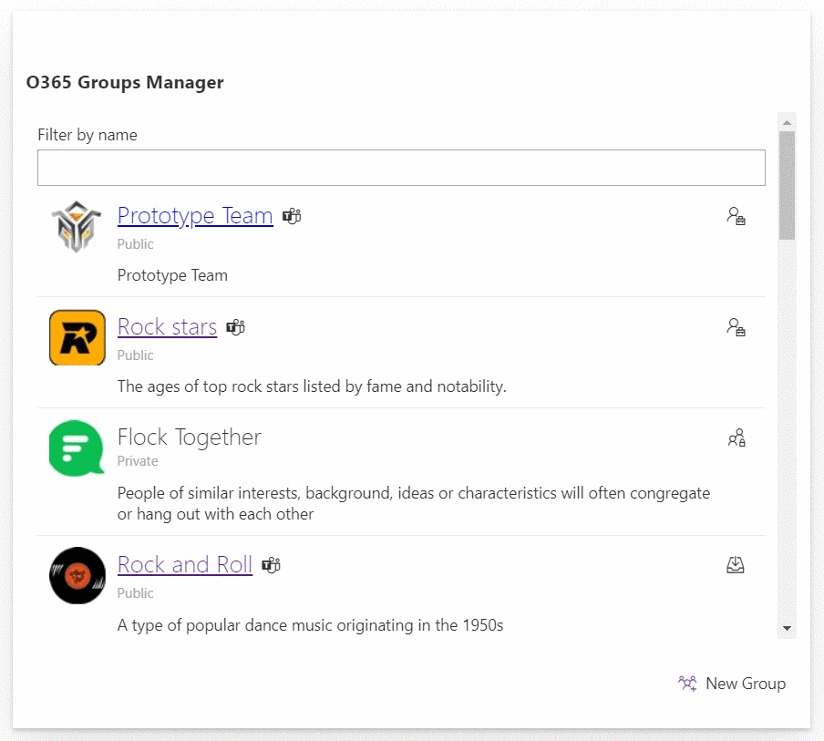
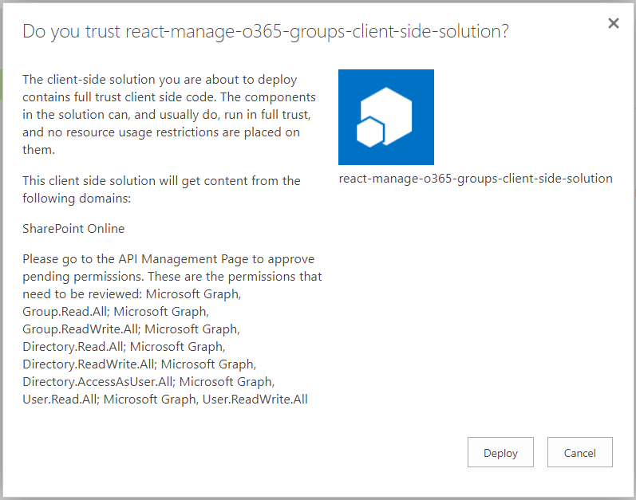
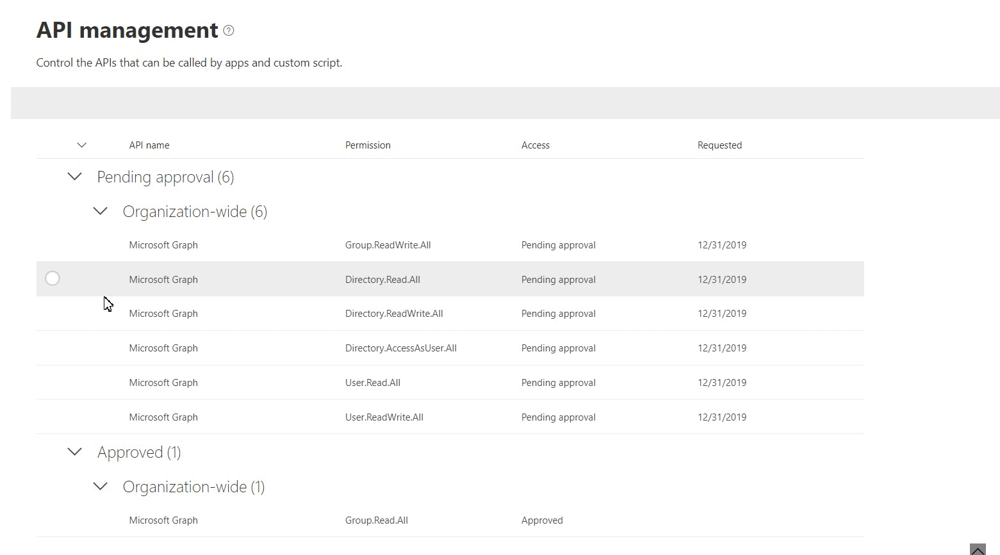

## Manage Office 365 Groups with SPFx

### Summary 
Office 365 Groups is the foundational membership service, that drives all teamwork across Microsoft 365. Once in a group, we can get the benefits of the group-connected services like shared Outlook inbox, shared calendar, SharePoint site, Planner, Power BI, Yammer, and Teams.

Is there a way to see all Office 365 Groups in a tenant?
*Yes, partially. You can view and manage your own groups in Outlook on the web.* 

This SPFx solution goes beyond this limitation and provides below functionalities using MS Graph APIs:
1. List all public and private groups with basic information (name, description, privacy, logo, etc.)
2. Search the group
3. Join and leave public groups
4. Join a private group with approval of group administrator (using Power Automate flow) and leave the private group
5. Manage group link for administrators
6. Browse MS Teams associated with group
7. Set up new group



### NPM Packages Used
Below NPM package(s) are used to develop this sample:
1. PnP/PnPjs (https://pnp.github.io/pnpjs/)
2. @pnp/spfx-controls-react (https://sharepoint.github.io/sp-dev-fx-controls-react/)

### Project setup and important files
```txt
react-manage-o365-groups
    ├── Power Automate Flow                                 <-- Power Automate Flow Templates
    │   └── Logic Apps Template
    │           └── Join Private Group.json
    │       └── Package
    │           └── JoinPrivateGroup_20191230151251.zip
    └── src
        └── models
            ├── IGroup.ts
            ├── ITeamChannel.ts 
        └── services
            ├── O365GroupService.ts                         <-- Extensible Service
        └── webparts
            └── o365GroupsManager
                ├── O365GroupsManagerWebPart.manifest.json
                ├── O365GroupsManagerWebPart.ts
                ├── components
                │   └── O365GroupsManager
                │   │   ├── O365GroupsManager.tsx           <-- Group Management Component
                │   │   ├── O365GroupsManager.module.scss
                │   │   ├── IO365GroupsManagerProps.ts
                │   │   ├── IO365GroupsManagerState.ts
                │   └── GroupList                           <-- Group Listing Component
                |   │   ├── GroupList.tsx
                |   │   ├── IGroupListProps.ts
                |   │   ├── IGroupListState.ts
                │   └── NewGroup                            <-- New Group Creation Component
                |       ├── NewGroup.tsx
                |       ├── INewGroupProps.ts
                |       ├── INewGroupState.ts
                └── loc
                    ├── en-us.js
                    └── mystrings.d.ts
```

## Used SharePoint Framework Version 


# Demo
The SPFx solution provides below functionalities:

## O365 Group Listing and Search
The web part lists all public and private O365 groups and helps to search the group by name.




Below are the list of options available for user based on the role.

Group Visibility|Role|Action
----------------|----|------
Public|Owner|Manage Group
Public|Member|Leave Group
Public|-|Join Group
Private|Owner|Manage Group
Private|Member|Leave Group
Private|-|Request to Join Group

## Join the Public Group
Clicking "Join Group" icon against the O365 group helps to join the public group.



## Join the Private Group
Clicking "Request to Join Group" icon against the O365 group helps to send the approval request to the owners of the private group. The approval takes place using Power Automate.


## Leave the Group
Clicking "Leave Group" icon against the O365 group helps to leave the public and private group.



## Create New Group
The web part helps to create new O365 group.



## Applies to
* [SharePoint Framework Developer Preview](https://docs.microsoft.com/sharepoint/dev/spfx/sharepoint-framework-overview)
* [SharePoint Online](https://docs.microsoft.com/en-us/sharepoint/sharepoint-online)
* [Office 365 developer tenant](https://docs.microsoft.com/sharepoint/dev/spfx/set-up-your-developer-tenant)

# WebPart Properties
Property|Type|Required|Comments
--------|----|--------|--------
Flow URL|Text|No|URL of MS Flow (Power Automate) to join the private group

# Solution

Solution|Author(s)
--------|---------
react-manage-o365-groups|[Nanddeep Nachan](https://www.linkedin.com/in/nanddeepnachan/) (SharePoint Consultant, [@NanddeepNachan](https://twitter.com/NanddeepNachan) )
&nbsp;|[Smita Nachan](https://www.linkedin.com/in/smitanachan/) (SharePoint Consultant, [@SmitaNachan](https://twitter.com/SmitaNachan) )

## Version history

Version|Date|Comments
-------|----|--------
1.0.0|January 01, 2020|Initial release


# Disclaimer
**THIS CODE IS PROVIDED *AS IS* WITHOUT WARRANTY OF ANY KIND, EITHER EXPRESS OR IMPLIED, INCLUDING ANY IMPLIED WARRANTIES OF FITNESS FOR A PARTICULAR PURPOSE, MERCHANTABILITY, OR NON-INFRINGEMENT.**

---

# Prerequisites

- Administrative access to Azure AD of Office 365 tenant
- Permissions to create a flow in Power Automate (prior MS Flow)
- Set up Power Automate flow for approval to join private group. Please refer [Calling Graph API from Power Automate Flow](https://www.c-sharpcorner.com/article/calling-graph-api-from-power-automate-flow/)
- SharePoint Online tenant 
- Site Collection created under the **/sites/** or **/**- 
- You need following set of permissions in order to manage Office 365 groups. Find out more about consuming the [Microsoft Graph API in the SharePoint Framework](https://docs.microsoft.com/en-us/sharepoint/dev/spfx/use-aad-tutorial)
```
"webApiPermissionRequests": [  
    {
        "resource": "Microsoft Graph",
        "scope": "Group.Read.All"
    },
    {
        "resource": "Microsoft Graph",
        "scope": "Group.ReadWrite.All"
    },
    {
        "resource": "Microsoft Graph",
        "scope": "Directory.Read.All"
    },
    {
        "resource": "Microsoft Graph",
        "scope": "Directory.ReadWrite.All"
    },
    {
        "resource": "Microsoft Graph",
        "scope": "Directory.AccessAsUser.All"
    },
    {
        "resource": "Microsoft Graph",
        "scope": "User.Read.All"
    },
    {
        "resource": "Microsoft Graph",
        "scope": "User.ReadWrite.All"
    }
]
```

# Minimal Path to Awesome

- Clone this repo
- Navigate to the folder with current sample
- Restore dependencies: `$ npm i`
- Bundle the solution: `$ gulp bundle --ship`
- Package the solution: `$ gulp package-solution --ship`
- Locate the solution at `./sharepoint/solution/react-manage-o365-groups.sppkg` and upload it to SharePoint tenant app catalog
- You will see a message saying that solution has pending permissions which need to be approved:

- Approve the permission requests. There are [different options available](https://docs.microsoft.com/en-us/sharepoint/dev/spfx/use-aadhttpclient#manage-permission-requests) - new SharePoint Admin UI, PowerShell, [`$o365`](https://pnp.github.io/office365-cli/) cli. 
- For the matter of this sample, the fastest way to do it is through new SharePoint Admin UI. 
- Open Web API permission management page by navigating to the url `https://<tenant>-admin.sharepoint.com/_layouts/15/online/AdminHome.aspx#/webApiPermissionManagement` (change the `<tenant>` to your O365 tenant name) or by going to the new Admin UI directly from old SharePoint Admin Center. 
- Select pending requests and approve it:

- Run `$ gulp serve --nobrowser`
- Open hosted workbench, i.e. `https://<tenant>.sharepoint.com/sites/<your site>/_layouts/15/workbench.aspx`
- Search and add `O365 Groups Manager` web part to see it in action

# Features
This project contains sample client-side web part built on the SharePoint Framework illustrating possibilities to manage Office 365 Groups using React and MS Graph.

This sample illustrates the following concepts on top of the SharePoint Framework:
- Using PnP/PnPjs
- Creating extensible services
- Explore MS Graph APIs for Office 365 Group
- Using the MSGraphClient in a SharePoint Framework web part
- Requesting API permissions in a SharePoint Framework package
- Communicating with the Microsoft Graph using its REST API
- Using Office UI Fabric controls for building SharePoint Framework client-side web parts
- Passing web part properties to React components
- Call MS Flow (Power Automate) flow from SharePoint Framework web part


