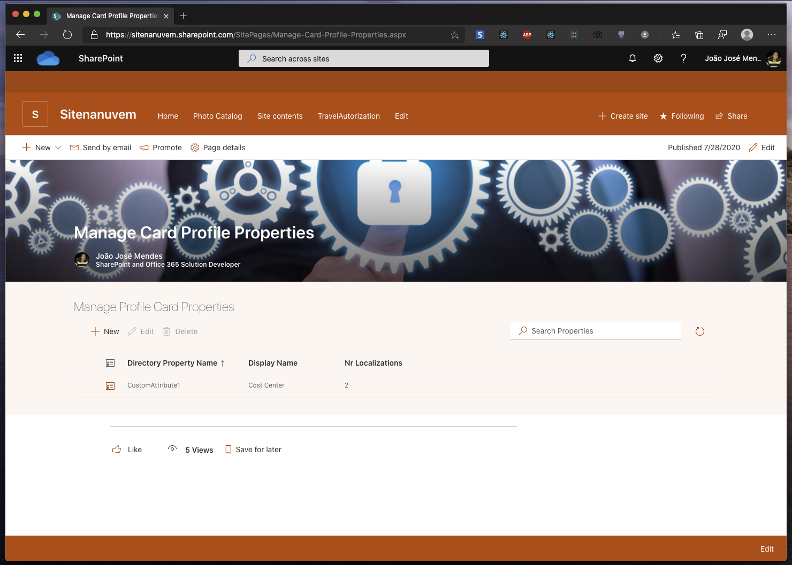
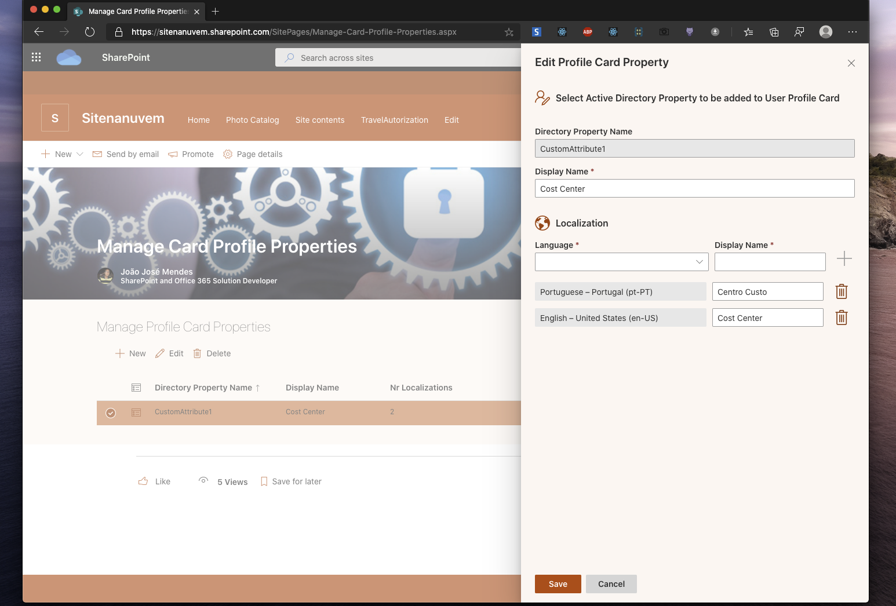
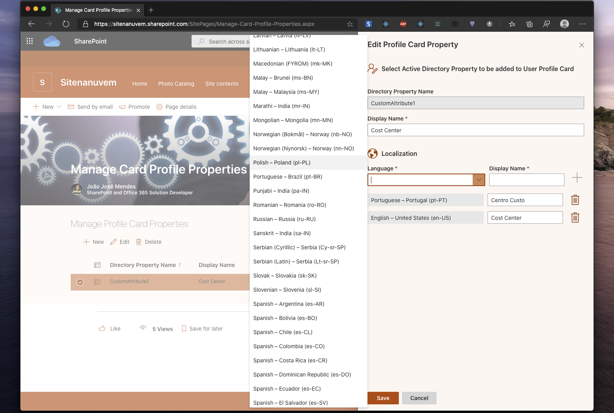
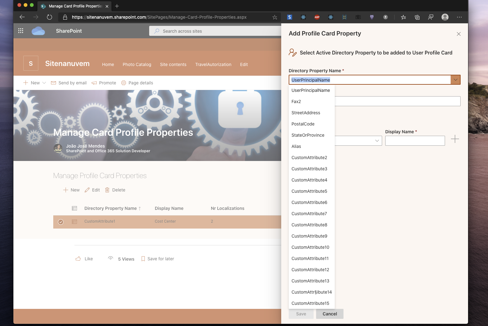
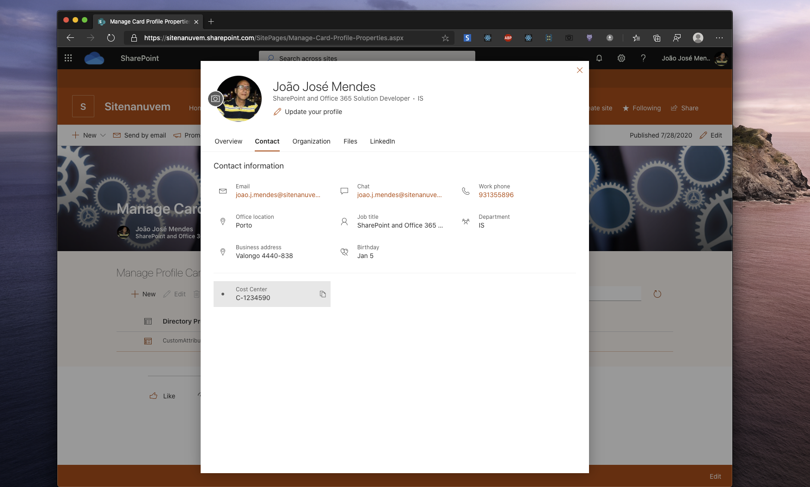

# React Manage Profile Card Properties 

## Summary
This web part allows tenant administrators to manage profile card properties.  
We can create, edit, delete, directory properties that can be add to profile card.

Only users with Tenant Admin Role are allowed to managed profile card properties. 

##  Manage Profile Card Properties

## Used SharePoint Framework Version 

## Applies to

* [SharePoint Framework](https://docs.microsoft.com/sharepoint/dev/spfx/sharepoint-framework-overview)
* [Office 365 tenant](https://docs.microsoft.com/sharepoint/dev/spfx/set-up-your-development-environment)

## WebPart Properties
 
Property |Type|Required| comments
--------------------|----|--------|----------
WebPart Title| Text| no|
 

## Solution
The Web Part Use Microsoft Graph API, Fluent-UI components.

Solution|Author(s)
--------|---------
Manage Profile Card Properties |João Mendes

## Version history

Version|Date|Comments
-------|----|--------
1.0.0|July 28, 2020|Initial release

## Disclaimer
**THIS CODE IS PROVIDED *AS IS* WITHOUT WARRANTY OF ANY KIND, EITHER EXPRESS OR IMPLIED, INCLUDING ANY IMPLIED WARRANTIES OF FITNESS FOR A PARTICULAR PURPOSE, MERCHANTABILITY, OR NON-INFRINGEMENT.**

---

## Minimal Path to Awesome

- Clone this repository
- Move to sample folder
- In the command line run:
  - `npm install`
  - `gulp build`
  - `gulp bundle --ship`
  - `gulp package-solution --ship`
  - `Add to AppCatalog and deploy`
- Approve the required permissions (User.ReadWrite, Directory.AccessAsUser.All) on SharePoint Admin in App permissions

> **NOTE:** This web part does not work in the local workbench

