# Site Designs Manager 

## Summary
This web part allows tenant administrators to manage site designs through a graphical interface.  
We can create, edit, delete work with site scripts associated to a site design, manage permissions and apply site design to one or more sites.

Only users with Tenant Admin Role are allowed to managed tenant properties. 

##  Site Designs List

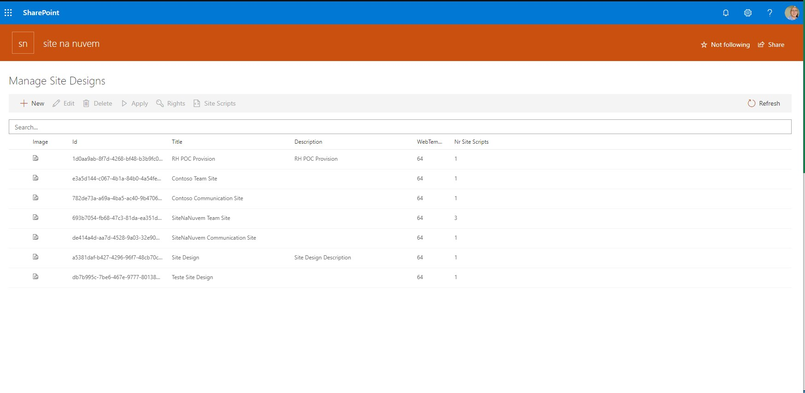

## Add, Edit and Delete site designs

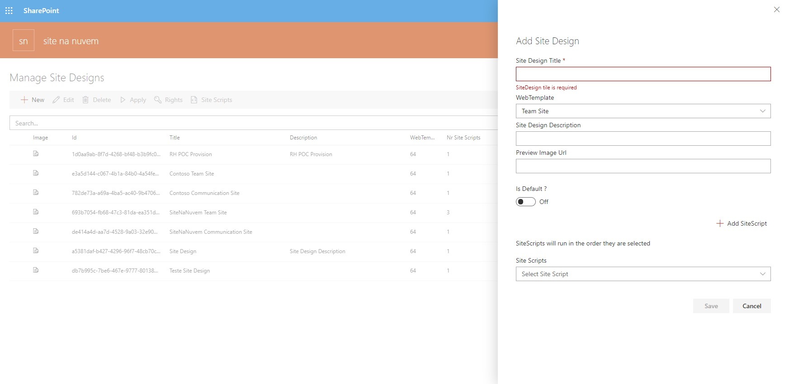  

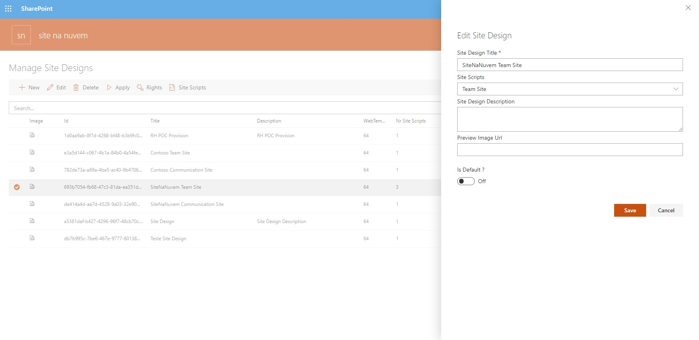  

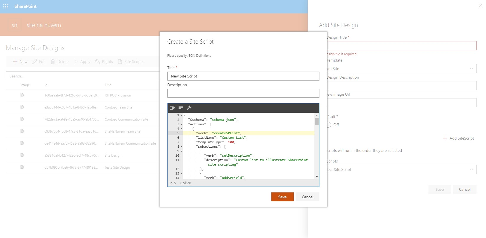 

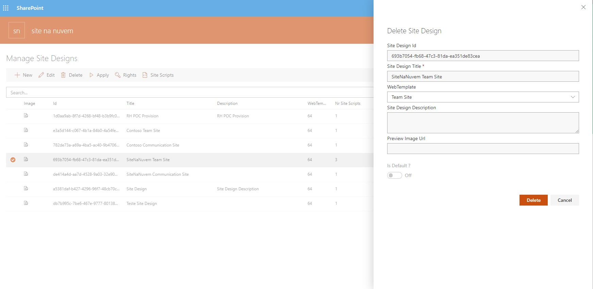  

## Site Designs Rights

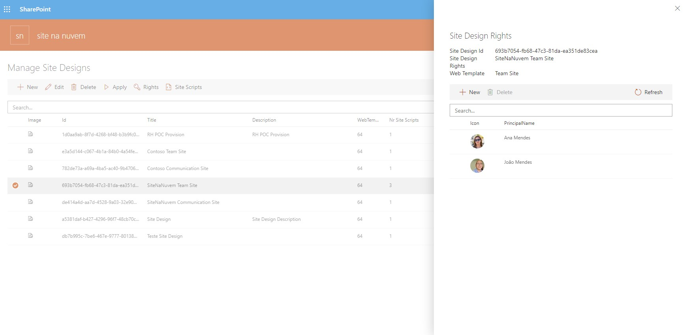  

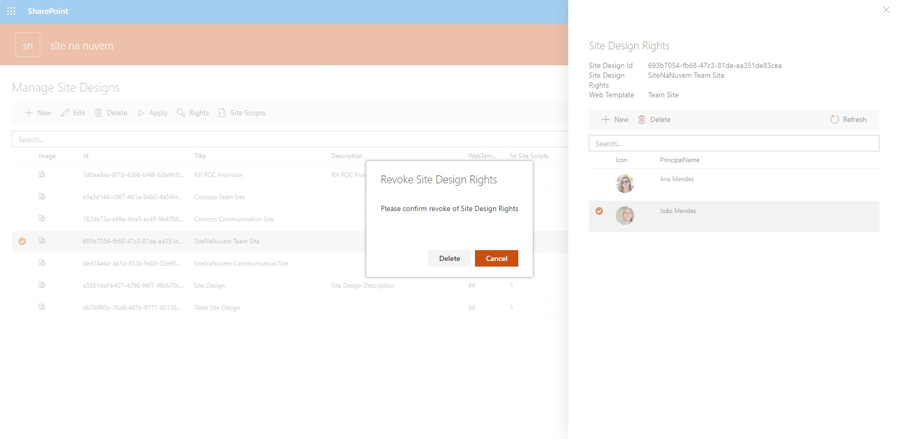  

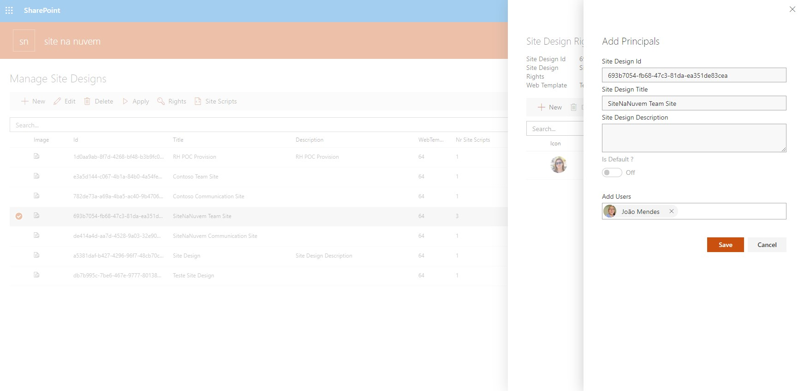  

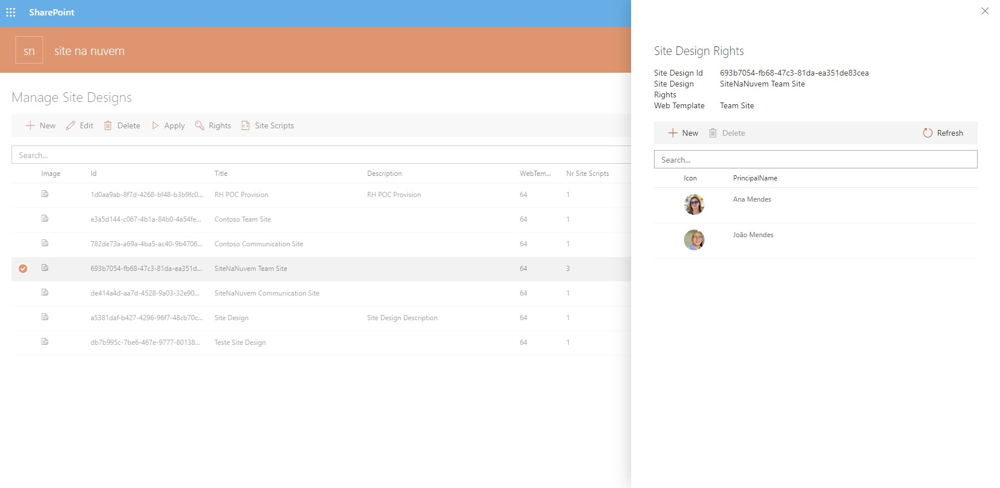  

## Site Design Site Scripts

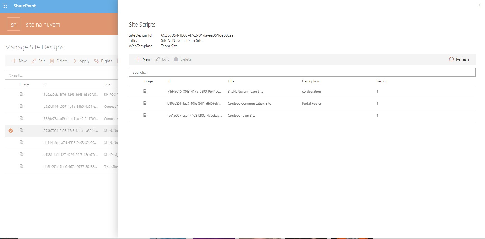  

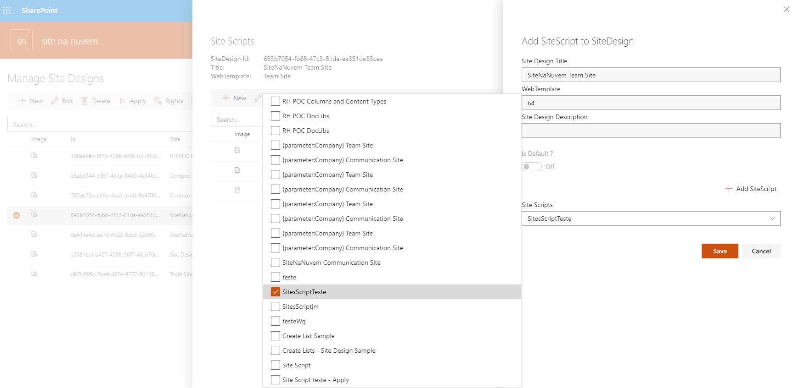  

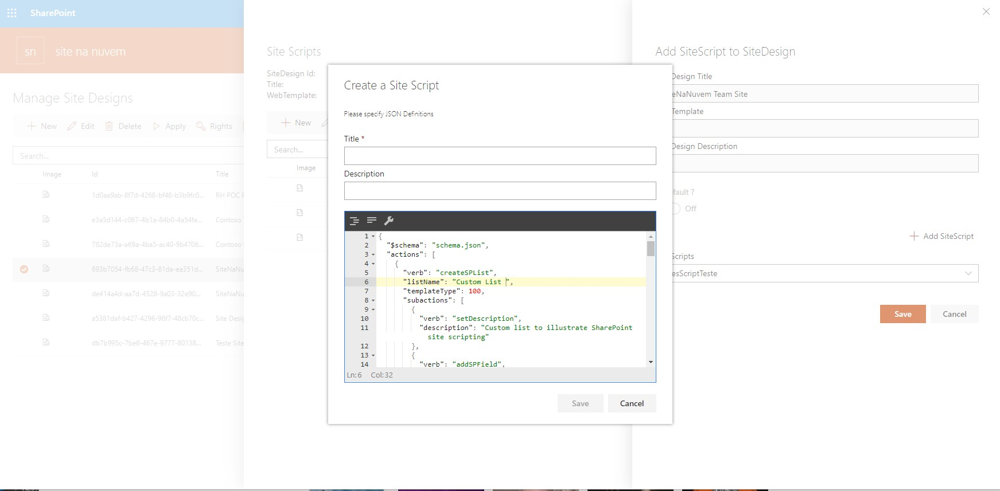  

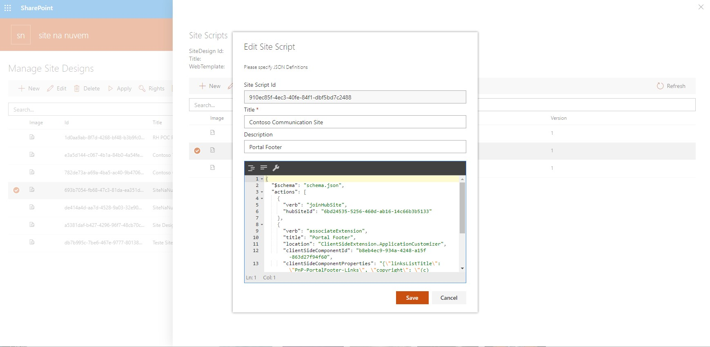  

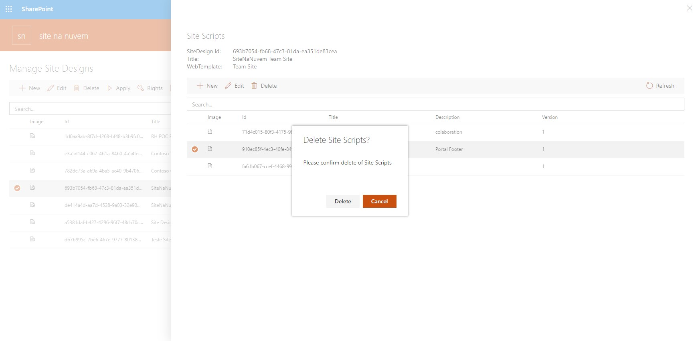  

## Apply Site Design

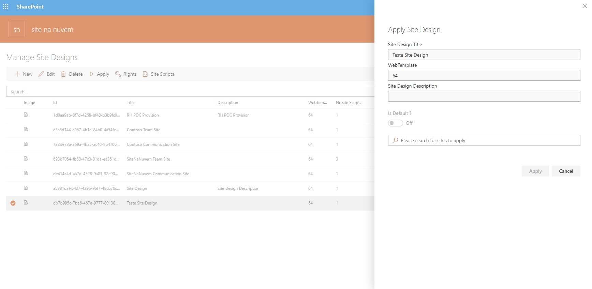  

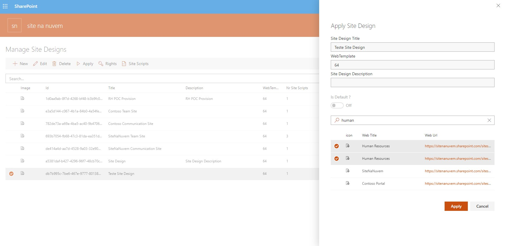  

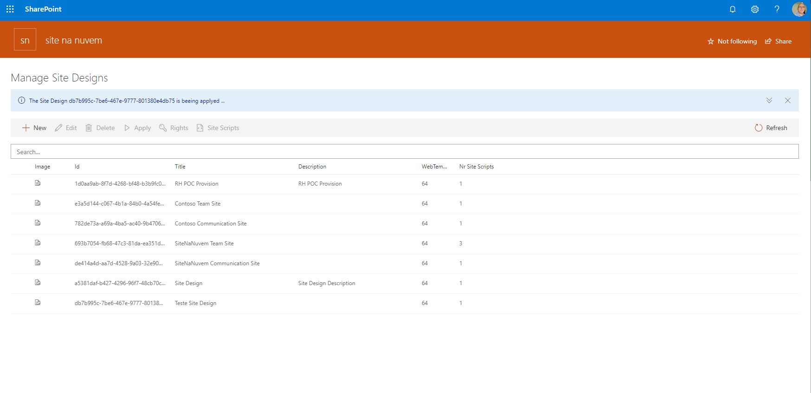  

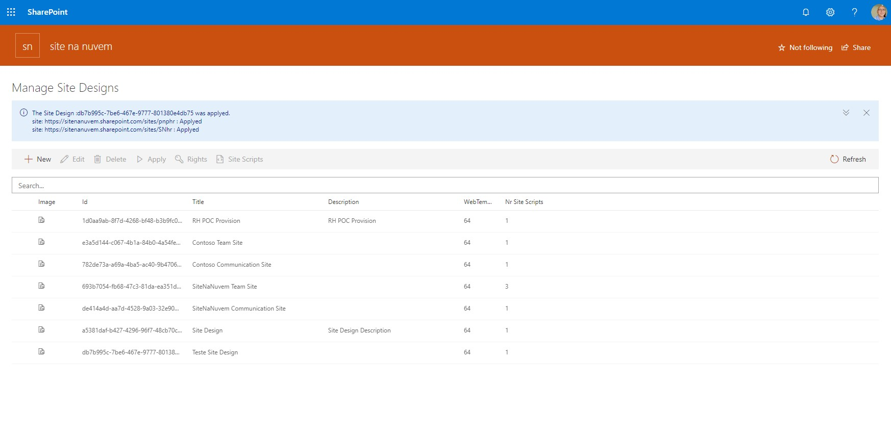  

## Compatibility

 
 

-Incompatible-red.svg "SharePoint Server 2016 Feature Pack 2 requires SPFx 1.1")

## Applies to

* [SharePoint Framework](https://docs.microsoft.com/sharepoint/dev/spfx/sharepoint-framework-overview)
* [Office 365 tenant](https://docs.microsoft.com/sharepoint/dev/spfx/set-up-your-development-environment)

## Web Part Properties
 
Property |Type|Required| comments
--------------------|----|--------|----------
WebPart Title| Text| no|
 

## Solution
The Web Part Use PnPjs library, Office-ui-fabric-react components.

Solution|Author(s)
--------|---------
Site Design Manager Web Part|João Mendes

## Version history

Version|Date|Comments
-------|----|--------
1.0.0|April 08, 2019|Initial release

## Minimal Path to Awesome

- Clone this repository
- Move to sample folder
- in the command line run:
  - `npm install`
  - `gulp build`
  - `gulp bundle --ship`
  - `gulp package-solution --ship`
  - Add to AppCatalog and deploy

>  This sample can also be opened with [VS Code Remote Development](https://code.visualstudio.com/docs/remote/remote-overview). Visit https://aka.ms/spfx-devcontainer for further instructions.

## Disclaimer
**THIS CODE IS PROVIDED *AS IS* WITHOUT WARRANTY OF ANY KIND, EITHER EXPRESS OR IMPLIED, INCLUDING ANY IMPLIED WARRANTIES OF FITNESS FOR A PARTICULAR PURPOSE, MERCHANTABILITY, OR NON-INFRINGEMENT.**

