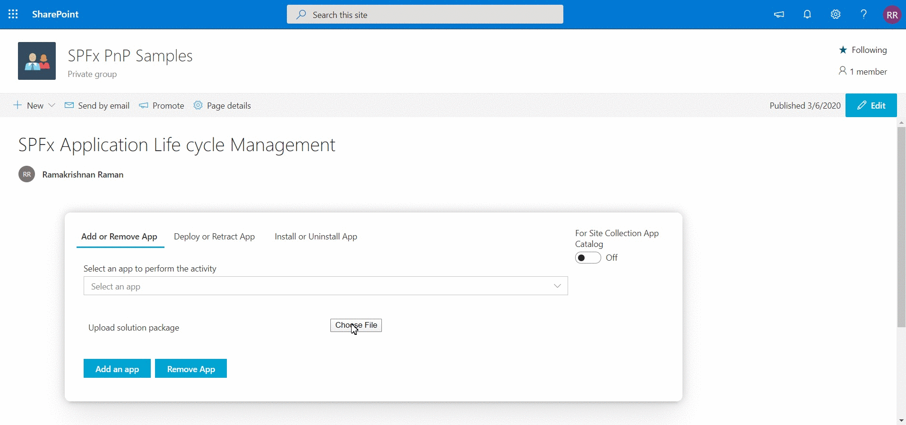

# Manage SPFx solution using ALM APIs

## Summary

This web part acts as a centralized place where admin can manage SPFx solutions present in their tenant using Application lifecycle Management(ALM) APIs and perform activities like Add, Deploy, Install, Retract, Uninstall & Remove apps.

### Tenant Appcatalog

### Site Collection Appcatalog

**Note:**
This web part is mainly build for tenant and SharePoint admins, since most of the operation requires administrator privileges.

## Compatibility

 
 

-Incompatible-red.svg "SharePoint Server 2016 Feature Pack 2 requires SPFx 1.1")

## Minimal Path to Awesome

- git clone the repo
- `npm i`
- `gulp bundle --ship`
- `gulp package-solution --ship`
- Add to Site Collection App Catalog or Tenant AppCatalog and Install the App
- Add the web part to any page in the Site Collection

>  This sample can also be opened with [VS Code Remote Development](https://code.visualstudio.com/docs/remote/remote-overview). Visit https://aka.ms/spfx-devcontainer for further instructions.

## Solution

Solution|Author(s)
--------|---------
React-Manage-SPFx-Solutions-ALM|[Ramakrishnan Raman](https://github.com/Ramakrishnan24689)

## Help

We do not support samples, but we this community is always willing to help, and we want to improve these samples. We use GitHub to track issues, which makes it easy for  community members to volunteer their time and help resolve issues.

If you're having issues building the solution, please run [spfx doctor](https://pnp.github.io/cli-microsoft365/cmd/spfx/spfx-doctor/) from within the solution folder to diagnose incompatibility issues with your environment.

You can try looking at [issues related to this sample](https://github.com/pnp/sp-dev-fx-webparts/issues?q=label%3A%22sample%3A%20react-manage-spfx-solutions-alm") to see if anybody else is having the same issues.

You can also try looking at [discussions related to this sample](https://github.com/pnp/sp-dev-fx-webparts/discussions?discussions_q=react-manage-spfx-solutions-alm) and see what the community is saying.

If you encounter any issues while using this sample, [create a new issue](https://github.com/pnp/sp-dev-fx-webparts/issues/new?assignees=&labels=Needs%3A+Triage+%3Amag%3A%2Ctype%3Abug-suspected%2Csample%3A%20react-manage-spfx-solutions-alm&template=bug-report.yml&sample=react-manage-spfx-solutions-alm&authors=@Ramakrishnan24689&title=react-manage-spfx-solutions-alm%20-%20).

For questions regarding this sample, [create a new question](https://github.com/pnp/sp-dev-fx-webparts/issues/new?assignees=&labels=Needs%3A+Triage+%3Amag%3A%2Ctype%3Aquestion%2Csample%3A%20react-manage-spfx-solutions-alm&template=question.yml&sample=react-manage-spfx-solutions-alm&authors=@Ramakrishnan24689&title=react-manage-spfx-solutions-alm%20-%20).

Finally, if you have an idea for improvement, [make a suggestion](https://github.com/pnp/sp-dev-fx-webparts/issues/new?assignees=&labels=Needs%3A+Triage+%3Amag%3A%2Ctype%3Aenhancement%2Csample%3A%20react-manage-spfx-solutions-alm&template=question.yml&sample=react-manage-spfx-solutions-alm&authors=@Ramakrishnan24689&title=react-manage-spfx-solutions-alm%20-%20).

## Disclaimer

**THIS CODE IS PROVIDED *AS IS* WITHOUT WARRANTY OF ANY KIND, EITHER EXPRESS OR IMPLIED, INCLUDING ANY IMPLIED WARRANTIES OF FITNESS FOR A PARTICULAR PURPOSE, MERCHANTABILITY, OR NON-INFRINGEMENT.**

