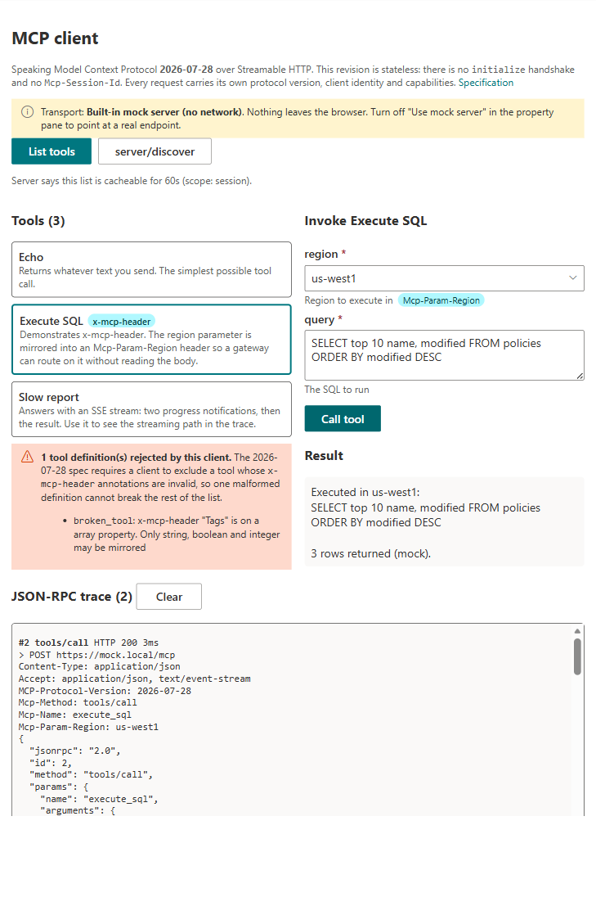
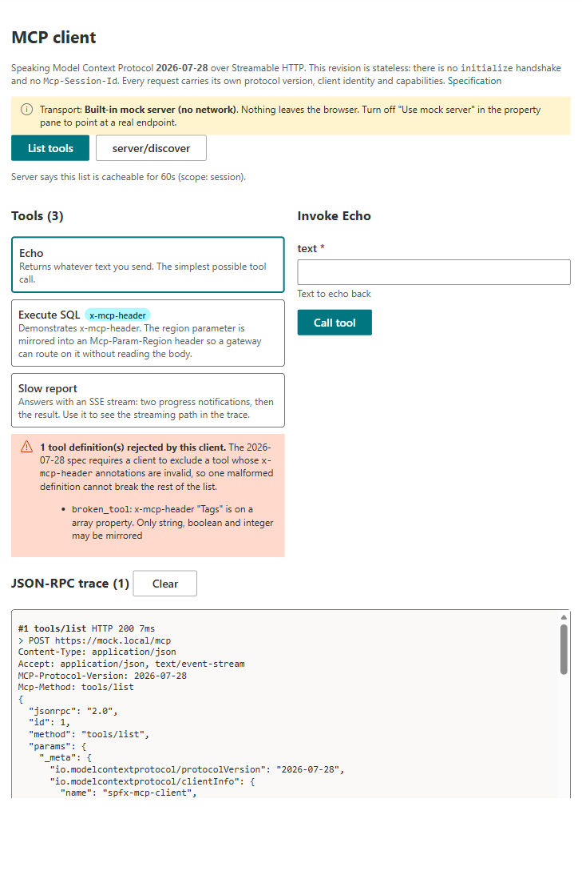
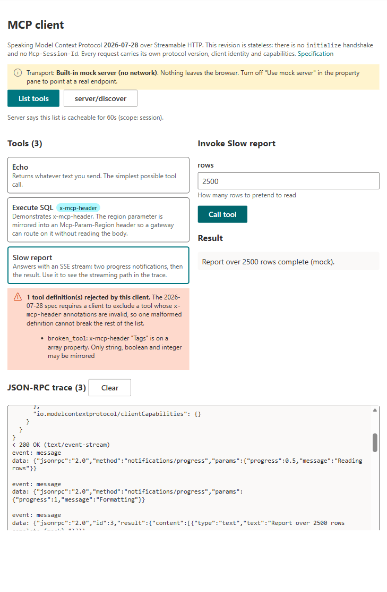

# MCP Client for SharePoint

## Summary

A SharePoint Framework web part that acts as a Model Context Protocol (MCP) client from inside a SharePoint page. It connects to an MCP server over Streamable HTTP, lists the tools that server exposes, lets a user invoke one from a form generated out of the tool's JSON Schema, and renders the full HTTP and JSON-RPC trace so the protocol is visible rather than hidden inside an agent.

Existing MCP work in the SharePoint space runs in the opposite direction: servers that expose SharePoint content to an external host such as Claude Desktop or a Copilot Studio agent. This sample inverts that. SharePoint is the host surface, and the MCP server is the thing being consumed.

It ships with a **mock MCP server that runs in the browser tab**, so it can be cloned and run with nothing to deploy, no CORS to configure and no tenant setup at all.

## It speaks the 2026-07-28 revision

This matters more than it sounds. Protocol revision `2026-07-28` is the largest change to MCP since it launched, and most client code written before it is now wrong:

| | Before (2025-03-26 to 2025-11-25) | This sample (2026-07-28) |
| --- | --- | --- |
| Session setup | `initialize` then `initialized` handshake | **Removed.** Every request is self contained |
| Session identity | `Mcp-Session-Id` header, pinning the client to one instance | **Removed.** Any request can land on any instance |
| Protocol version | Negotiated once at handshake | Sent per request, in `_meta` and in a header |
| Capabilities | Exchanged at handshake | Sent per request; `server/discover` is optional |
| Routing | Gateways had to parse the JSON body | `Mcp-Method` and `Mcp-Name` headers mirror body fields |
| Server to client calls | Requests on an SSE stream | Embedded in results as Multi Round-Trip Requests |

Every request the web part sends therefore looks like this, and the trace panel shows exactly this:

```http
POST /mcp HTTP/1.1
Content-Type: application/json
Accept: application/json, text/event-stream
MCP-Protocol-Version: 2026-07-28
Mcp-Method: tools/call
Mcp-Name: execute_sql
Mcp-Param-Region: us-west1

{
  "jsonrpc": "2.0",
  "id": 2,
  "method": "tools/call",
  "params": {
    "name": "execute_sql",
    "arguments": { "region": "us-west1", "query": "SELECT 1" },
    "_meta": {
      "io.modelcontextprotocol/protocolVersion": "2026-07-28",
      "io.modelcontextprotocol/clientInfo": { "name": "spfx-mcp-client", "version": "1.0.0" },
      "io.modelcontextprotocol/clientCapabilities": {}
    }
  }
}
```

Three requirements of the revision are implemented here that are easy to miss:

- **Header and body must agree.** A server rejects a mismatch with JSON-RPC error `-32020` `HeaderMismatch`. The headers are therefore derived from the request body rather than passed in beside it, and the mock server actually validates them, so a wrong client is caught rather than tolerated.
- **`x-mcp-header` mirroring is mandatory for clients.** A server may mark a tool parameter to be copied into an `Mcp-Param-{Name}` header so a gateway can route on it. Optional to offer, not optional to support.
- **Values that are not header safe use the Base64 sentinel.** Non-ASCII, padded, or control-character values travel as `=?base64?...?=`, and so does a plain value that happens to look like the sentinel.



The trace above is a real `tools/call`, captured from the web part running on a SharePoint page. `Mcp-Param-Region` is there because the server annotated that parameter with `x-mcp-header` and the client is required to mirror it.

## Features

- Built-in mock MCP server, so the sample runs with zero setup
- Connect to a real remote server by URL, with an optional Entra bearer token for the signed-in user
- `tools/list` with client-side rejection of malformed tool definitions, and the reason shown
- `server/discover`
- Tool invocation from a form generated from the tool's JSON Schema
- Full trace panel: request headers, request body, response status and body, and any notifications received before the response
- Handles both response shapes: a single JSON object and an SSE stream carrying progress notifications first
- Surfaces the `ttlMs` and `cacheScope` cache hints new in this revision
- Fluent UI, theme aware, works in section backgrounds

## Design decisions

**A hand written JSON-RPC client, not the official SDK.** For `tools/list`, `tools/call` and `server/discover` the wire format is small, and writing it out is the point of a sample about a protocol. It also avoids pinning the sample to an SDK version while the specification is moving this fast, and keeps the bundle small.

**The seam is at HTTP, not at JSON-RPC.** `IHttpTransport` takes a URL, headers and a body string. The mock server therefore exercises exactly the same header construction as a real server does, so what the trace panel shows is real wire format in both modes, not a simulation.

**No secret ever reaches browser code.** When an Entra resource URI is configured, the token comes from the SPFx AAD token provider and is scoped to the signed-in user. A server that needs a client secret must sit behind a broker, which is a server side concern and deliberately out of scope.

## Prerequisites

None for the mock server.

For a real server:

- An MCP endpoint speaking Streamable HTTP at protocol revision `2026-07-28`
- CORS on that server allowing the SharePoint origin, and allowing the `MCP-Protocol-Version`, `Mcp-Method`, `Mcp-Name` and `Mcp-Param-*` request headers
- For authentication, an Entra app registration exposing the API, requested in `package-solution.json` and approved on the tenant API access page

## Compatibility

| | |
| --- | --- |
| SPFx | 1.23.2 |
| Node.js | `>=22.14.0 <23.0.0`, built and tested on v22.23.2 |
| React | 17.0.1 |
| TypeScript | 5.8 |
| MCP protocol | 2026-07-28 |
| Hosts | SharePoint Online, Teams tab, Teams personal app, SharePoint full page |

Check [aka.ms/spfx-matrix](https://aka.ms/spfx-matrix) before publishing.

## Minimal path to awesome

```bash
git clone https://github.com/pnp/sp-dev-fx-webparts.git
cd sp-dev-fx-webparts/samples/react-mcp-client
npm install
npm run build
```

Add the web part to a page. **Use mock server** is on by default, so select **List tools** and then call one. Try all three:

- `echo` is the simplest possible call
- `execute_sql` shows `x-mcp-header`: watch `Mcp-Param-Region` appear in the trace
- `slow_report` answers with an SSE stream, so the trace shows two progress notifications before the result

You will also see `broken_tool` missing from the list, with an explanation. That is the client correctly refusing a tool whose annotation is invalid.





To point at a real server, turn **Use mock server** off in the property pane and set the endpoint URL, plus an Entra resource URI if the server requires a token.

## Tests

```bash
npm run build
```

`npm run build` runs the Jest suite as part of the build. 48 tests cover the header encoding table from the specification verbatim, `x-mcp-header` validation, SSE parsing, and the client end to end against the mock server, including a deliberately tampering transport that proves the mock rejects a header and body mismatch.

## Contributors

- Elliot Margot

## Version history

| Version | Date | Comments |
| --- | --- | --- |
| 1.0 | TBD | Initial release |

## References

- [MCP specification 2026-07-28: Streamable HTTP](https://modelcontextprotocol.io/specification/2026-07-28/basic/transports/streamable-http)
- [What changed in 2026-07-28](https://blog.modelcontextprotocol.io/posts/2026-07-28)
- [Connect to Azure AD-secured APIs from SPFx](https://learn.microsoft.com/sharepoint/dev/spfx/use-aadhttpclient)

## Disclaimer

**THIS CODE IS PROVIDED _AS IS_ WITHOUT WARRANTY OF ANY KIND, EITHER EXPRESS OR IMPLIED, INCLUDING ANY IMPLIED WARRANTIES OF FITNESS FOR A PARTICULAR PURPOSE, MERCHANTABILITY, OR NON-INFRINGEMENT.**

<!-- Required by PnP validation. Must be an HTML img tag, not Markdown. -->

