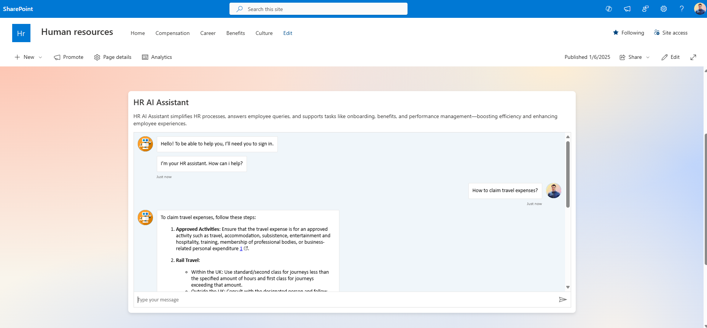
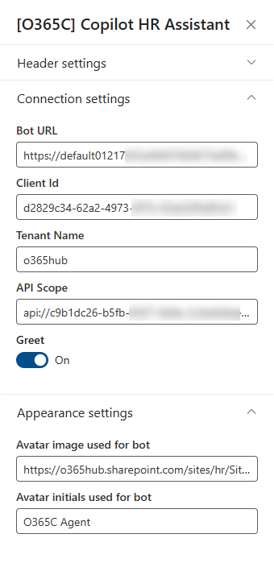

# Copilot Agent - HR Assistant

## Summary

HR Assistant SPFx web part app integrates the Microsoft Copilot Agent, built via Copilot Studio, into SharePoint Online modern pages. It features a chat interface with Single Sign-On, simplifying HR processes, answering employee queries, and supporting tasks like onboarding, benefits, and performance management—boosting efficiency and enhancing employee experiences.

## Used SharePoint Framework Version

## Applies to

- [SharePoint Framework](https://aka.ms/spfx)
- [Microsoft 365 tenant](https://docs.microsoft.com/en-us/sharepoint/dev/spfx/set-up-your-developer-tenant)

> Get your own free development tenant by subscribing to [Microsoft 365 developer program](http://aka.ms/o365devprogram)

## Prerequisites

For detailed setup instructions, please refer to the [SETUP.md](SETUP.md) file.

## Solution

| Solution    | Author(s)                                               |
| ----------- | ------------------------------------------------------- |
| react-mcs-hr-assistant | Ejaz Hussain - Advania UK - https://x.com/EjazHussain_ |

## Version history

| Version | Date             | Comments        |
| ------- | ---------------- | --------------- |
| 1.0     | January 08, 2025 | Initial release |

## Disclaimer

**THIS CODE IS PROVIDED _AS IS_ WITHOUT WARRANTY OF ANY KIND, EITHER EXPRESS OR IMPLIED, INCLUDING ANY IMPLIED WARRANTIES OF FITNESS FOR A PARTICULAR PURPOSE, MERCHANTABILITY, OR NON-INFRINGEMENT.**

---

## Minimal Path to Awesome

For detailed setup instructions, please refer to the [SETUP.md](SETUP.md) file.

## Features

- **Microsoft Copilot Integration**: Seamlessly integrates the Microsoft Copilot Agent, built via Copilot Studio, into SharePoint Online modern pages.
- **Chat Interface**: Provides an intuitive chat interface for users to interact with the HR Assistant.
- **Single Sign-On (SSO)**: Supports Single Sign-On for a seamless user experience.
- **Employee Query Resolution**: Efficiently answers employee queries related to HR policies and procedures.
- **Customizable**: Allows customization to fit specific organizational needs and branding.
- **Secure**: Ensures secure communication and data handling within the SharePoint environment.
- **User-Friendly**: Easy to deploy and use, enhancing the overall employee experience.

## References

- [Overview of the SharePoint Framework](https://learn.microsoft.com/en-us/sharepoint/dev/spfx/sharepoint-framework-overview?wt.mc_id=MVP_326658)

- [Extend Microsoft 365 Copilot with Copilot agents](https://learn.microsoft.com/en-us/microsoft-copilot-studio/microsoft-copilot-extend-copilot-extensions?wt.mc_id=MVP_326658)

- [Copilot Studio - SPFx Custom Action sample](https://github.com/microsoft/CopilotStudioSamples/tree/master/SharePointSSOComponent?wt.mc_id=MVP_326658) 
