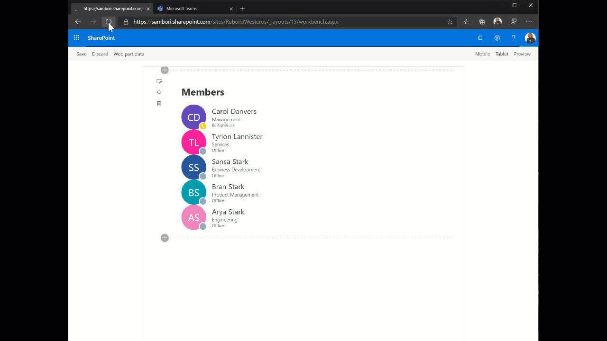

# SPFx Web part Group members list with Presence information

## Summary

This sample shows how to get the members of a specific group, including their presence information (using the new Presence endpoint in the MS Graph API).

## Compatibility

 
 

-Incompatible-red.svg "SharePoint Server 2016 Feature Pack 2 requires SPFx 1.1")

## Applies to

* [SharePoint Framework Developer](https://docs.microsoft.com/sharepoint/dev/spfx/sharepoint-framework-overview)
* [Office 365 developer tenant](https://docs.microsoft.com/sharepoint/dev/spfx/set-up-your-developer-tenant)

## Solution

Solution|Author(s)
--------|---------
react-members-with-presence|Luis Mañez (MVP, [ClearPeople](http://www.clearpeople.com), @luismanez)

## Version history

Version|Date|Comments
-------|----|--------
1.0.0|Dec 23, 2019|Initial release

## Minimal Path to Awesome

* clone repo
* Using the Office365 CLI, connect to your tenant and run the following commands (this will add the proper permissions to the Tenant, in order to call Graph API):
  - spo serviceprincipal grant add --resource "Microsoft Graph" --scope "User.Read.All"
  - spo serviceprincipal grant add --resource "Microsoft Graph" --scope "Presence.Read.All"
* run _gulp serve_
* open the SharePoint workbench in a Modern Team site (Communication site does not have a Group)

>  This sample can also be opened with [VS Code Remote Development](https://code.visualstudio.com/docs/remote/remote-overview). Visit https://aka.ms/spfx-devcontainer for further instructions.

## Features

This sample shows how to get the members of a specific Group and their Presence information.

This sample illustrates the following concepts on top of the SharePoint Framework:

* Using GraphHttpClient to get data from MS Graph API
* How to get Presence information using MS Graph API
* How to configure API Permissions using Office365 CLI
* Using async / await for the async calls
* Office UI fabric components

## Disclaimer

**THIS CODE IS PROVIDED *AS IS* WITHOUT WARRANTY OF ANY KIND, EITHER EXPRESS OR IMPLIED, INCLUDING ANY IMPLIED WARRANTIES OF FITNESS FOR A PARTICULAR PURPOSE, MERCHANTABILITY, OR NON-INFRINGEMENT.**

