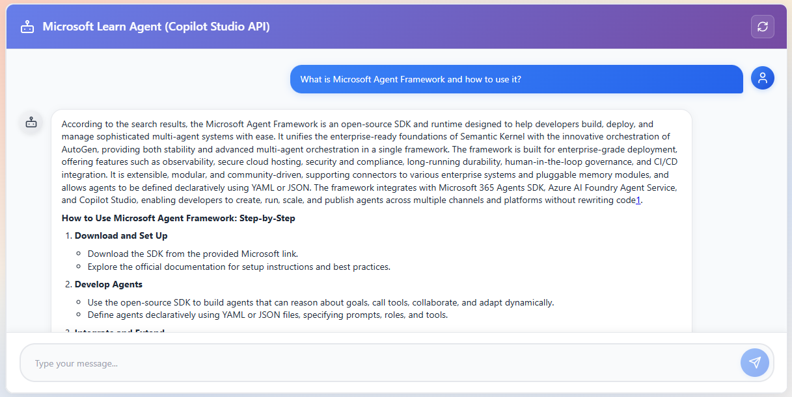
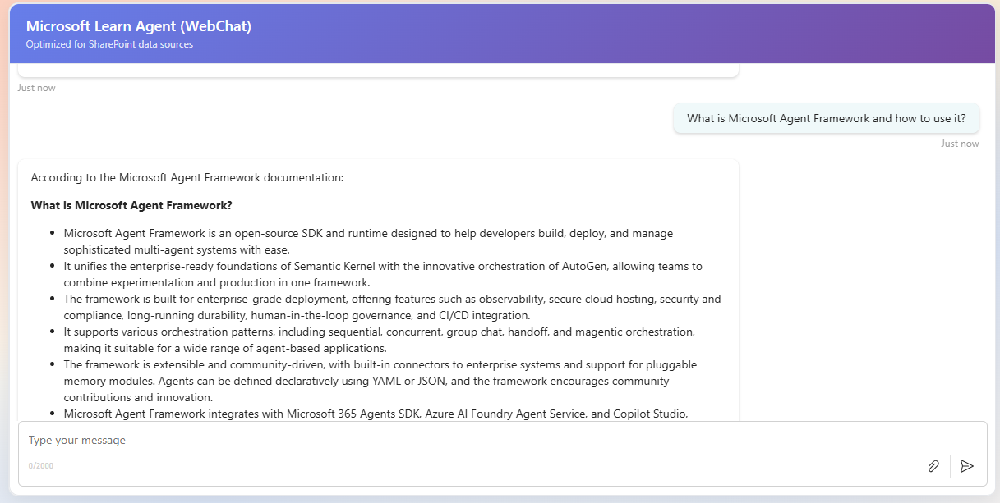

# Microsoft Learn Agent (Copilot Studio) for SPFx

This sample demonstrates how to integrate a Copilot Studio (Microsoft Learn) agent into a SharePoint Framework (SPFx) web part. The web part supports two integration modes:

- WebChat mode (uses Bot Framework WebChat via the Agent SDK bridge)
- Studio Client / Direct API mode (programmatic, headless integration using the CopilotStudioClient)

The sample is intended to show a production-ready pattern for embedding a Copilot Studio agent into SharePoint pages with Single Sign-On (SSO) using MSAL.

## Overview — UI screenshots

Below are two sample UI screenshots demonstrating the two integration approaches implemented by this sample:

- Studio Client (direct API / custom UI)
- WebChat (Agent SDK WebChat bridge)

Studio Client (Direct API)



WebChat (Agent SDK)



## Compatibility

| warning: Important          |
|:---------------------------|
| Every SPFx version is optimally compatible with specific versions of Node.js. In order to be able to build this sample, you need to ensure that the version of Node on your workstation matches one of the versions listed in this section. This sample will not work on a different version of Node.|
|Refer to <https://aka.ms/spfx-matrix> for more information on SPFx compatibility.   |

This sample is optimally compatible with the following environment configuration:


-Incompatible-red.svg "SharePoint Server 2016 Feature Pack 2 requires SPFx 1.1")


## Applies to

- [SharePoint Framework](https://aka.ms/spfx)
- [Microsoft 365 tenant](https://docs.microsoft.com/en-us/sharepoint/dev/spfx/set-up-your-developer-tenant)

> Get your own free development tenant by subscribing to [Microsoft 365 developer program](http://aka.ms/o365devprogram)

## Contributors

- [Ejaz Hussain](https://github.com/ejazhussain)

## Version history

| Version | Date             | Comments        |
| ------- | ---------------- | --------------- |
| 1.0     | October 11, 2025 | Initial release |

## Summary of what this sample does

- Connects to a Copilot Studio / Power Virtual Agents agent and renders a chat UI in a SharePoint web part.
- Supports both a full WebChat UI (fast setup) and a custom Studio Client UI (full control).
- Uses MSAL in the browser to acquire tokens scoped to the Power Platform APIs so the client can call the Copilot Studio endpoints.

## Prerequisites (high level)

Before you can run this sample, the following items must be completed. Where possible links and step-by-step guidance are included so non-technical users can follow along.

1. Microsoft 365 tenant with SharePoint Online access (developer or production tenant).
2. Copilot Studio (Power Virtual Agents) access and at least one published agent. You need the agent identifier (botId) and the environment id. See: https://learn.microsoft.com/microsoft-copilot-studio
3. Azure AD App Registration (single-page app) with proper API permissions (see App registration steps below).
4. Global admin consent for Power Platform API permission (an administrator may be required to grant consent for the tenant).
5. A workstation with Node (see Compatibility above) and the necessary SPFx toolchain (npm, gulp).

If you don't have Copilot Studio access, talk to your tenant admin—Copilot Studio access may require a license or enrollment in preview programs depending on your tenant and Microsoft licensing.

## Detailed prerequisites and configuration steps

### A. Get Copilot Studio Configuration

#### Step 1: Open your Copilot Studio environment

1. Navigate to [make.powerapps.com](https://make.powerapps.com/) or [copilot.microsoft.com/studio](https://copilot.microsoft.com/studio) (follow the Microsoft guidance for your tenant)
2. Navigate to your published agent

#### Step 2: Configure Authentication

1. Ensure the agent is configured with **'Authenticate with Microsoft'**
2. (Optional) Enable **tenant graph grounding** for Microsoft 365 content access

#### Step 3: Get Environment ID and Agent Identifier

1. Go to **Settings** → **Advanced** → **Metadata**
2. Copy the following values:
   - **Environment ID**
   - **Schema name** (this is your Agent Identifier, e.g., `cr770_myAgent`)

You will use these values in the web part properties (`environmentId` and `agentIdentifier`).

> **Note:** If you can't find these values, check the agent settings or refer to the [Copilot Studio documentation](https://learn.microsoft.com/microsoft-copilot-studio) for guidance on locating publish metadata.

### B. Azure AD App Registration (required to acquire tokens with MSAL)

This step requires permissions to create application identities in your Azure tenant. For this sample, create a Native Client Application Identity (no secrets required).

#### Step 1: Open Azure Portal

1. Navigate to [portal.azure.com](https://portal.azure.com)
2. Go to **Azure Active Directory** (Entra ID)

#### Step 2: Create a new App Registration

1. Click **App registrations** → **New registration**
2. Provide a **Name** (e.g., "SharePoint Copilot Studio Agent" or "Microsoft Learn Agent")
3. Choose **"Accounts in this organization directory only"**
4. Under **Redirect URI**:
   - Select **"Single-page application"** from the platform dropdown
   - Enter your first SharePoint site URL **without the trailing slash** (e.g., `https://contoso.sharepoint.com/sites/mysite`)
5. Click **Register**

#### Step 3: Configure Authentication - Add SharePoint URLs

1. Go to **Authentication** in the Manage section
2. Under **Single-page application**, add redirect URIs:
   - `https://localhost:4321` (only if you plan to test locally - this is the default SPFx port)
   - For each SharePoint site where you'll deploy the extension, add the site URL **without trailing slash** (e.g., `https://contoso.sharepoint.com/sites/mysite`)
3. Under **Implicit grant and hybrid flows**, ensure **both checkboxes are unchecked** (SPAs use PKCE flow)
4. Click **Save**

**Example for multiple sites:**
- `https://localhost:4321` (for local testing - default SPFx port)
- `https://contoso.sharepoint.com/sites/hr`
- `https://contoso.sharepoint.com/sites/finance`
- `https://contoso.sharepoint.com/sites/it`

> **Note:** The Azure portal will show "Your Redirect URI is eligible for the Authorization Code Flow with PKCE" when configured correctly — this is the desired modern SPA authentication flow.

#### Step 4: Configure API Permissions

1. In your new application, go to **API Permissions** in the Manage section
2. Click **Add a permission**
3. In the side panel, click the **APIs my organization uses** tab
4. Search for **"Power Platform API"** or use the GUID `8578e004-a5c6-46e7-913e-12f58912df43`
5. Under **Delegated permissions**, expand **CopilotStudio** and check:
   - `CopilotStudio.Copilots.Invoke`
6. Click **Add permissions**
7. (Optional but recommended) Add **Microsoft Graph** delegated permissions:
   - `User.Read` — Sign in and read user profile
   - `Files.Read.All` — Read all files that the signed-in user can access (if the agent needs to browse documents)
   - `Sites.Read.All` — Read items in all site collections (if the agent needs SharePoint content)
8. (Optional) Click **Grant admin consent for your organization**

> **Note:** If you don't see "Power Platform API" in the list, you may need to add it to your tenant first or use the GUID above to search directly.

#### Step 5: Note Required Values

On the **Overview** page, copy and save:
- **Application (client) ID** (e.g., `12345678-1234-1234-1234-123456789012`)
- **Directory (tenant) ID** (e.g., `87654321-4321-4321-4321-210987654321`)

These values map to `appClientId` and `tenantId` in your web part properties.

#### Step 6: Grant Admin Consent (if not done in Step 4)

1. In the Azure portal, go to your app registration → **API permissions**
2. Confirm the permissions you added appear in the list
3. Click **"Grant admin consent for \<Your Tenant\>"** (requires Global Administrator or Privileged Role admin)
4. Verify the **Status** column shows **"Granted for \<Tenant\>"**

If you cannot grant admin consent, send these permission names to your tenant admin and ask them to grant consent.

#### Verifying the Configuration

- After configuring the app registration and redirect URIs, open the browser dev tools and load the web part
- When MSAL runs, it will attempt silent token acquisition and then interactive sign-in if necessary
- If you see errors like **"redirect_uri_mismatch"**, re-check that the origin shown in the browser matches a redirect URI in the Azure app registration
- If the token request fails with **"insufficient_scope"**, verify the delegated permissions and that admin consent was granted

## How to configure the web part properties

When you add the web part to a page (or through the web part properties in the workbench), populate the following fields found in the web part manifest:

- description: friendly display name
- environmentId: (from Copilot Studio publish settings)
- agentIdentifier: (bot/agent id from Copilot Studio)
- tenantId: Azure AD tenant ID
- appClientId: Azure AD Application (client) ID
- useWebChatMode: set to true to use Bot Framework WebChat bridge; false to use the custom Studio Client UI


Save the properties and test the web part by opening a page where the web part is added.

## Quick start — run locally

Follow these steps after you've completed the prerequisites above.

1. Install Node.js matching the engine in `package.json` (Windows example using nvm-windows or direct installer):

```powershell
# Check your node version
node -v

# If you need nvm for Windows: https://github.com/coreybutler/nvm-windows
# Install Node 22.x (example) and use it
nvm install 22.14.0
nvm use 22.14.0
```

2. Clone the repo and change into the sample folder:

```powershell
git clone https://github.com/pnp/sp-dev-fx-webparts.git
cd sp-dev-fx-webparts/samples/react-microsoft-learn-agent
```

3. Install dependencies:

```powershell
npm install
```

4. Run the local dev server

This project includes a `fast-serve` script to serve the web part during development. You can run either the fast-serve helper or the standard SPFx gulp serve depending on your environment.

Option A — Fast serve (recommended for this sample):

```powershell
npm run serve
```

This will start a local dev server and serve the web part to a test page. The console will show the origin that should be listed in your Azure AD app registration redirect URIs.

Option B — Classic SPFx serve (if you prefer):

```powershell
gulp trust-dev-cert
gulp serve --nobrowser
```

5. Open the SharePoint Hosted Workbench or the url shown by the fast-serve output and add the `[365C] Microsoft Learn Agent` web part.

6. Configure the web part properties (see section above) with the values from your Copilot Studio agent and Azure AD app.

7. The web part should request SSO via MSAL and connect to your Copilot Studio agent.

## Running in Teams or as a full-page SPFx app

This web part supports Teams hosts and full page SharePoint hosts per the manifest. For Teams you may need to follow Teams app packaging steps and adjust redirect URIs to include Teams origins. See: https://docs.microsoft.com/microsoftteams/platform

## Troubleshooting & common issues

- "No users signed in" / token failures: ensure your app registration redirect URI matches the origin where you are running the web part. Check browser console logs for MSAL errors.
- Permission consent errors: ensure an admin has granted consent for the Power Platform API permission.
- Agent connection errors: confirm the `environmentId` and `agentIdentifier` values are correct and that the agent is published in Copilot Studio.
- CORS / direct connect: if you use a custom proxy endpoint (`directConnectUrl`) ensure CORS is allowed and the endpoint is reachable from the browser.

## Files of interest

- `src/helpers/AcquireToken.ts` — lightweight token acquisition helper using MSAL.
- `src/helpers/MSALHelper.ts` and `src/helpers/UnifiedAuth.ts` — centralized MSAL logic used by the web part.
- `src/webparts/learnAgent/...` — web part code and the two client UI implementations (StudioClient and WebChat).
- `package.json` — lists the Node engine and scripts used for local development.

## References and further reading

- Copilot Studio / Power Virtual Agents docs: https://learn.microsoft.com/microsoft-copilot-studio
- Agent SDK / CopilotStudioClient: https://www.npmjs.com/package/@microsoft/agents-copilotstudio-client
- Bot Framework WebChat: https://github.com/microsoft/BotFramework-WebChat
- MSAL.js (browser): https://docs.microsoft.com/azure/active-directory/develop/msal-overview
- SPFx development docs: https://docs.microsoft.com/sharepoint/dev/spfx

## Contributors

- Ejaz Hussain (author/maintainer)

## License & Disclaimer

This sample is provided "as-is" with no warranties. Use at your own risk. See repository LICENSE for details.

