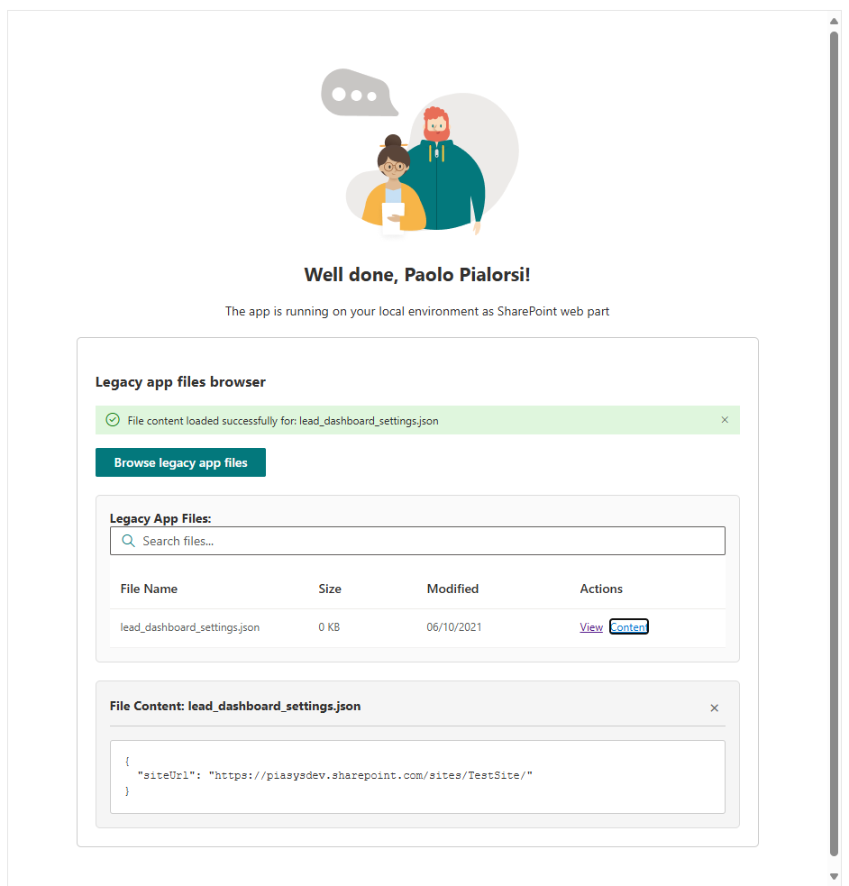

# SPFx Legacy App Files Browser

## Summary

This SharePoint Framework (SPFx) web part provides a simplified interface for browsing and viewing files stored in the legacy "SharePoint Online Client Extensibility Web Application Principal" folder using the native SPFx MSGraphClientV3. The web part allows users to list legacy app files and view their text content directly within the interface, making it easy to examine and migrate legacy SharePoint application data. This sample can also be used to take inspiration in case you need to migrate settings stored in the approot special folder of the "SharePoint Online Client Extensibility Web Application Principal" after the transition to the new "SharePoint Online Web Client Extensibility" principal application for SharePoint Framework.

## Used SharePoint Framework Version

## Applies to

- [SharePoint Framework](https://aka.ms/spfx)
- [Microsoft 365 tenant](https://docs.microsoft.com/en-us/sharepoint/dev/spfx/set-up-your-developer-tenant)

> Get your own free development tenant by subscribing to [Microsoft 365 developer program](http://aka.ms/o365devprogram)

## Prerequisites

- Microsoft Graph API permissions approval for "Files.Read"
- SharePoint Online environment
- OneDrive for Business access for users

## Solution

| Solution    | Author(s)                                               |
| ----------- | ------------------------------------------------------- |
| migrate-personal-settings | Paolo Pialorsi | Microsoft ([LinkedIn](https://www.linkedin.com/in/paolopialorsi/)) |

## Version history

| Version | Date             | Comments        |
| ------- | ---------------- | --------------- |
| 1.0     | July 8th, 2025 | Initial release |

## Disclaimer

**THIS CODE IS PROVIDED _AS IS_ WITHOUT WARRANTY OF ANY KIND, EITHER EXPRESS OR IMPLIED, INCLUDING ANY IMPLIED WARRANTIES OF FITNESS FOR A PARTICULAR PURPOSE, MERCHANTABILITY, OR NON-INFRINGEMENT.**

---

## Minimal Path to Awesome

- Clone this repository
- Ensure that you are at the solution folder
- In the command-line run:
  - **npm install**
  - **gulp serve**
- Add the web part to a SharePoint page
- Approve Microsoft Graph API permissions in SharePoint Admin Center:
  - Navigate to "Advanced" → "API access"
  - Approve "Files.Read" permission for Microsoft Graph

> For detailed deployment and configuration instructions, see [IMPLEMENTATION_DETAILS.md](./IMPLEMENTATION_DETAILS.md)

## Features

This SPFx web part demonstrates a clean, simplified approach to accessing legacy SharePoint application files with the following key features:

### Core Functionality
- **File Browsing**: Browse files in the legacy "SharePoint Online Client Extensibility Web Application Principal" folder
- **File Content Viewing**: View text file contents directly within the web part interface
- **Native Authentication**: Uses SPFx's built-in MSGraphClientV3 for seamless authentication
- **Responsive Design**: Clean, professional interface that works across devices

### Technical Highlights
- **Native SPFx Integration**: No custom authentication logic required
- **Microsoft Graph API**: Direct integration with Graph API for file access
- **React Components**: Modern React functional components with hooks
- **Fluent UI**: Consistent Microsoft design language
- **Error Handling**: Comprehensive error handling and user feedback
- **Loading States**: Professional loading indicators and disabled states

This web part illustrates the following concepts:

- Native SPFx MSGraphClientV3 implementation
- Microsoft Graph API file access patterns
- Modern React functional components with TypeScript
- Fluent UI component integration
- Professional error handling and user experience design
- Clean architecture without custom authentication complexity

## Detailed Documentation

For comprehensive implementation details, architecture information, code examples, and troubleshooting guides, see:

📖 **[IMPLEMENTATION_DETAILS.md](./IMPLEMENTATION_DETAILS.md)**

This detailed documentation covers:
- Complete architecture overview
- Code implementation examples
- User interface design
- API integration details
- Deployment instructions
- Troubleshooting guide
- Future enhancement possibilities

> Notice that better pictures and documentation will increase the sample usage and the value you are providing for others. Thanks for your submissions advance.

> Share your web part with others through Microsoft 365 Patterns and Practices program to get visibility and exposure. More details on the community, open-source projects and other activities from http://aka.ms/m365pnp.

## References

- [Getting started with SharePoint Framework](https://docs.microsoft.com/en-us/sharepoint/dev/spfx/set-up-your-developer-tenant)
- [Building for Microsoft teams](https://docs.microsoft.com/en-us/sharepoint/dev/spfx/build-for-teams-overview)
- [Use Microsoft Graph in your solution](https://docs.microsoft.com/en-us/sharepoint/dev/spfx/web-parts/get-started/using-microsoft-graph-apis)
- [MSGraphClientV3 Documentation](https://docs.microsoft.com/en-us/sharepoint/dev/spfx/use-msgraph)
- [Microsoft Graph API Reference](https://docs.microsoft.com/en-us/graph/api/overview)
- [Fluent UI React Components](https://developer.microsoft.com/en-us/fluentui#/controls/web)
- [Publish SharePoint Framework applications to the Marketplace](https://docs.microsoft.com/en-us/sharepoint/dev/spfx/publish-to-marketplace-overview)
- [Microsoft 365 Patterns and Practices](https://aka.ms/m365pnp) - Guidance, tooling, samples and open-source controls for your Microsoft 365 development

## Additional Resources

- **[IMPLEMENTATION_DETAILS.md](./IMPLEMENTATION_DETAILS.md)** - Complete technical documentation
- [SharePoint Framework API Permissions](https://docs.microsoft.com/en-us/sharepoint/dev/spfx/use-aadhttpclient)
- [Microsoft Graph Files API](https://docs.microsoft.com/en-us/graph/api/resources/driveitem)
