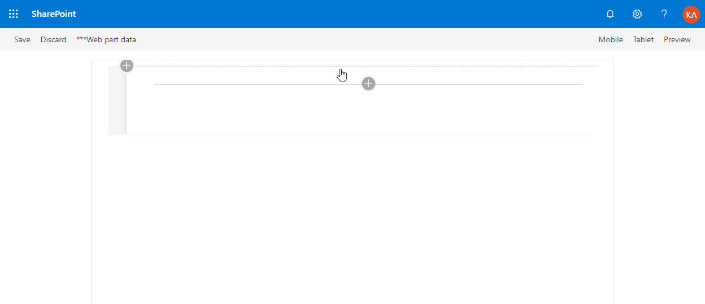

# Webpart with React and Mobx using multiple stores

## Summary
A sample webpart that uses the [Mobx](https://mobx.js.org/) library with multiple stores to keep track of the applications state.



## Used SharePoint Framework Version 


## Applies to

* [SharePoint Framework](https://docs.microsoft.com/sharepoint/dev/spfx/sharepoint-framework-overview)
* [SharePoint Framework Webpart Samples](https://github.com/SharePoint/sp-dev-fx-webparts)
* [Office 365 developer tenant](https://docs.microsoft.com/sharepoint/dev/spfx/set-up-your-developer-tenant)

## Solution

Solution|Author(s)
--------|---------
react-mobx-multiple-stores | Kemal Sinanagic / [@kemicza](http://twitter.com/kemicza) / kemicza@gmail.com

## Version history

Version|Date|Comments
-------|----|--------
1.0|May 24, 2019|Initial release

## Disclaimer
**THIS CODE IS PROVIDED *AS IS* WITHOUT WARRANTY OF ANY KIND, EITHER EXPRESS OR IMPLIED, INCLUDING ANY IMPLIED WARRANTIES OF FITNESS FOR A PARTICULAR PURPOSE, MERCHANTABILITY, OR NON-INFRINGEMENT.**

---

## Minimal Path to Awesome

```sh
$ git clone https://github.com/SharePoint/sp-dev-fx-webparts
$ cd sp-dev-fx-webparts/samples/react-mobx-multiple-stores
$ npm install
$ gulp serve
```

## Features

* Enforces that the state always needs be updated in **actions**, using the <em>always</em> flag for <em>enforceActions</em>.
* Demonstrates the **toJS** method to convert an observable array to a javascript structure. This is used to render the items in a DetailsList.
* Out-of-the-box MobX **decorators** to keep the code clean.
* **Asynchronous** actions
* MobX **computed** values
* **Typescript** version 3.3.4 using <em>@microsoft/rush-stack-compiler-3.3</em> for compatibility with the latest MobX version and typings

