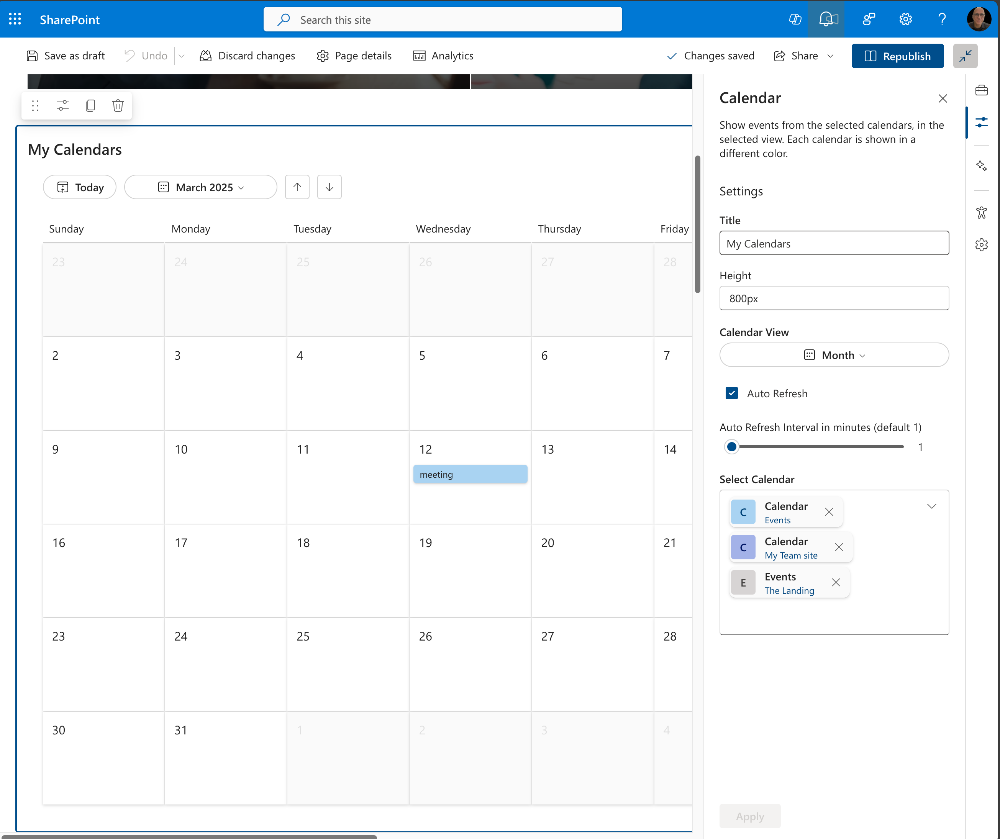
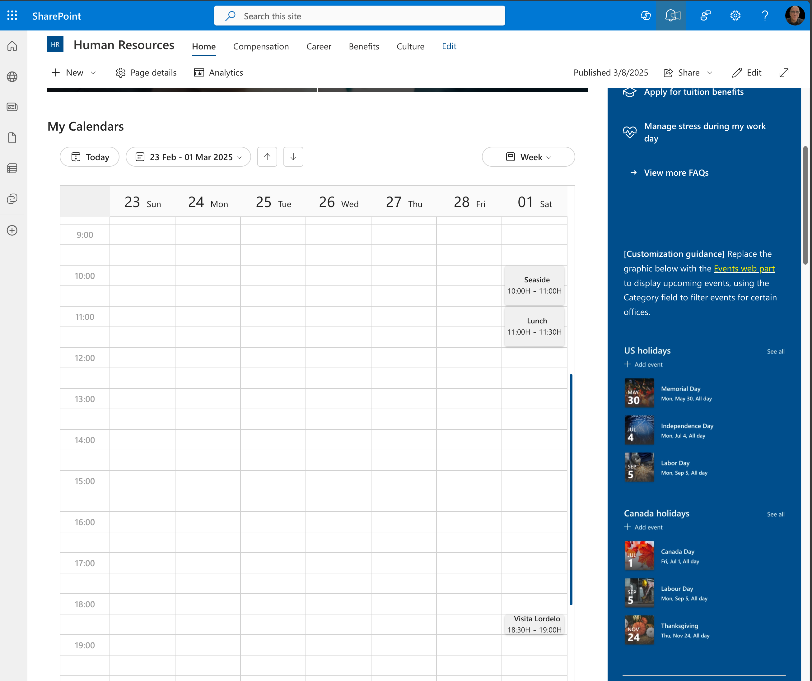

# New Modern Calendar Web Part

## Summary

New Modern Calendar Web Part for SharePoint Framework
This is a new web part that allows users to view their calendar events directly within SharePoint. It integrates with Microsoft Graph to pull in calendar data and provides a user-friendly interface for viewing events.

## Used SharePoint Framework Version

## Applies to

- [SharePoint Framework](https://aka.ms/spfx)
- [Microsoft 365 tenant](https://docs.microsoft.com/en-us/sharepoint/dev/spfx/set-up-your-developer-tenant)

> Get your own free development tenant by subscribing to [Microsoft 365 developer program](http://aka.ms/o365devprogram)

## Prerequisites

 Microsoft Graph permissions

- User.Read
- Group.Read.All
- Sites.Read.All

## Solution

| Solution    | Author(s)                                               |
| ----------- | ------------------------------------------------------- |
| modern-calendar | João Mendes  @joaojmendes.bsky.social |

## Version history

| Version | Date             | Comments        |
| ------- | ---------------- | --------------- |
| 1.0     | March 07, 2025 | Initial release |

## Disclaimer

**THIS CODE IS PROVIDED _AS IS_ WITHOUT WARRANTY OF ANY KIND, EITHER EXPRESS OR IMPLIED, INCLUDING ANY IMPLIED WARRANTIES OF FITNESS FOR A PARTICULAR PURPOSE, MERCHANTABILITY, OR NON-INFRINGEMENT.**

---

## Minimal Path to Awesome

- Clone this repository
- Ensure that you are at the solution folder
- in the command-line run:
  - **npm install**
  - **gulp serve**

## Features

Integrates with Microsoft Graph to pull in calendar data and provides a user-friendly interface for viewing events. The web part is designed to be responsive and works well on desktop devices

This extension illustrates the following concepts:

- FleuntUI 9
- Enhanced UI design
- Integration with Microsoft Graph
- Custom Property pane Fields
- Use external Libraries

## References

- [Getting started with SharePoint Framework](https://docs.microsoft.com/en-us/sharepoint/dev/spfx/set-up-your-developer-tenant)
- [Building for Microsoft teams](https://docs.microsoft.com/en-us/sharepoint/dev/spfx/build-for-teams-overview)
- [Use Microsoft Graph in your solution](https://docs.microsoft.com/en-us/sharepoint/dev/spfx/web-parts/get-started/using-microsoft-graph-apis)
- [Publish SharePoint Framework applications to the Marketplace](https://docs.microsoft.com/en-us/sharepoint/dev/spfx/publish-to-marketplace-overview)
- [Microsoft 365 Patterns and Practices](https://aka.ms/m365pnp) - Guidance, tooling, samples and open-source controls for your Microsoft 365 development

