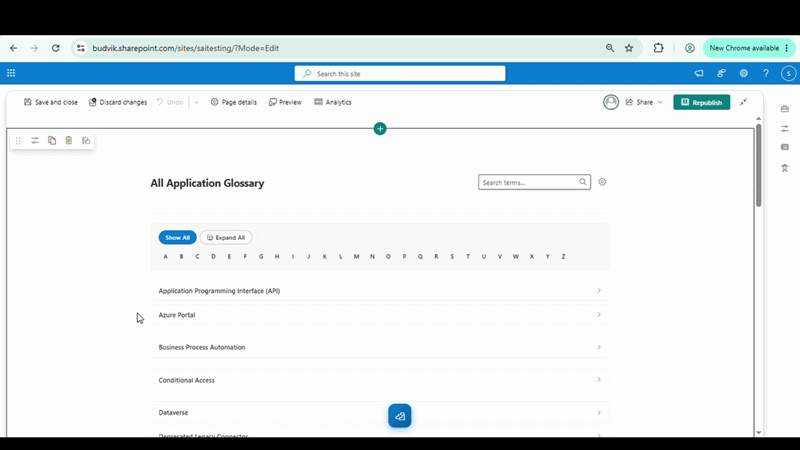
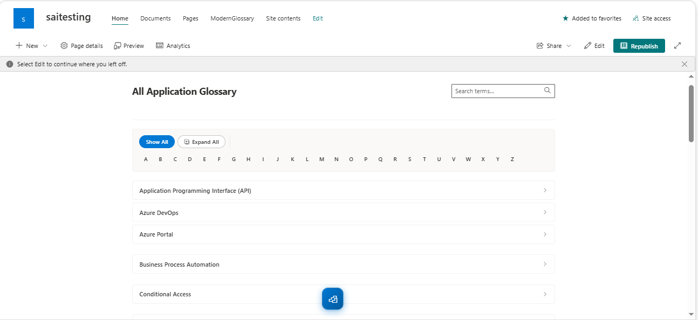
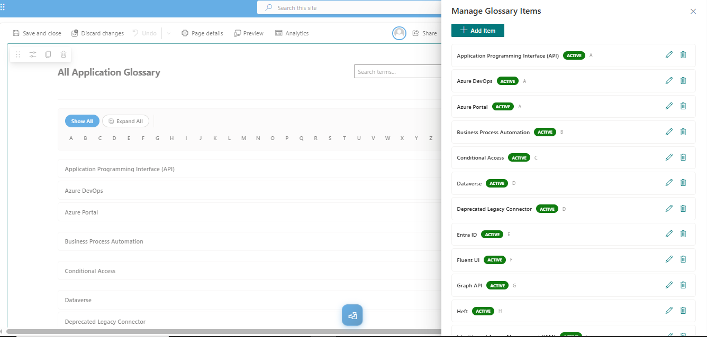

# Modern Glossary

## Summary

A dynamic SharePoint Framework (SPFx) web part that displays an A-Z indexed, accordion-style glossary sourced from a SharePoint list. Features alphabet-based navigation, expand/collapse controls, free-text search, in-place add/edit/delete item management, and Active/Inactive content lifecycle control - perfect for IT glossaries, acronym libraries, and application directories on SharePoint pages.

This sample is optimally compatible with the following environment configuration:

## Applies to

- [SharePoint Framework](https://aka.ms/spfx)
- [Microsoft 365 tenant](https://docs.microsoft.com/sharepoint/dev/spfx/set-up-your-developer-tenant)

## Prerequisites

- SharePoint Online environment
- A SharePoint list with the following columns:
  - **Title** (Single line of text) - Required, built-in
  - **Description** (Multiple lines of text) - Required
  - **ApplicationUrl** (Hyperlink) - Required
  - **DetailsUrl** (Hyperlink) - Required
  - **Status** (Choice: Active / Inactive) - Required
  - **AlphabetLetter** (Choice: A-Z) - Required

## Contributors

- [Sai Siva Ram Bandaru](https://github.com/saiiiiiii)

## Version history

| Version | Date            | Comments         |
| ------- | --------------- | ---------------- |
| 1.0     | August 8, 2026  | Initial release  |

## Minimal Path to Awesome

- Clone this repository
- Ensure that you are at the solution folder
- In the command-line run:
  - `npm install`
  - `npm run start`
- Create a SharePoint list named `ModernGlossary` with the required columns (Title, Description, ApplicationUrl, DetailsUrl, Status, AlphabetLetter)
- Add the web part to a page and configure it to use the list

## Features

This web part illustrates the following concepts:

### Core Features

- **A-Z Alphabet Navigation**: Full A-Z index strip for filtering the glossary
  - Click any letter to view only that letter's terms
  - Letters with no matching Active items render disabled
  - **Show All** clears the letter filter
- **Accordion-Style Term Display**: Each term expands to show Description, Application URL, and Details URL
  - Chevron arrow held in a single, fixed end-of-row position regardless of title length
  - Full keyboard and screen-reader accessibility (`aria-expanded`, `aria-controls`, `role="region"`)
- **Expand All / Collapse All**: Positioned alongside Show All, using identical pill styling; toggles every currently visible accordion item
- **Free-Text Search**: Filters across Title and Description, combinable with the letter filter

## Configuration

### Web Part Properties

| Property  | Type   | Default                    | Description                                                     |
|-----------|--------|----------------------------|-----------------------------------------------------------------|
| title     | string | "All Application Glossary" | Display heading shown above the alphabet navigation             |
| listName  | string | "ModernGlossary"           | Exact title of the SharePoint list to read glossary terms from  |

### SharePoint List Structure

| Column Name    | Internal Name     | Type                           | Required | Description                                  |
|----------------|-------------------|--------------------------------|----------|----------------------------------------------|
| Title          | `Title`           | Single line of text (built-in) | Yes      | The glossary term                            |
| Description    | `Description`     | Multiple lines of text         | Yes      | Definition shown in the expanded accordion   |
| ApplicationUrl | `ApplicationUrl`  | Hyperlink                      | Yes      | Label + link to the live application/tool    |
| DetailsUrl     | `DetailsUrl`      | Hyperlink                      | Yes      | Label + link to supporting documentation     |
| Status         | `Status`          | Choice: `Active`, `Inactive`   | Yes      | Controls visibility; only `Active` is shown  |
| AlphabetLetter | `AlphabetLetter`  | Choice: `A`-`Z`                | Yes      | Explicit letter bucket for A-Z grouping      |

### Display Modes

#### Edit Mode

- Gear icon appears next to the search box
- Click to open the Manage Glossary Items panel
- Add, edit, delete, and toggle item status

#### Read Mode (Published Page)

- Only Active glossary terms are displayed
- Gear icon and management panel are not rendered
- Users can browse, search, and expand terms

## References

- [Getting started with SharePoint Framework](https://docs.microsoft.com/sharepoint/dev/spfx/set-up-your-developer-tenant)
- [Building for Microsoft Teams](https://docs.microsoft.com/sharepoint/dev/spfx/build-for-teams-overview)
- [Use Microsoft Graph in your solution](https://docs.microsoft.com/sharepoint/dev/spfx/web-parts/get-started/using-microsoft-graph-apis)
- [Publish SharePoint Framework applications to the Marketplace](https://docs.microsoft.com/sharepoint/dev/spfx/publish-to-marketplace-overview)
- [Microsoft 365 Patterns and Practices](https://aka.ms/m365pnp)
- [PnP JS Documentation](https://pnp.github.io/pnpjs/)
- [Working with Lists and Items using PnP JS](https://pnp.github.io/pnpjs/sp/items/)
- [Fluent UI React](https://developer.microsoft.com/fluentui#/controls/web)

## Help

We do not support samples, but this community is always willing to help, and we want to improve these samples. We use GitHub to track issues, which makes it easy for community members to volunteer their time and help resolve issues.

If you're having issues building the solution, please run [spfx doctor](https://pnp.github.io/cli-microsoft365/cmd/spfx/spfx-doctor/) from within the solution folder to diagnose incompatibility issues with your environment.

You can try looking at [issues related to this sample](https://github.com/pnp/sp-dev-fx-webparts/issues?q=label%3A%22sample%3A%20modern-glossary%22) to see if anybody else is having the same issues.

You can also try looking at [discussions related to this sample](https://github.com/pnp/sp-dev-fx-webparts/discussions?discussions_q=modern-glossary) and see what the community is saying.

If you encounter any issues while using this sample, [create a new issue](https://github.com/pnp/sp-dev-fx-webparts/issues/new?assignees=&labels=Needs%3A+Triage+%3Amag%3A%2Ctype%3Abug-suspected%2Csample%3A%20modern-glossary&template=bug-report.yml&sample=modern-glossary&authors=@saiiiiiii&title=modern-glossary%20-%20).

For questions regarding this sample, [create a new question](https://github.com/pnp/sp-dev-fx-webparts/issues/new?assignees=&labels=Needs%3A+Triage+%3Amag%3A%2Ctype%3Aquestion%2Csample%3A%20modern-glossary&template=question.yml&sample=modern-glossary&authors=@saiiiiiii&title=modern-glossary%20-%20).

Finally, if you have an idea for improvement, [make a suggestion](https://github.com/pnp/sp-dev-fx-webparts/issues/new?assignees=&labels=Needs%3A+Triage+%3Amag%3A%2Ctype%3Aenhancement%2Csample%3A%20modern-glossary&template=suggestion.yml&sample=modern-glossary&authors=@saiiiiiii&title=modern-glossary%20-%20).

## Disclaimer

**THIS CODE IS PROVIDED *AS IS* WITHOUT WARRANTY OF ANY KIND, EITHER EXPRESS OR IMPLIED, INCLUDING ANY IMPLIED WARRANTIES OF FITNESS FOR A PARTICULAR PURPOSE, MERCHANTABILITY, OR NON-INFRINGEMENT.**

