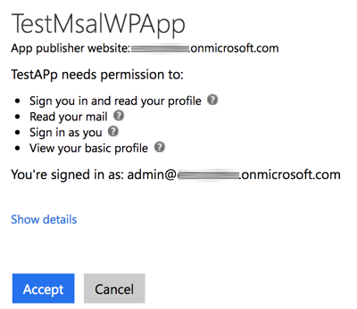
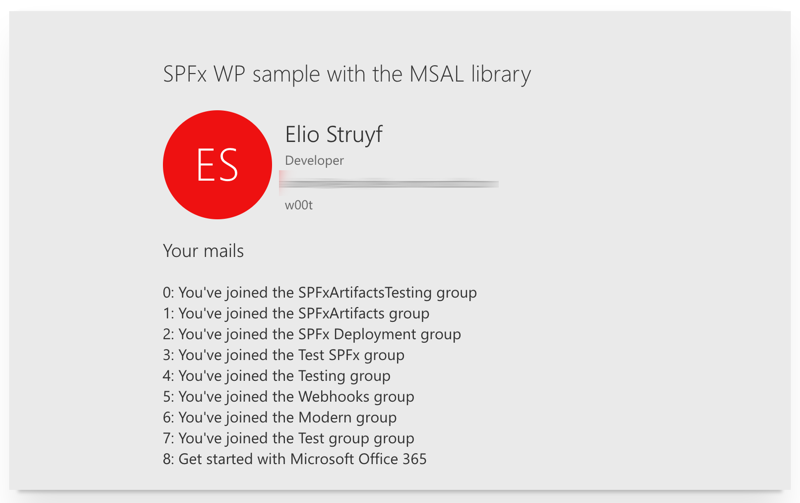
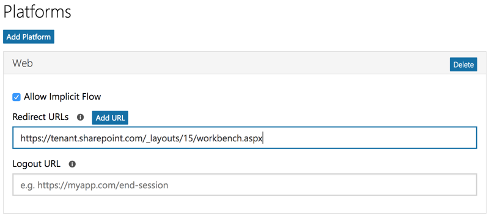

# Microsoft Authentication Library (MSAL JS) authentication sample

## Summary

Sample SharePoint Framework web part which makes use of the [Microsoft Authentication Library (MSAL JS)](https://github.com/AzureAD/microsoft-authentication-library-for-js) to call the Microsoft Graph.

### MSAL WP

The sample web part will retrieve an access token with the `User.Read` and `Mail.Read` scope. Once an access token is retrieved, it will do a call to receive the current user and its mail messages.

After you gave permissions, the following will information will get displayed:

## Compatibility

 

-Compatible-green.svg)

## Applies to

* [SharePoint Framework](https://docs.microsoft.com/sharepoint/dev/spfx/sharepoint-framework-overview)
* [Office 365 developer tenant](https://docs.microsoft.com/sharepoint/dev/spfx/set-up-your-developer-tenant)

## Solution

Solution|Author(s)
--------|---------
react-msal-msgraph|[Elio Struyf](https://github.com/estruyf) (MVP, [U2U](https://www.u2u.be), [@eliostruyf](https://www.twitter.com/eliostruyf))

## Version history

Version|Date|Comments
-------|----|--------
1.0.0|March 17, 2017|Initial release

## Prerequisites

- Office 365 subscription with SharePoint Online and Exchange

## Minimal Path to Awesome

- Clone this repo
- Go and register a new application on [https://apps.dev.microsoft.com](https://apps.dev.microsoft.com)
    - Once logged in, click on **add an app**
    - Specify the application name, and click create
    - Click on **add platform**, and choose **web**
    - Specify the workbench URL and be sure that **allow implicit flow** is enabled
    - Click on save to store these changes

>  This sample can also be opened with [VS Code Remote Development](https://code.visualstudio.com/docs/remote/remote-overview). Visit https://aka.ms/spfx-devcontainer for further instructions.

- Copy the **application id** and change add this to the [MsalWP.tsx file on line 20](./src/webparts/msalWp/components/MsalWp.tsx#20)
- Run `npm i`
- Run `gulp serve --nobrowser`
- Test out your web part in the local or hosted workbench

## Features

Sample web part in this solution illustrates the following concepts on top of the SharePoint Framework:

- using React for building SharePoint Framework client-side web parts
- using Office UI Fabric React styles for building user experience consistent with SharePoint and Office
- on-demand authentication with the Azure Active Directory using the MSAL JS library
- communicating with the Microsoft Graph using its REST API
- using the MSAL JS library with SharePoint Framework web parts built using React

## Help

We do not support samples, but this community is always willing to help, and we want to improve these samples. We use GitHub to track issues, which makes it easy for  community members to volunteer their time and help resolve issues.

If you're having issues building the solution, please run [spfx doctor](https://pnp.github.io/cli-microsoft365/cmd/spfx/spfx-doctor/) from within the solution folder to diagnose incompatibility issues with your environment.

You can try looking at [issues related to this sample](https://github.com/pnp/sp-dev-fx-webparts/issues?q=label%3A%22sample%3A%20react-msal-msgraph%22) to see if anybody else is having the same issues.

You can also try looking at [discussions related to this sample](https://github.com/pnp/sp-dev-fx-webparts/discussions?discussions_q=react-msal-msgraph) and see what the community is saying.

If you encounter any issues while using this sample, [create a new issue](https://github.com/pnp/sp-dev-fx-webparts/issues/new?assignees=&labels=Needs%3A+Triage+%3Amag%3A%2Ctype%3Abug-suspected%2Csample%3A%20react-msal-msgraph&template=bug-report.yml&sample=react-msal-msgraph&authors=@estruyf&title=react-msal-msgraph%20-%20).

For questions regarding this sample, [create a new question](https://github.com/pnp/sp-dev-fx-webparts/issues/new?assignees=&labels=Needs%3A+Triage+%3Amag%3A%2Ctype%3Aquestion%2Csample%3A%20react-msal-msgraph&template=question.yml&sample=react-msal-msgraph&authors=@estruyf&title=react-msal-msgraph%20-%20).

Finally, if you have an idea for improvement, [make a suggestion](https://github.com/pnp/sp-dev-fx-webparts/issues/new?assignees=&labels=Needs%3A+Triage+%3Amag%3A%2Ctype%3Aenhancement%2Csample%3A%20react-msal-msgraph&template=suggestion.yml&sample=react-msal-msgraph&authors=@estruyf&title=react-msal-msgraph%20-%20).

## Disclaimer

**THIS CODE IS PROVIDED *AS IS* WITHOUT WARRANTY OF ANY KIND, EITHER EXPRESS OR IMPLIED, INCLUDING ANY IMPLIED WARRANTIES OF FITNESS FOR A PARTICULAR PURPOSE, MERCHANTABILITY, OR NON-INFRINGEMENT.**

