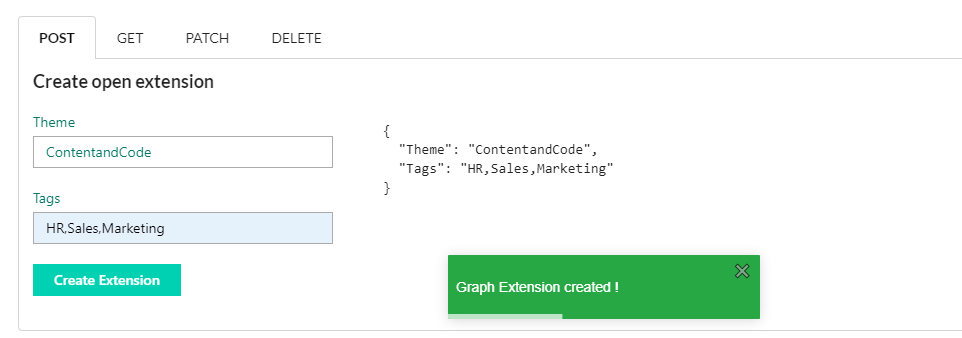
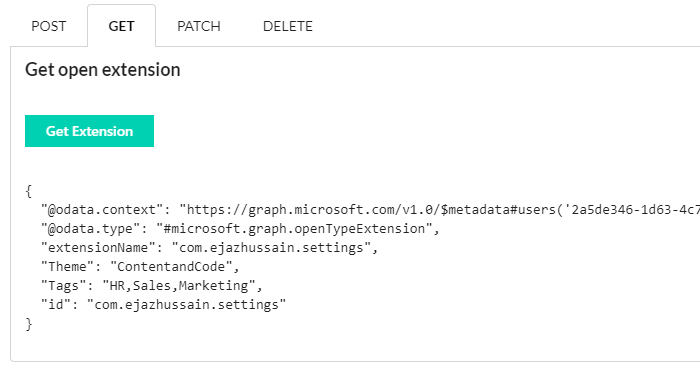
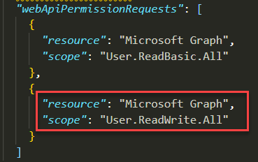

## react-msgraph-extension

## Summary
This sample shows how to managed Microsoft Graph Open Extension in SPFx. This application uses **User** Resource to create Open Extension.

## ScreenShots

### Create a new Microsoft Graph Open Extension

### Get an existing Microsoft Graph Open Extension

## Used SharePoint Framework Version 

## Applies to

* [SharePoint Framework](https://docs.microsoft.com/sharepoint/dev/spfx/sharepoint-framework-overview)
* [Office 365 tenant](https://docs.microsoft.com/sharepoint/dev/spfx/set-up-your-development-environment)

## Prerequisites
 
> You need following set of permissions in order to manage Microsoft Open Graph Extension.Find out more about consuming the [Microsoft Graph API in the SharePoint Framework](https://docs.microsoft.com/en-us/sharepoint/dev/spfx/use-aad-tutorial)   

## Solution

Solution|Author(s)
--------|---------
react-msgraph-extension | Ejaz Hussain

## Version history

Version|Date|Comments
-------|----|--------
1.0|October 20, 2019|Initial release

## Disclaimer
**THIS CODE IS PROVIDED *AS IS* WITHOUT WARRANTY OF ANY KIND, EITHER EXPRESS OR IMPLIED, INCLUDING ANY IMPLIED WARRANTIES OF FITNESS FOR A PARTICULAR PURPOSE, MERCHANTABILITY, OR NON-INFRINGEMENT.**

---

## Minimal Path to Awesome

- Clone this repository
- in the command line run:
  - `npm install`
  - `gulp serve`

If you have not previously granted the required Microsoft Graph permissions, you need to:

- Run `gulp bundle --ship`
- Run `gulp package-solution --ship`
- Install the `.sppkg` file (under `.\sharepoint\solution`) to the SP app catalog
- Approve the API permissions in the new SP admin center

## Features
Here are main features for this application

- Create a new Open Graph Extension
- Get an existing Graph Open Extension
- Update an existing Open Graph Extension
- Remove an existing Open Graph Extension

