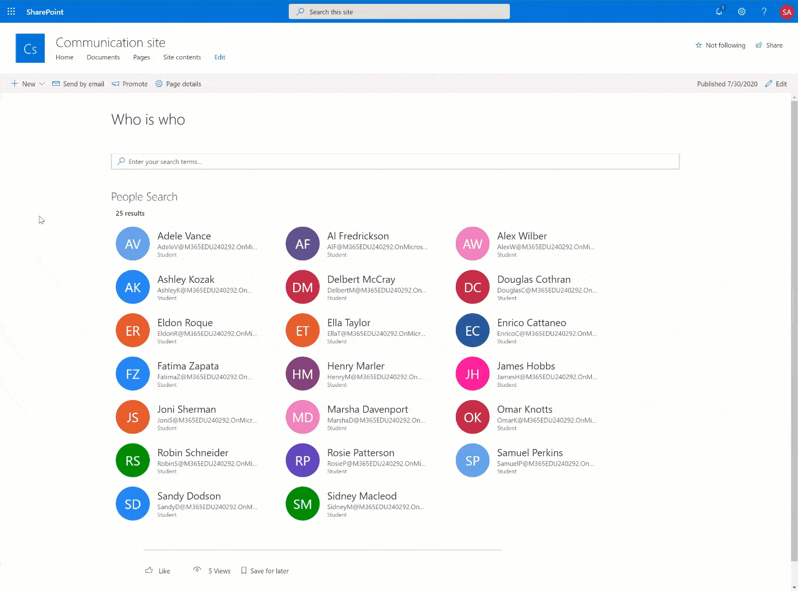

# Microsoft Graph People Search

## Summary

Show and search users from your organization, through Microsoft Graph. Search results show as a nice People Card, and display the Live Persona Card on hover.  
The web part accepts a search query through a Dynamic Data connection, to further filter the displayed results. A source for this search query is not provided, but by default this can come from the Microsoft Search search box or the Page Environment. You could also use the Search Box Web Part provided by the [PnP Modern Search Web Parts](https://microsoft-search.github.io/pnp-modern-search/).

The sample also shows how to use SPFx Web Part asynchronous rendering using `isRenderAsync` property and `renderCompleted` method.

 
 

## Future improvements
- Support loading Profile Pictures
- Support for multiple pages
- Improve $select field with predefined properties of the User object
- Improve field mapping with the selected properties defined in $select
- Toggle Live Person Card

## Accompanying blog post
I wrote a blog post covering more if the inner workings, you can find it at [SPFx People Search web part based on Microsoft Graph](https://blog.yannickreekmans.be/spfx-people-search-web-part-based-on-microsoft-graph/)

## Compatibility


-Incompatible-red.svg "SharePoint Server 2016 Feature Pack 2 requires SPFx 1.1")


## Applies to

* [SharePoint Online](https://docs.microsoft.com/sharepoint/dev/spfx/sharepoint-framework-overview)
* [Microsoft Teams](https://products.office.com/en-US/microsoft-teams/group-chat-software) - Untested!!
* [Office 365 tenant](https://docs.microsoft.com/sharepoint/dev/spfx/set-up-your-development-environment)

## Solution

Solution|Author(s)
--------|---------
react-msgraph-peoplesearch | Yannick Reekmans ([YannickReekmans](https://twitter.com/YannickReekmans))

## Version history

Version|Date|Comments
-------|----|--------
2.0.0|July 30, 2020|Initial release

## Minimal Path to Awesome

- Clone this repository
- in the command line run:
  - `npm install`
  - `gulp build`
  - `gulp bundle --ship`
  - `gulp package-solution --ship`
- Add to AppCatalog and deploy
- Assign `User.Read.All` delegated permissions to the **SharePoint Online Client Extensibility Web Application Principal**, easiest way is with [Office 365 CLI](https://pnp.github.io/office365-cli/):
```

>  This sample can also be opened with [VS Code Remote Development](https://code.visualstudio.com/docs/remote/remote-overview). Visit https://aka.ms/spfx-devcontainer for further instructions.
o365 login
o365 spo serviceprincipal grant add --resource 'Microsoft Graph' --scope 'User.Read.All'
```

>  This sample can also be opened with [VS Code Remote Development](https://code.visualstudio.com/docs/remote/remote-overview). Visit https://aka.ms/spfx-devcontainer for further instructions.

## Acknowledgements / Inspiration

There are many web parts that aim to do the same thing, but they either use SharePoint Search as data store or they render their results in a completely different way. It's impossible to acknowledge all sources of inspiration to this solution, but I do want to give a shout out to two projects (and their contributors) that were foundational to deliver this solution as quickly as I did:

### React Directory Web Part
The foundation on which I started building my own solution. This web part can be downloaded from the [SharePoint Framework Client-Side Web Part Samples & Tutorial Materials](https://github.com/pnp/sp-dev-fx-webparts/tree/main/samples/react-directory)

#### Thanks to
- João Mendes ([@joaojmendes](https://twitter.com/joaojmendes))
- Peter Paul Kirschner ([@petkir_at](https://twitter.com/petkir_at))

### PnP Modern Search Web Parts
These web parts were an enormous inspiration on code structure and implementation approach. Their codebase is very impressive, and a lot of the code in this web part is a literal copy paste from them. You can find more on the  [PnP Modern Search Web Parts](https://microsoft-search.github.io/pnp-modern-search/) page.

#### Thanks to
- Franck Cornu (aequos) - [@FranckCornu](http://www.twitter.com/FranckCornu) - [GitHub Sponsor Page](https://github.com/sponsors/FranckyC)  
- Mikael Svenson (Microsoft) - [@mikaelsvenson](http://www.twitter.com/mikaelsvenson)  
- Yannick Reekmans - [@yannickreekmans](https://twitter.com/yannickreekmans)  
- Albert-Jan Schot - [@appieschot](https://twitter.com/appieschot)  
- Tarald Gåsbakk (PuzzlePart) - [@taraldgasbakk](https://twitter.com/Taraldgasbakk)  
- Brad Schlintz (Microsoft) - [@bschlintz](https://twitter.com/bschlintz)  
- Richard Gigan - [@PooLP](https://twitter.com/PooLP)  

## Help

We do not support samples, but we this community is always willing to help, and we want to improve these samples. We use GitHub to track issues, which makes it easy for  community members to volunteer their time and help resolve issues.

If you're having issues building the solution, please run [spfx doctor](https://pnp.github.io/cli-microsoft365/cmd/spfx/spfx-doctor/) from within the solution folder to diagnose incompatibility issues with your environment.

If you encounter any issues while using this sample, [create a new issue](https://github.com/pnp/sp-dev-fx-webparts/issues/new?assignees=&labels=Needs%3A+Triage+%3Amag%3A%2Ctype%3Abug-suspected%2Csample%3A%20react-msgraph-peoplesearch&template=bug-report.yml&sample=react-msgraph-peoplesearch&authors=@YannickRe&title=react-msgraph-peoplesearch%20-%20).

For questions regarding this sample, [create a new question](https://github.com/pnp/sp-dev-fx-webparts/issues/new?assignees=&labels=Needs%3A+Triage+%3Amag%3A%2Ctype%3Aquestion%2Csample%3A%20react-msgraph-peoplesearch&template=question.yml&sample=react-msgraph-peoplesearch&authors=@YannickRe&title=react-msgraph-peoplesearch%20-%20).

Finally, if you have an idea for improvement, [make a suggestion](https://github.com/pnp/sp-dev-fx-webparts/issues/new?assignees=&labels=Needs%3A+Triage+%3Amag%3A%2Ctype%3Aenhancement%2Csample%3A%20react-msgraph-peoplesearch&template=question.yml&sample=react-msgraph-peoplesearch&authors=@YannickRe&title=react-msgraph-peoplesearch%20-%20).

## Disclaimer

**THIS CODE IS PROVIDED *AS IS* WITHOUT WARRANTY OF ANY KIND, EITHER EXPRESS OR IMPLIED, INCLUDING ANY IMPLIED WARRANTIES OF FITNESS FOR A PARTICULAR PURPOSE, MERCHANTABILITY, OR NON-INFRINGEMENT.**


