# Multilist Grid

## Summary
React-multilist-grid is an SPFx web part that uses React, Office-UI-Fabric, and Redux to let users edit list data from lists that reside in multiple webs and multiple sites in a single grid, similar to Quick Edit mode. The lists do not to be of the same type – you just need to create column mappings to tell the web part which fields to show in which columns of the grid.

The configuration panel of the web part is show below. It has two buttons—one to configure the columns that will be displayed on the grid, and another to configure the lists that contain the data to be edited.
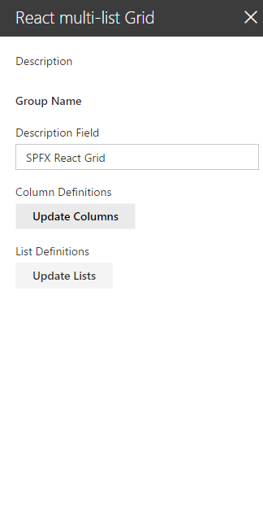

Clicking on the Update Columns button shows the Column Definition configuration panel shown below:
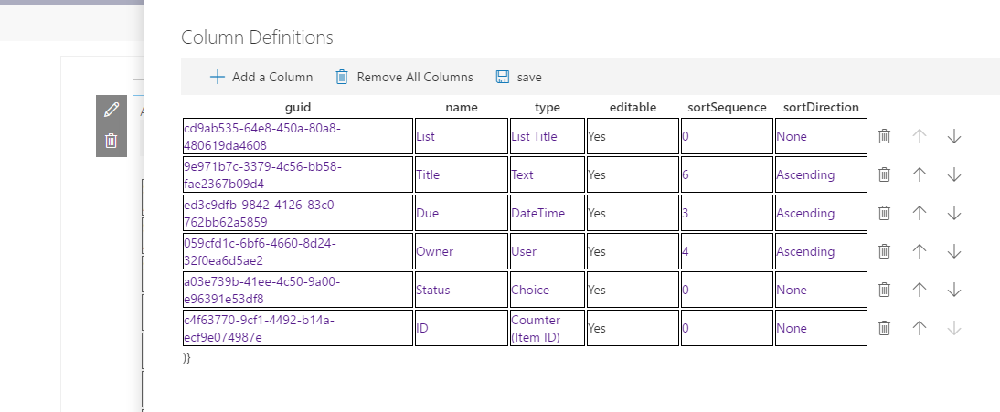

When adding a column the web part automatically assigns a guid for internal use.  In the &#39;name&#39; field you can use any name you like. The text entered here will be used as the column header in the grid. In the &#39;type&#39; field, you need to select the type of data to be displayed:
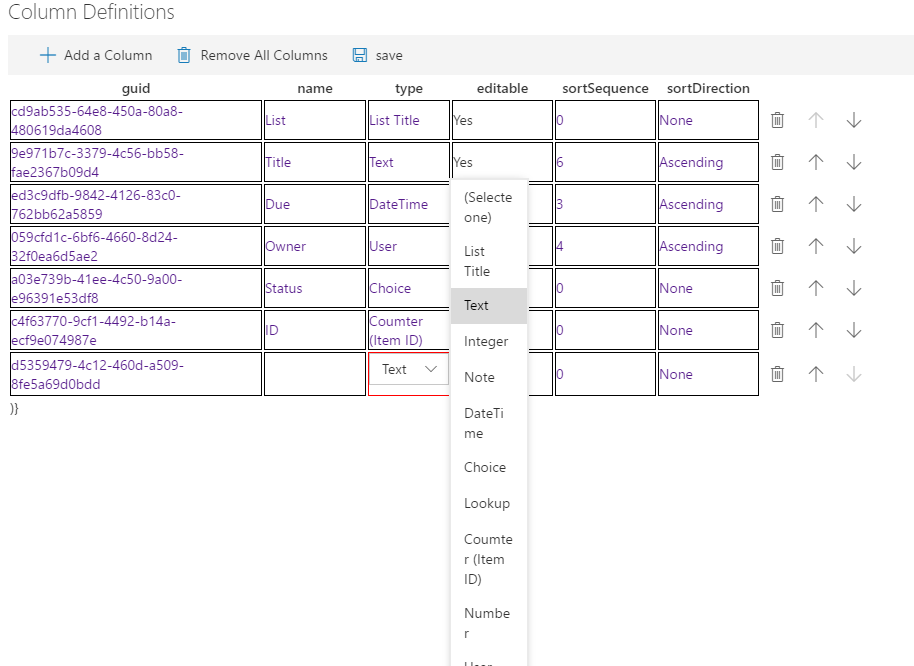

These are SharePoint field types for the most part(not all field types have been implemented yet). There is one &#39;special&#39; field type called &#39;List Title&#39;. It is used to identify which list an item came from when displayed in the grid. You can move an item from one list (and site) to another by changing the selected list title in the grid. In the &#39;editable&#39; field you can specify whether this field can be edited in the grid(not yet implemented).  The sortSequence and sortDirection field let you set up default sorting on a given column.

The columns will be displayed in the grid in the order they appear on the Column Definition panel. You can use the up and down arrow icons on each row to rearrange the columns. The delete icon on each row can be used to delete a column from the grid.

After defining all the columns to be displayed in your grid, click the save icon in the command bar and you will be returned to the configuration panel for the web part.

Clicking the Update Lists button on the configuration panel will open the List Definitions panel:
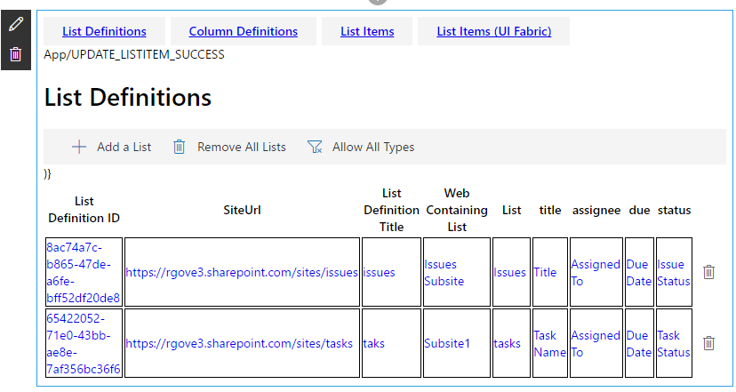
Here you configure which lists the web part should display in the grid. When adding a list the web part automatically assigns a guid for internal use.  In the &#39;SiteUrl&#39; you must enter the url of the site collection that contains the list. In the &#39;List Definition Title&#39; field enter a user friendly title for this list. The text you enter here will be shown on the grid for all items that came from this list in the &#39;List Title&#39; column (provided you have created a &#39;List Title&#39; column.

When you tab to the  &#39;Web Containing List&#39; field, you can use the search icon:

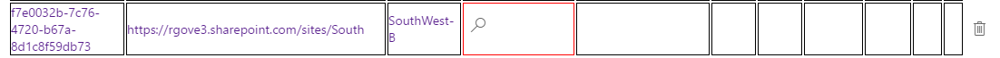

to open the Web Selector which allows you to choose the web that contains the list to display:
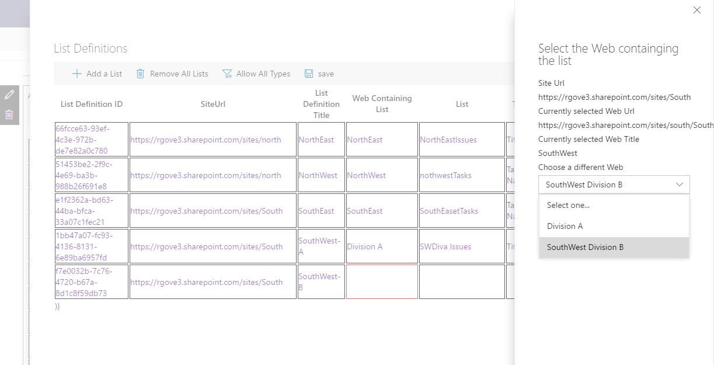

The Web Selector initially shows all the webs under the rootweb. When you select a different web, it then shows the subwebs under the selected web.  You can keep selecting subwebs until you reach the web that contains the list to display.

After selecting the web, tab over to the list column, and choose the list from the selected web that you want to show in the grid:

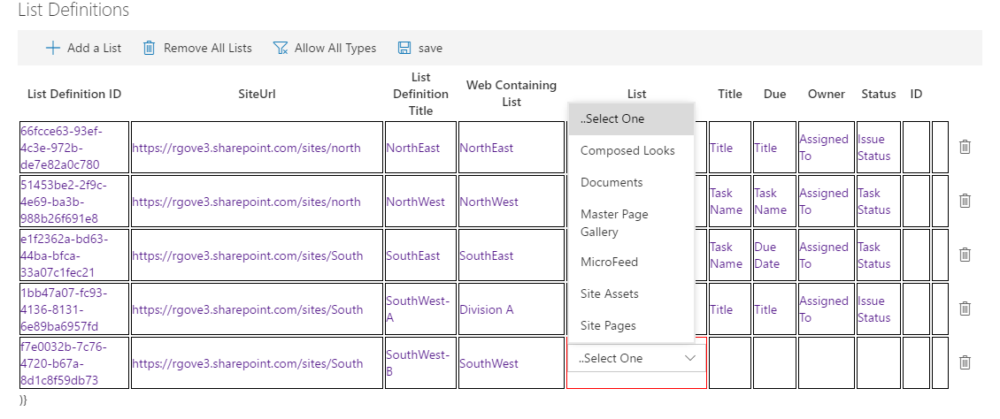

Following the &#39;List&#39; field, there is one field for each column you created in the Column Definitions panel. When you tab to each of these columns a dropdown list is presented showing you all the fields in this list that match the field type you specified on the Column Definition panel:

Choose the field you want to have displayed for this list in the specified column.

[Selecting the Title Field]
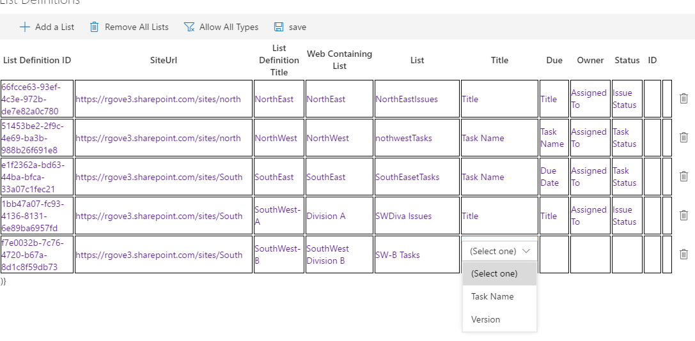

[Selecting the Due Date Field]
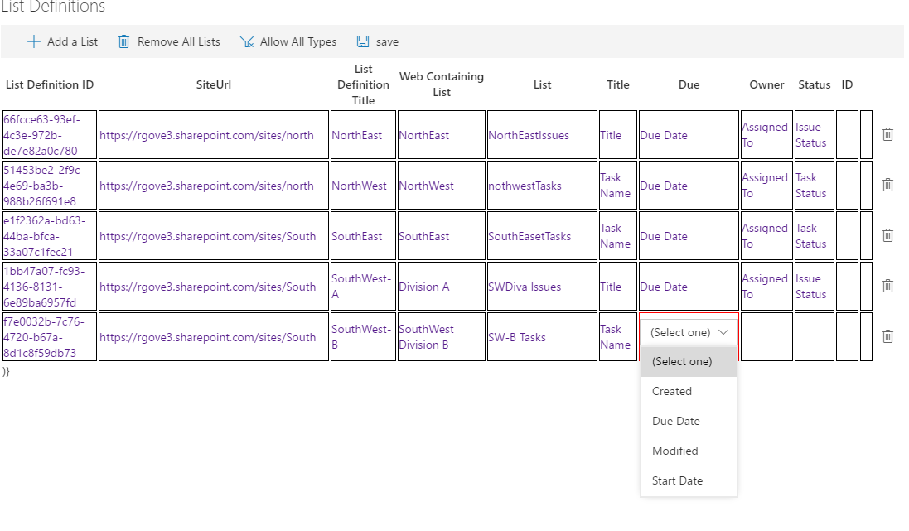

Click the save button in the command bar once you are done defining all your lists.

The web part will now display a grid showing all of the items in the lists you have selected:
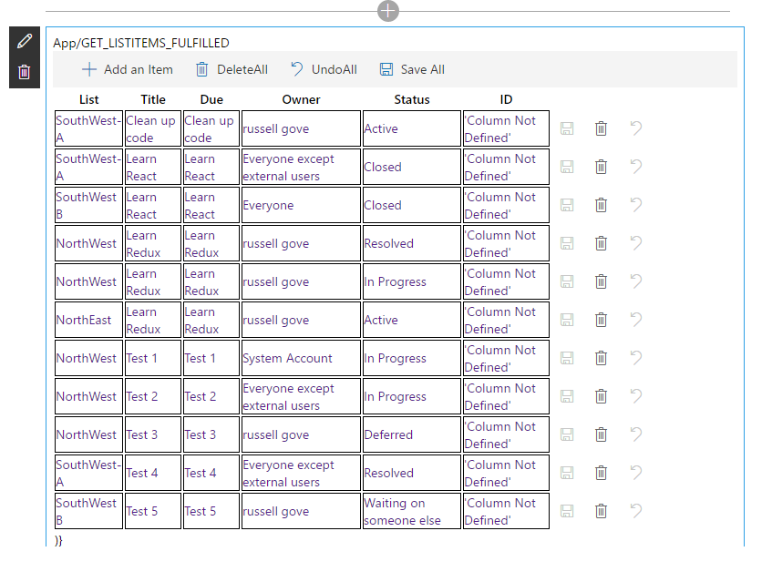

You can edit any cell in the grid by tabbing to it, or clicking on it. To move an item between lists, simply click on the &#39;List Title&#39; column and choose a new list:

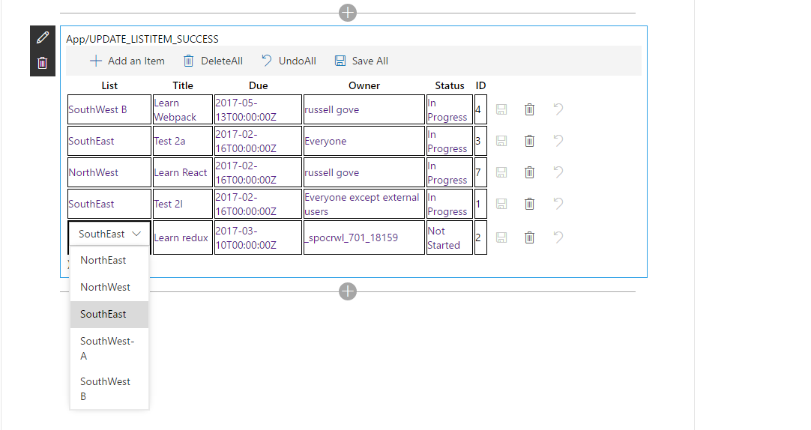

If you change a field of type &#39;user&#39;, the web part will attempt to lookup the user in the destination site and use that user when adding the item to the new site. Similar mappings are done for other column types.

You can click the save icon on each row to save the selected row back to SharePoint. The delete icon can be used to mark an item to be deleted:
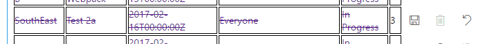

The item will not be removed from SharePoint until the save icon is clicked.

Use the Undo icon to undo the changes made to an item.

## Compatibility

 

-Compatible-green.svg)

## Applies to

* [SharePoint Framework Developer Preview](https://docs.microsoft.com/sharepoint/dev/spfx/sharepoint-framework-overview)
* [Office 365 developer tenant](https://docs.microsoft.com/sharepoint/dev/spfx/set-up-your-developer-tenant)

## Prerequisites

> React, Redux Office-UI-Fabric

## Solution

Solution|Author(s)
--------|---------
 react-spfx-multilist-grid | Russell Gove

## Version history

Version|Date|Comments
-------|----|--------
0.1|December 31, 2016|Initial version

## Minimal Path to Awesome

- Clone this repository
- in the command line run:
  - `npm install`
  - `tsd install`
  - `gulp serve`

>  This sample can also be opened with [VS Code Remote Development](https://code.visualstudio.com/docs/remote/remote-overview). Visit https://aka.ms/spfx-devcontainer for further instructions.

> Include any additional steps as needed.

## Features

An SPFx Web part that uses React, Office-UI-Fabric, and Redux to let users edit list data from multiple Webs and Multiple Sites in a single grid.

Usage:

1. Define the columns to be shown in the grid

2. Define the lists to be edited

3. Edit the info

## Disclaimer

**THIS CODE IS PROVIDED *AS IS* WITHOUT WARRANTY OF ANY KIND, EITHER EXPRESS OR IMPLIED, INCLUDING ANY IMPLIED WARRANTIES OF FITNESS FOR A PARTICULAR PURPOSE, MERCHANTABILITY, OR NON-INFRINGEMENT.**

