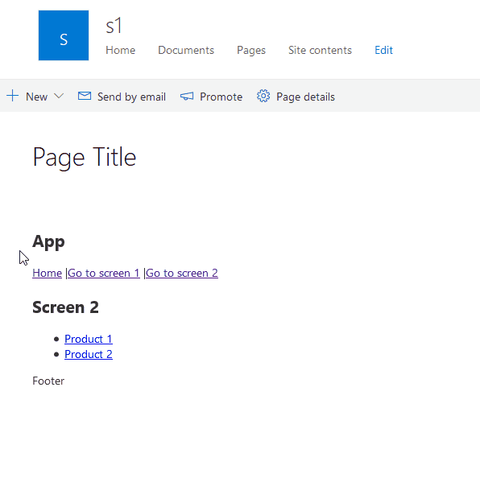
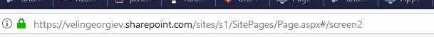

# SharePoint Framework React multi screen web part sample #

## Summary

This sample uses the popular [React Router](https://github.com/ReactTraining/react-router#readme) library to create tab, multi-screen or single page app (spa) experience in React SPFx web part. This is useful when the web part is more complex and to simplify the user experience multiple screens or tabs are needed. The same approach can be taken when a single page app (SPA) has to be migrated to modern SharePoint sites.

## Make use of browser history and url hashes to navigate between different tabs/screens of the web part

The web part utilizes the usage of hashes in the URL so different screen will be displayed based on hash in the URL. That way the browser history is also used so it could provide similar experience as in a single page application.

## Used SharePoint Framework Version 

## Applies to

* [SharePoint Framework](https://docs.microsoft.com/sharepoint/dev/spfx/sharepoint-framework-overview)
* [Office 365 developer tenant](https://docs.microsoft.com/sharepoint/dev/spfx/set-up-your-developer-tenant)

## Prerequisites

- Office 365 subscription with SharePoint Online.
- SharePoint Framework [development environment](https://docs.microsoft.com/sharepoint/dev/spfx/set-up-your-development-environment) already set up.

## Solution

Solution|Author(s)
--------|---------
react-multiscreen-webpart | Velin Georgiev ([@VelinGeorgiev](https://twitter.com/velingeorgiev)), Stefan Bauer ([@StfBauer](https://twitter.com/stfbauer))

## Version history

Version|Date|Comments
-------|----|--------
0.0.1|July 3, 2019 | Initial commit

## Disclaimer
**THIS CODE IS PROVIDED *AS IS* WITHOUT WARRANTY OF ANY KIND, EITHER EXPRESS OR IMPLIED, INCLUDING ANY IMPLIED WARRANTIES OF FITNESS FOR A PARTICULAR PURPOSE, MERCHANTABILITY, OR NON-INFRINGEMENT.**

---

## Minimal Path to Awesome

- Clone this repository.
- Open the command line, navigate to the web part folder and execute:
    - `npm i`
    - `gulp serve`

## Usefull links

- [React Router](https://github.com/ReactTraining/react-router#readme)

