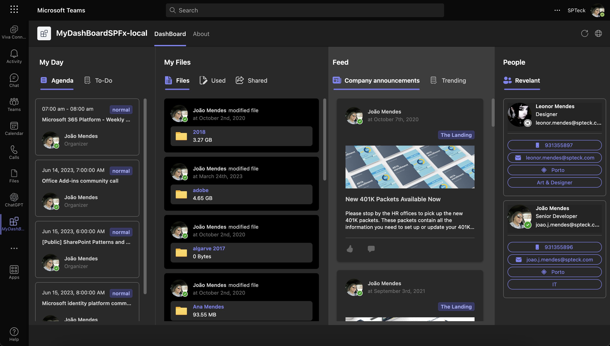
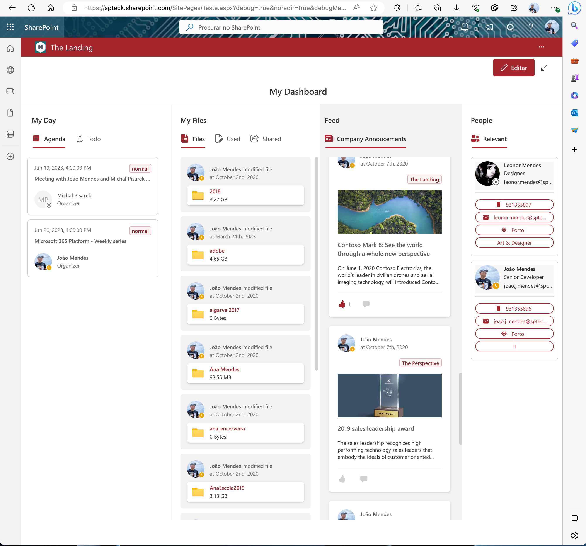
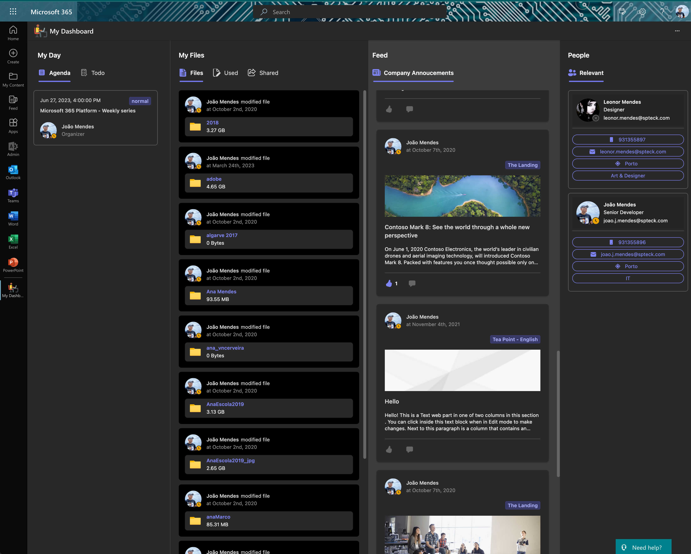
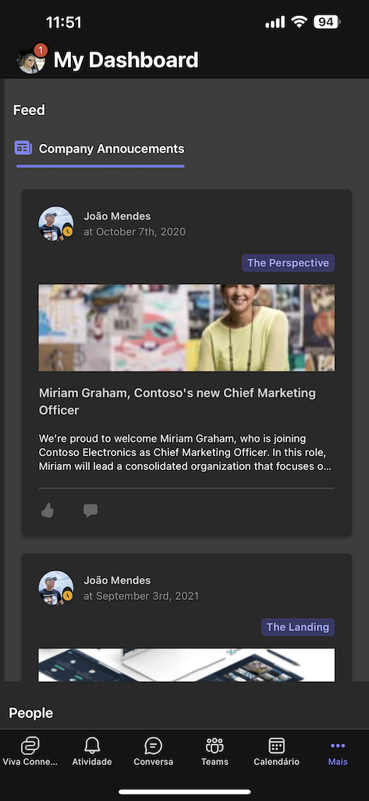
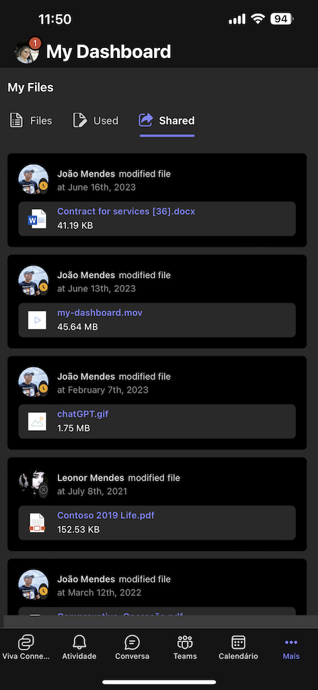
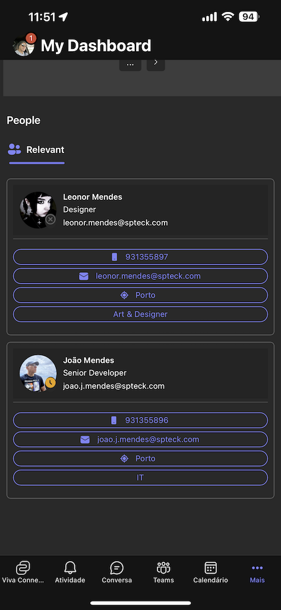

# My Dashboard

## Summary

This SPFx app allows quick access to user agenda, ToDo Tasks, Files and  News and Relevant People related to user.

  

## Compatibility

| :warning: Important          |
|:---------------------------|
| Every SPFx version is only compatible with specific version(s) of Node.js. In order to be able to build this sample, please ensure that the version of Node on your workstation matches one of the versions listed in this section. This sample will not work on a different version of Node.|
|Refer to <https://aka.ms/spfx-matrix> for more information on SPFx compatibility.   |

## Applies to

* [SharePoint Framework](https://learn.microsoft.com/sharepoint/dev/spfx/sharepoint-framework-overview)
* [Microsoft 365 tenant](https://learn.microsoft.com/sharepoint/dev/spfx/set-up-your-development-environment)

## Prerequisites

This sample use Microsoft Graph Toolkit V3 RC and use the following components : 

* mgt-Agenda
* mgt-ToDo
* mgt-Person and PersonCard
* mgt-Search-results
* mgt-get
* mgt-files

Please add the required Microsoft Graph Permissions.  Please see [Microsoft Graph Toolkit overview](https://learn.microsoft.com/graph/toolkit/overview)

## Contributors

* [João Mendes](https://github.com/joaojmendes)

## Version history

Version|Date|Comments
-------|----|--------
1.0.0|June 23, 2023|Initial release

## Minimal Path to Awesome

The project was created with Visual Studio Teams Toolkit.  

* Clone this repository
* Navigate to `src` folder
* in the command line run:
  * `npm install`
  * `gulp build`
  * `gulp bundle --ship`
  * `gulp package-solution --ship`
  * Add and Deploy Package to AppCatalog

> This sample can also be opened with [VS Code Remote Development](https://code.visualstudio.com/docs/remote/remote-overview). Visit <https://aka.ms/spfx-devcontainer> for further instructions.

## Features

This sample illustrates the following concepts on top of the SharePoint Framework:

* using React for building SharePoint Framework client-side web parts
* using Microsoft Graph Toolkit
* Using React Hooks
* using Global State Management (JOTAI)
* using FLuentUI V9
* using Visual Studio Teams Toolkit

## References

* [Getting started with SharePoint Framework](https://learn.microsoft.com/sharepoint/dev/spfx/set-up-your-developer-tenant)
* [Building for Microsoft teams](https://learn.microsoft.com/sharepoint/dev/spfx/build-for-teams-overview)
* [Use Microsoft Graph in your solution](https://learn.microsoft.com/sharepoint/dev/spfx/web-parts/get-started/using-microsoft-graph-apis)
* [Publish SharePoint Framework applications to the Marketplace](https://learn.microsoft.com/sharepoint/dev/spfx/publish-to-marketplace-overview)
* [Microsoft 365 Patterns and Practices](https://aka.ms/m365pnp) - Guidance, tooling, samples and open-source controls for your Microsoft 365 development
* [Fluent UI version 9](https://github.com/microsoft/fluentui/tree/master/packages/react-components) - Converged Fluent UI components

## Help

We do not support samples, but we this community is always willing to help, and we want to improve these samples. We use GitHub to track issues, which makes it easy for  community members to volunteer their time and help resolve issues.

If you're having issues building the solution, please run [spfx doctor](https://pnp.github.io/cli-microsoft365/cmd/spfx/spfx-doctor/) from within the solution folder to diagnose incompatibility issues with your environment.

If you encounter any issues while using this sample, [create a new issue](https://github.com/pnp/sp-dev-fx-webparts/issues/new?assignees=&labels=Needs%3A+Triage+%3Amag%3A%2Ctype%3Abug-suspected%2Csample%3A%20react-my-dashboard&template=bug-report.yml&sample=react-my-dashboard&authors=@smaity%20@joaojmendes&title=react-my-dashboard%20-%20).

For questions regarding this sample, [create a new question](https://github.com/pnp/sp-dev-fx-webparts/issues/new?assignees=&labels=Needs%3A+Triage+%3Amag%3A%2Ctype%3Aquestion%2Csample%3A%20react-my-dashboard&template=question.yml&sample=react-my-dashboard&authors=@smaity%20@joaojmendes&title=react-my-dashboard%20-%20).

Finally, if you have an idea for improvement, [make a suggestion](https://github.com/pnp/sp-dev-fx-webparts/issues/new?assignees=&labels=Needs%3A+Triage+%3Amag%3A%2Ctype%3Aenhancement%2Csample%3A%20react-my-dashboard&template=question.yml&sample=react-my-dashboard&authors=@smaity%20@joaojmendes&title=react-my-dashboard%20-%20).

## Disclaimer

**THIS CODE IS PROVIDED *AS IS* WITHOUT WARRANTY OF ANY KIND, EITHER EXPRESS OR IMPLIED, INCLUDING ANY IMPLIED WARRANTIES OF FITNESS FOR A PARTICULAR PURPOSE, MERCHANTABILITY, OR NON-INFRINGEMENT.**

