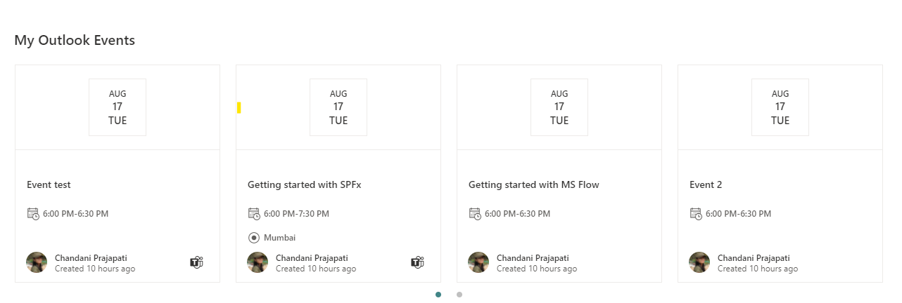
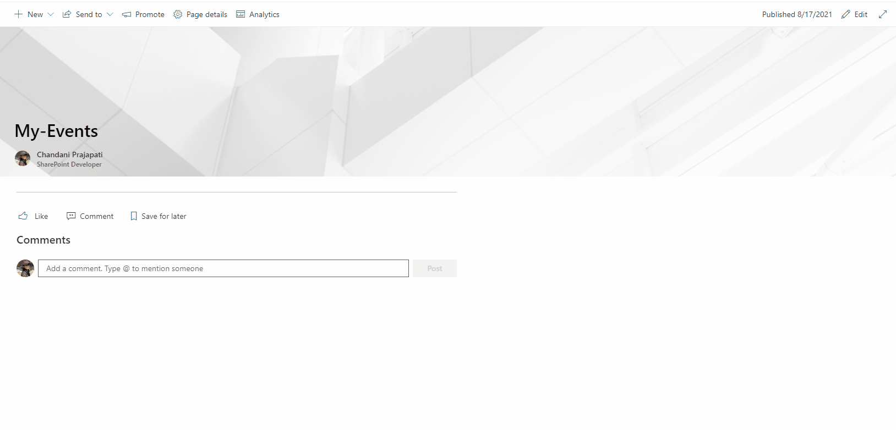

http://aka.ms/m365devprogramhttp://aka.ms/m365devprogramhttp://aka.ms/m365devprogramhttp://aka.ms/m365devprogram# My Events

## Summary

This web part provides loggedin user's outlook events with some advanced features. 

## Features

- It shows outlook events of loggedin users.
- Date range selection of events like this week, this month, next two weeks, this quarter, all upcoming and so on.
- Compact/Flimstarp layout selection
- Show number of events configuartion in compact layout
- Redirect to teams link if there is a teams meeting
- Look and feel is same as OOTB events web part





## Compatibility


 


-Not%20compatible-red.svg)


## Applies to

- [SharePoint Framework](https://aka.ms/spfx)
- [Microsoft 365 tenant](https://learn.microsoft.com/sharepoint/dev/spfx/set-up-your-developer-tenant)

> Get your own free development tenant by subscribing to [Microsoft 365 developer program](http://aka.ms/o365devprogram)

## Prerequisites

* SharePoint Online tenant
* Approve below permissions from SharePoint Admin.

```json
 "webApiPermissionRequests": [
      {
        "resource": "Microsoft Graph",
        "scope": "Calendars.Read"
      },
      {
        "resource": "Microsoft Graph",
        "scope": "Calendars.ReadWrite"
      }
    ]
```

## Solution

Solution|Author(s)
--------|---------
react-my-events | [Chandani Prajapati](https://github.com/chandaniprajapati) ([@Chandani_SPD](https://twitter.com/Chandani_SPD))

## Version history

Version|Date|Comments
-------|----|--------
1.0 | August 18, 2021 | Initial release
1.1 | October 4, 2021 | Fixed date issue as start and end date are rendering incorrect in event card.
1.3 | March 25, 2022  | Upgraded to SPFx 1.15.

## Minimal Path to Awesome

- Clone this repository (or [download this solution as a .ZIP file](https://pnp.github.io/download-partial/?url=https://github.com/pnp/sp-dev-fx-webparts/tree/main/samples/react-my-events) then unzip it)
- From your command line, change your current directory to the directory containing this sample (`react-my-events`, located under `samples`)
- in the command-line run:
  - `npm install`
  - `gulp serve`

>  This sample can also be opened with [VS Code Remote Development](https://code.visualstudio.com/docs/remote/remote-overview). Visit https://aka.ms/spfx-devcontainer for further instructions.

## References

- [Getting started with SharePoint Framework](https://learn.microsoft.com/sharepoint/dev/spfx/set-up-your-developer-tenant)
- [Building for Microsoft teams](https://learn.microsoft.com/sharepoint/dev/spfx/build-for-teams-overview)
- [Use Microsoft Graph in your solution](https://learn.microsoft.com/sharepoint/dev/spfx/web-parts/get-started/using-microsoft-graph-apis)
- [Publish SharePoint Framework applications to the Marketplace](https://learn.microsoft.com/sharepoint/dev/spfx/publish-to-marketplace-overview)
- [Microsoft 365 Patterns and Practices](https://aka.ms/m365pnp) - Guidance, tooling, samples and open-source controls for your Microsoft 365 development
- [Drive Graph END Point](https://learn.microsoft.com/graph/api/resources/driveitem?view=graph-rest-1.0)

## Help


We do not support samples, but this community is always willing to help, and we want to improve these samples. We use GitHub to track issues, which makes it easy for  community members to volunteer their time and help resolve issues.

If you're having issues building the solution, please run [spfx doctor](https://pnp.github.io/cli-microsoft365/cmd/spfx/spfx-doctor/) from within the solution folder to diagnose incompatibility issues with your environment.

You can try looking at [issues related to this sample](https://github.com/pnp/sp-dev-fx-webparts/issues?q=label%3A%22sample%3A%20react-my-events%22) to see if anybody else is having the same issues.

You can also try looking at [discussions related to this sample](https://github.com/pnp/sp-dev-fx-webparts/discussions?discussions_q=react-my-events) and see what the community is saying.

If you encounter any issues using this sample, [create a new issue](https://github.com/pnp/sp-dev-fx-webparts/issues/new?assignees=&labels=Needs%3A+Triage+%3Amag%3A%2Ctype%3Abug-suspected%2Csample%3A%20react-my-events&template=bug-report.yml&sample=react-my-events&authors=@chandaniprajapati&title=react-my-events%20-%20).

For questions regarding this sample, [create a new question](https://github.com/pnp/sp-dev-fx-webparts/issues/new?assignees=&labels=Needs%3A+Triage+%3Amag%3A%2Ctype%3Aquestion%2Csample%3A%20react-my-events&template=question.yml&sample=react-my-events&authors=@chandaniprajapati&title=react-my-events%20-%20).

Finally, if you have an idea for improvement, [make a suggestion](https://github.com/pnp/sp-dev-fx-webparts/issues/new?assignees=&labels=Needs%3A+Triage+%3Amag%3A%2Ctype%3Aenhancement%2Csample%3A%20react-my-events&template=suggestion.yml&sample=react-my-events&authors=@chandaniprajapati&title=react-my-events%20-%20).


## Disclaimer

**THIS CODE IS PROVIDED *AS IS* WITHOUT WARRANTY OF ANY KIND, EITHER EXPRESS OR IMPLIED, INCLUDING ANY IMPLIED WARRANTIES OF FITNESS FOR A PARTICULAR PURPOSE, MERCHANTABILITY, OR NON-INFRINGEMENT.**


