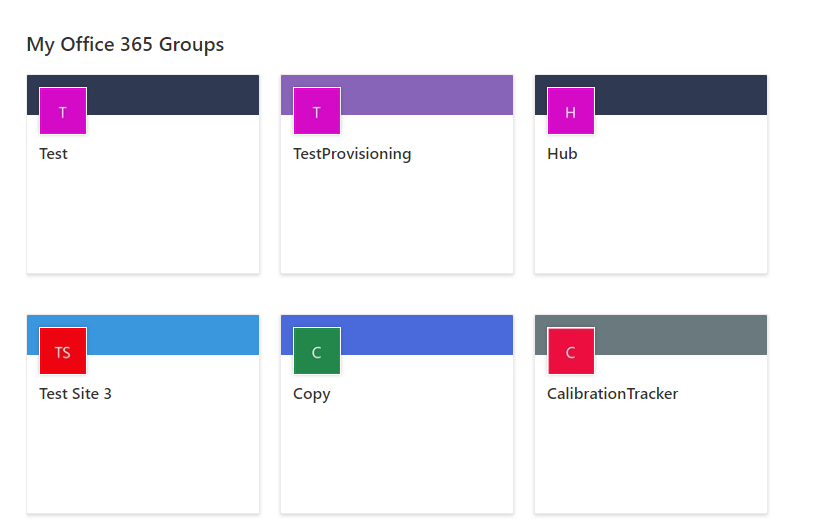
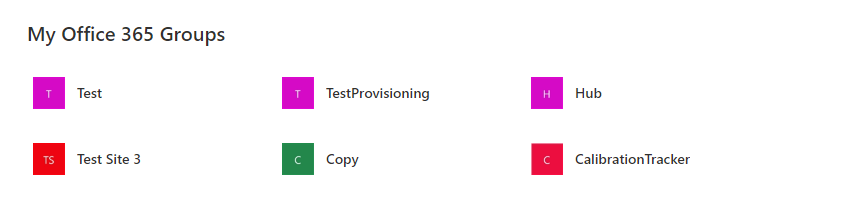
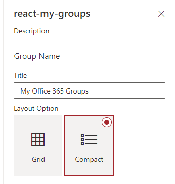
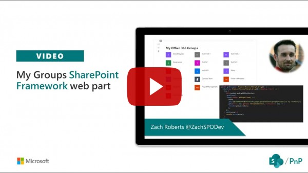

# My Groups

## Summary

Using Microsoft Graph, this web part grabs the Office 365 groups the current user is a member of with links to the groups SharePoint site.

The web part has been updated to include a grid like in addition to the compact layout as seen below:

Compact Layout:

You can change between the grid and compact layout through the settings in the property pane:

## Compatibility

 
 

-Incompatible-red.svg "SharePoint Server 2016 Feature Pack 2 requires SPFx 1.1")

## Applies to

* [SharePoint Framework](https://docs.microsoft.com/sharepoint/dev/spfx/sharepoint-framework-overview)

## Solution

Solution|Author(s)
--------|---------
react-my-groups | [Zach Roberts](https://github.com/zachroberts8668)

## Version history

Version|Date|Comments
-------|----|--------
1.0|September 13, 2019|Initial release
1.1|June 1, 2020| Updated to SPFX 1.10.0
1.2|July 8, 2020| Added Grid Layout

## Minimal Path to Awesome

* Clone this repository
* From your command line, change to this sample's folder (`react-my-groups`, under `samples`)
* in the command line run:
  * `npm install`
  * `gulp bundle --ship`
  * `gulp package-solution --ship`
* Add the package to your app catalog
* Approve the Graph API permissions in the SharePoint admin center
* Add the web part to your page

>  This sample can also be opened with [VS Code Remote Development](https://code.visualstudio.com/docs/remote/remote-overview). Visit https://aka.ms/spfx-devcontainer for further instructions.

## Features

This web part lists the current user's Office 365 groups with links to the groups SharePoint site.

## Video

## Help

We do not support samples, but we this community is always willing to help, and we want to improve these samples. We use GitHub to track issues, which makes it easy for  community members to volunteer their time and help resolve issues.

If you're having issues building the solution, please run [spfx doctor](https://pnp.github.io/cli-microsoft365/cmd/spfx/spfx-doctor/) from within the solution folder to diagnose incompatibility issues with your environment.

You can try looking at [issues related to this sample](https://github.com/pnp/sp-dev-fx-webparts/issues?q=label%3A%22sample%3A%20react-my-groups") to see if anybody else is having the same issues.

You can also try looking at [discussions related to this sample](https://github.com/pnp/sp-dev-fx-webparts/discussions?discussions_q=react-my-groups) and see what the community is saying.

If you encounter any issues while using this sample, [create a new issue](https://github.com/pnp/sp-dev-fx-webparts/issues/new?assignees=&labels=Needs%3A+Triage+%3Amag%3A%2Ctype%3Abug-suspected%2Csample%3A%20react-my-groups&template=bug-report.yml&sample=react-my-groups&authors=@zachroberts8668&title=react-my-groups%20-%20).

For questions regarding this sample, [create a new question](https://github.com/pnp/sp-dev-fx-webparts/issues/new?assignees=&labels=Needs%3A+Triage+%3Amag%3A%2Ctype%3Aquestion%2Csample%3A%20react-my-groups&template=question.yml&sample=react-my-groups&authors=@zachroberts8668&title=react-my-groups%20-%20).

Finally, if you have an idea for improvement, [make a suggestion](https://github.com/pnp/sp-dev-fx-webparts/issues/new?assignees=&labels=Needs%3A+Triage+%3Amag%3A%2Ctype%3Aenhancement%2Csample%3A%20react-my-groups&template=question.yml&sample=react-my-groups&authors=@zachroberts8668&title=react-my-groups%20-%20).

## Disclaimer

**THIS CODE IS PROVIDED *AS IS* WITHOUT WARRANTY OF ANY KIND, EITHER EXPRESS OR IMPLIED, INCLUDING ANY IMPLIED WARRANTIES OF FITNESS FOR A PARTICULAR PURPOSE, MERCHANTABILITY, OR NON-INFRINGEMENT.**

