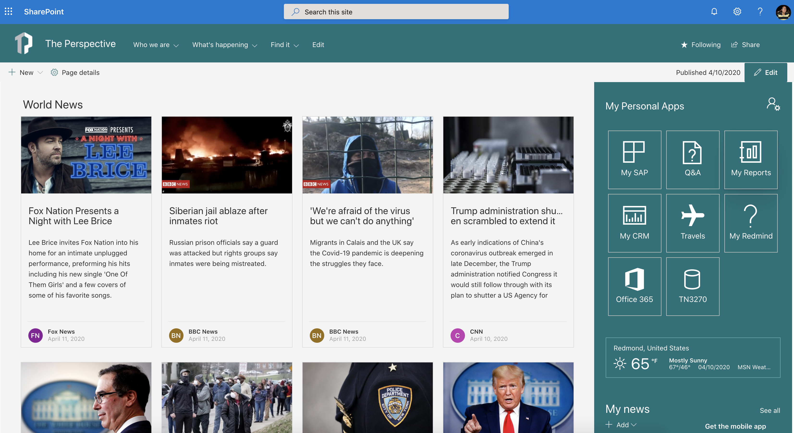
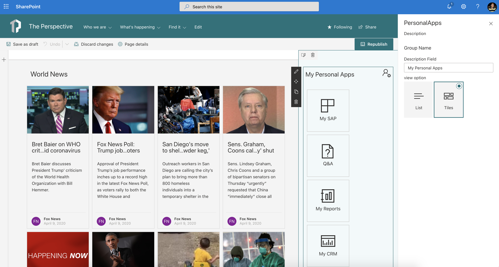
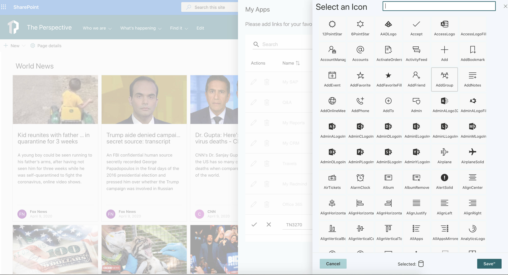
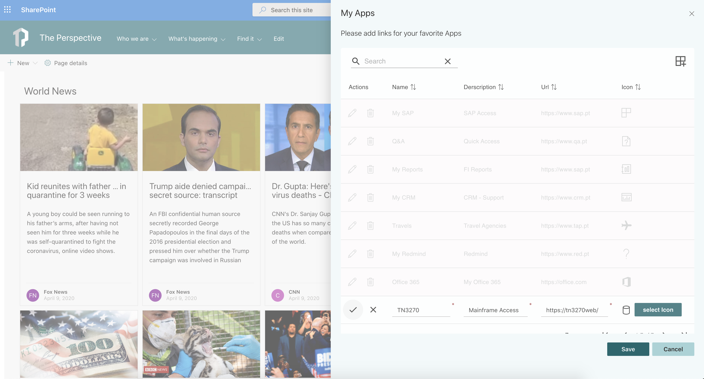
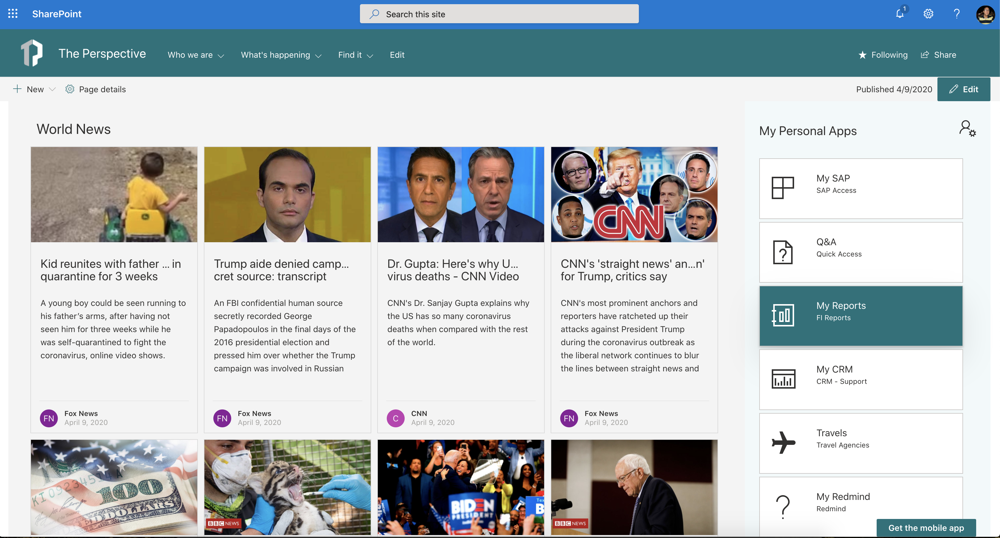
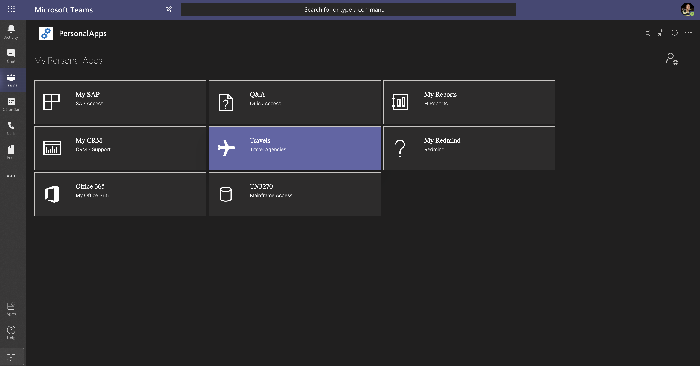
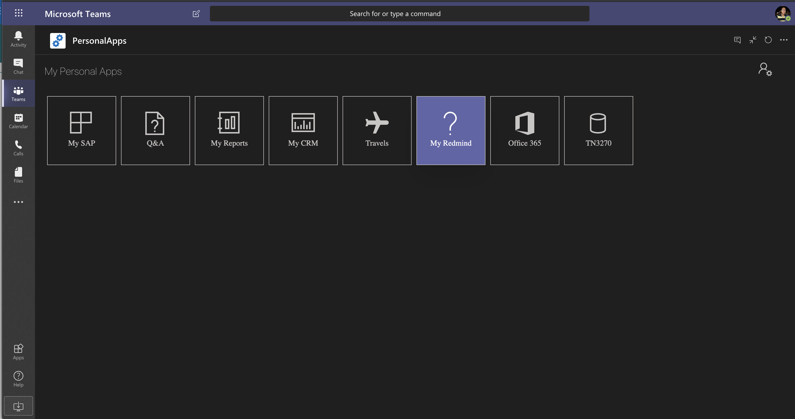
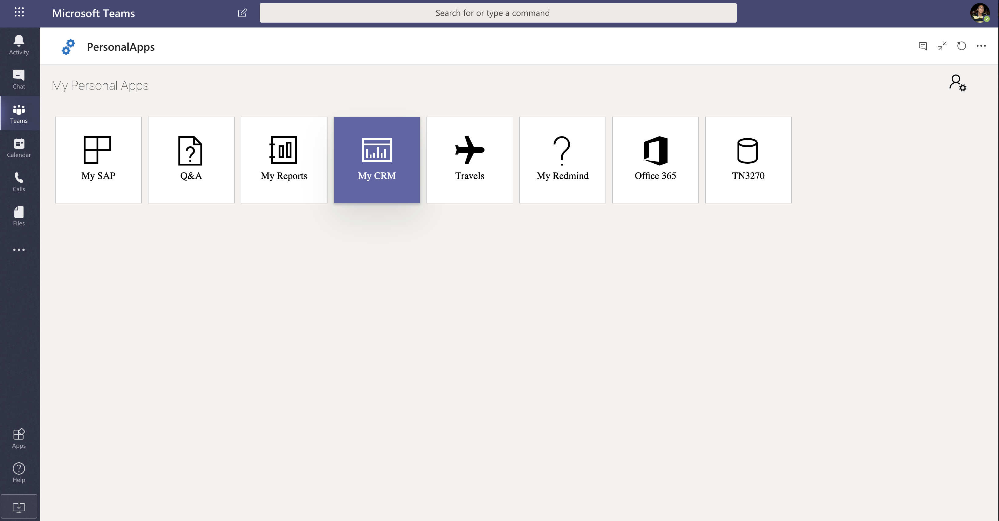

# React My Personal Apps (Links)

## Summary
The Web Part My Personal Apps allows the user to define links to Applications or Sites for quick access.

This Web Part uses MSgraph Open Extension to save the personal information on user object.

  

## Used SharePoint Framework Version

## Applies to

* [SharePoint Framework](https://docs.microsoft.com/sharepoint/dev/spfx/sharepoint-framework-overview)
* [Office 365 tenant](https://docs.microsoft.com/sharepoint/dev/spfx/set-up-your-development-environment)

## Solution

Solution|Author(s)
--------|---------
react-my-personal-apps|João Mendes

## Version history

Version|Date|Comments
-------|----|--------
1.0.0|April 9, 2020|Initial release
1.0.1|April 28, 2020| Bug fix URL Links - Zach Roberts [SPODev](https://spodev.com)

## Disclaimer

**THIS CODE IS PROVIDED *AS IS* WITHOUT WARRANTY OF ANY KIND, EITHER EXPRESS OR IMPLIED, INCLUDING ANY IMPLIED WARRANTIES OF FITNESS FOR A PARTICULAR PURPOSE, MERCHANTABILITY, OR NON-INFRINGEMENT.**

---

## Minimal Path to Awesome

Please follow all the steps:

- Clone this repository
- in the command line run:
  - `npm install`
  - `gulp build`
  - `gulp bundle --ship`
  - `gulp package-solution --ship`
- Add and deploy package to your tenant's App Catalog
- Go to **API Access** - from **SharePoint Admin Center** new experience, and **Approve** the permission to use Microsoft Graph scope **User.ReadWrite.All**

