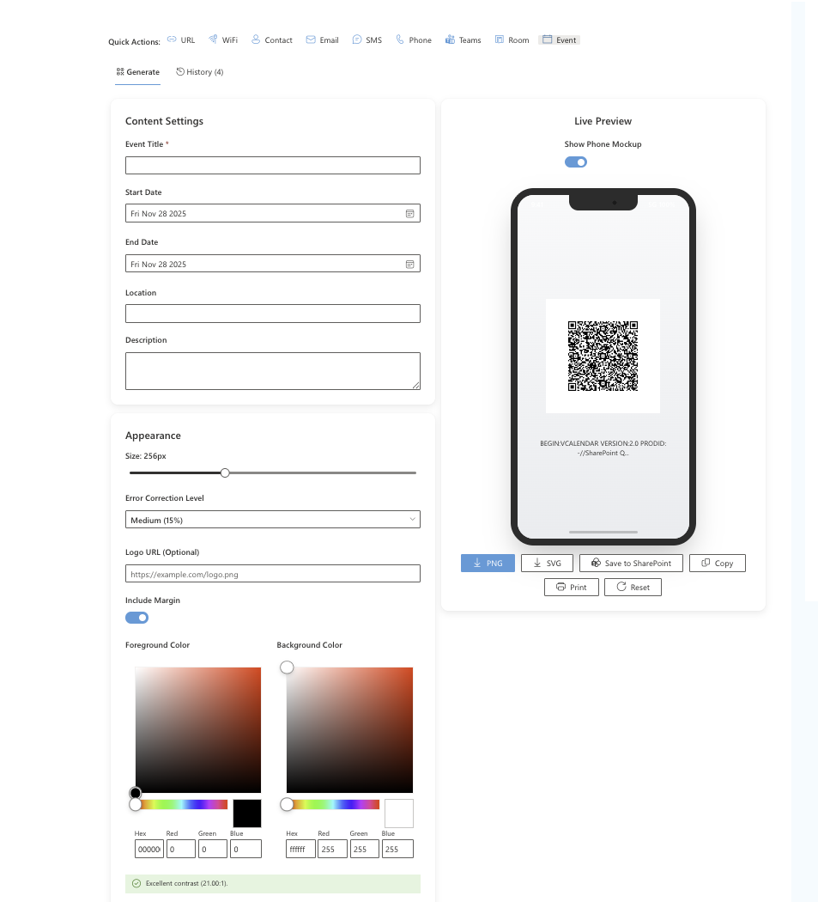

# QR Code Generator Web Part

## Summary

A modern, feature-rich SharePoint Framework (SPFx) web part for generating customizable QR codes directly within SharePoint. This solution provides an intuitive interface for creating QR codes for URLs, WiFi, Contacts, and now **Teams Meetings, Meeting Rooms, and Calendar Events**. It features advanced styling options, real-time preview, and seamless integration with SharePoint document libraries.



## Applies to

- [SharePoint Framework](https://aka.ms/spfx)
- [Microsoft 365 tenant](https://learn.microsoft.com/sharepoint/dev/spfx/set-up-your-developer-tenant)

> Get your own free development tenant by subscribing to [Microsoft 365 developer program](http://aka.ms/o365devprogram)
>
>
## Compatibility

| :warning: Important          |
|:---------------------------|
| Every SPFx version is optimally compatible with specific versions of Node.js. In order to be able to build this sample, you need to ensure that the version of Node on your workstation matches one of the versions listed in this section. This sample will not work on a different version of Node.|
|Refer to <https://aka.ms/spfx-matrix> for more information on SPFx compatibility.   |

This sample is optimally compatible with the following environment configuration:


-Incompatible-red.svg "SharePoint Server 2016 Feature Pack 2 requires SPFx 1.1")


## Prerequisites

- Node.js v22.14.0 or higher
- SharePoint Online environment
- Appropriate permissions to deploy SPFx solutions

## Contributors

- Nicolas Kheirallah

## Version history

| Version | Date              | Comments                                                                |
| ------- | ----------------- | ----------------------------------------------------------------------- |
| 1.1.0   | November 28, 2025 | Added Teams Meeting, Meeting Room, and Calendar Event support           |
| 1.0.0   | November 28, 2025 | Initial release with full feature set (URL, WiFi, VCard, Styling, Save) |


## Minimal Path to Awesome

1. Clone this repository
2. Navigate to the solution folder
3. In the command line run:
   ```bash
   npm install
   gulp serve
   ```
4. Open SharePoint Workbench
5. Add the "QR Code Generator" web part to the page

## Deployment

To deploy to your SharePoint tenant:

```bash
gulp bundle --ship
gulp package-solution --ship
```

Upload the `.sppkg` file from `sharepoint/solution` to your App Catalog.

## Features

This web part demonstrates the following concepts:

### 📅 Meeting & Event Integration (New!)

- **Teams Meetings**: Generate QR codes with Join URLs, Subject, and Time. Scans directly to join the meeting.
- **Meeting Rooms**: Create VCard QR codes for meeting rooms including Email and Location.
- **Calendar Events**: Generate iCalendar (.ics) QR codes to add events to mobile calendars.

### 📱 QR Code Generation

- **Multiple Types**: Support for Text/URL, WiFi credentials, VCard contacts, Email, SMS, and Phone numbers.
- **Advanced Styling**: Custom colors, dot patterns (square, rounded, dots), corner styles, and custom frames.
- **Logo Support**: Embed custom logos within the QR code.
- **Error Correction**: Configurable error correction levels (L, M, Q, H).

### 📎 SharePoint Integration

- **File Picker**: Browse and select SharePoint files to generate QR codes for documents.
- **Save to SharePoint**: Upload generated QR codes directly to SharePoint document libraries with custom naming.
- **Context Awareness**: Option to automatically generate QR code for the current page URL.

### 🎨 User Experience

- **Live Preview**: Real-time rendering with an optional phone mockup visualization.
- **History Management**: Automatically saves generated QR codes to local history for quick access.
- **Export Options**: Download as PNG or SVG, copy to clipboard, or print directly.
- **Quick Actions**: One-click templates for common use cases.

### 🛠 Technical Implementation

- **React Hooks**: Built using modern React functional components and hooks.
- **TypeScript**: Fully typed codebase for robustness.
- **Fluent UI**: Uses Microsoft Fluent UI controls for a native SharePoint look and feel.
- **PnP Controls**: Integrates `@pnp/spfx-controls-react` for File and Folder pickers.
- **Microsoft Graph**: Configured for future integration with Graph API (Permissions added).
- **Localization**: Multi-language support (English & Swedish).

## Configuration

The web part includes the following configurable properties:

- **Title**: Editable web part title
- **Description**: Web part description (configurable in property pane)

## Dependencies

- `qr-code-styling`: Advanced QR code generation
- `@pnp/spfx-controls-react`: Reusable SPFx controls
- `@fluentui/react`: UI components
- `file-saver`: Client-side file saving
- `@microsoft/microsoft-graph-client`: Graph API client

## References

- [Getting started with SharePoint Framework](https://docs.microsoft.com/en-us/sharepoint/dev/spfx/set-up-your-developer-tenant)
- [Building for Microsoft Teams](https://docs.microsoft.com/en-us/sharepoint/dev/spfx/build-for-teams-overview)
- [Use Microsoft Graph in your solution](https://docs.microsoft.com/en-us/sharepoint/dev/spfx/web-parts/get-started/using-microsoft-graph-apis)
- [Microsoft 365 Patterns and Practices](https://aka.ms/m365pnp)
- [QR Code Styling Library](https://github.com/kozakdenys/qr-code-styling)

## Disclaimer

**THIS CODE IS PROVIDED *AS IS* WITHOUT WARRANTY OF ANY KIND, EITHER EXPRESS OR IMPLIED, INCLUDING ANY IMPLIED WARRANTIES OF FITNESS FOR A PARTICULAR PURPOSE, MERCHANTABILITY, OR NON-INFRINGEMENT.**


