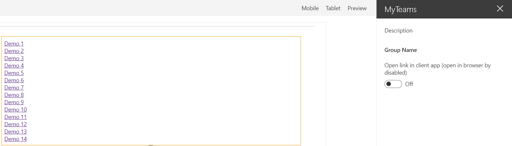

# My Teams

## Summary

This sample uses Microsoft Graph to list the Teams the current user is a member of. When the user clicks on one of the teams, the web part retrieves information about the default channel (General) and opens it.
The web part can be configured to open the team on the web browser or client app.




## Compatibility

 
 


-Incompatible-red.svg "SharePoint Server 2016 Feature Pack 2 requires SPFx 1.1")


## Applies to

- [SharePoint Framework](https://docs.microsoft.com/sharepoint/dev/spfx/sharepoint-framework-overview)

## Prerequisites

- Microsoft 365 subscription with SharePoint Online license
- SharePoint Framework [development environment](https://docs.microsoft.com/sharepoint/dev/spfx/set-up-your-development-environment) already set up.

## Solution

| Solution       | Author(s)      |
| -------------- | -------------- |
| react-my-teams | Joel Rodrigues |
| react-my-teams | [Yves Habersaat](https://github.com/yhabersaat) |


## Version history

| Version | Date              | Comments                  |
| ------- | ----------------- | ------------------------- |
| 1.1     | December 18, 2021 | Upgraded for SPFx v1.13.1 |
| 1.0     | February 26, 2019 | Initial release           |


## Minimal Path to Awesome

- Clone this repository (or [download this solution as a .ZIP file](https://pnp.github.io/download-partial/?url=https://github.com/pnp/sp-dev-fx-webparts/tree/main/samples/react-my-teams) then unzip it)

In the command line run:

```bash
npm install
gulp serve --nobrowser
```

Navigate to the hosted version of SharePoint workbench, eg. https://contoso.sharepoint.com/_layouts/15/workbench.aspx

>  This sample can also be opened with [VS Code Remote Development](https://code.visualstudio.com/docs/remote/remote-overview). Visit https://aka.ms/spfx-devcontainer for more information.

### Grant the service principal permission to the Microsoft Graph API

Once installed, the solution will request the required permissions via the Office 365 admin portal.
If you prefer to approve the permissions in advance, for example when testing the solution in the Workbench page without installing it, you can do so using Office 365 CLI:

```bash
o365 spo login https://contoso-admin.sharepoint.com
o365 spo serviceprincipal grant add --resource 'Microsoft Graph' --scope 'User.Read.All'
o365 spo serviceprincipal grant add --resource 'Microsoft Graph' --scope 'User.ReadWrite.All'
o365 spo serviceprincipal grant add --resource 'Microsoft Graph' --scope 'Group.Read.All'
o365 spo serviceprincipal grant add --resource 'Microsoft Graph' --scope 'Group.ReadWrite.All'
```

## Features

This Web Part lists all the teams the current user is a member of.


## Help

We do not support samples, but this community is always willing to help, and we want to improve these samples. We use GitHub to track issues, which makes it easy for  community members to volunteer their time and help resolve issues.

If you're having issues building the solution, please run [spfx doctor](https://pnp.github.io/cli-microsoft365/cmd/spfx/spfx-doctor/) from within the solution folder to diagnose incompatibility issues with your environment.

You can try looking at [issues related to this sample](https://github.com/pnp/sp-dev-fx-webparts/issues?q=label%3A%22sample%3A%20react-my-teams%22) to see if anybody else is having the same issues.

You can also try looking at [discussions related to this sample](https://github.com/pnp/sp-dev-fx-webparts/discussions?discussions_q=react-my-teams) and see what the community is saying.

If you encounter any issues while using this sample, [create a new issue](https://github.com/pnp/sp-dev-fx-webparts/issues/new?assignees=&labels=Needs%3A+Triage+%3Amag%3A%2Ctype%3Abug-suspected%2Csample%3A%20react-my-teams&template=bug-report.yml&sample=react-my-teams&authors=@joelfmrodrigues @yhabersaat&title=react-my-teams%20-%20).

For questions regarding this sample, [create a new question](https://github.com/pnp/sp-dev-fx-webparts/issues/new?assignees=&labels=Needs%3A+Triage+%3Amag%3A%2Ctype%3Aquestion%2Csample%3A%20react-my-teams&template=question.yml&sample=react-my-teams&authors=@joelfmrodrigues @yhabersaat&title=react-my-teams%20-%20).

Finally, if you have an idea for improvement, [make a suggestion](https://github.com/pnp/sp-dev-fx-webparts/issues/new?assignees=&labels=Needs%3A+Triage+%3Amag%3A%2Ctype%3Aenhancement%2Csample%3A%20react-my-teams&template=suggestion.yml&sample=react-my-teams&authors=@joelfmrodrigues @yhabersaat&title=react-my-teams%20-%20).


## Disclaimer

**THIS CODE IS PROVIDED *AS IS* WITHOUT WARRANTY OF ANY KIND, EITHER EXPRESS OR IMPLIED, INCLUDING ANY IMPLIED WARRANTIES OF FITNESS FOR A PARTICULAR PURPOSE, MERCHANTABILITY, OR NON-INFRINGEMENT.**


