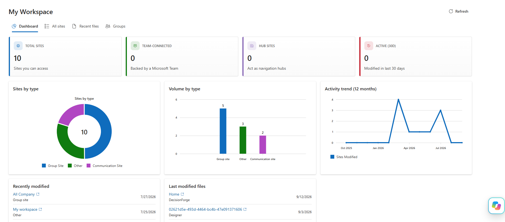
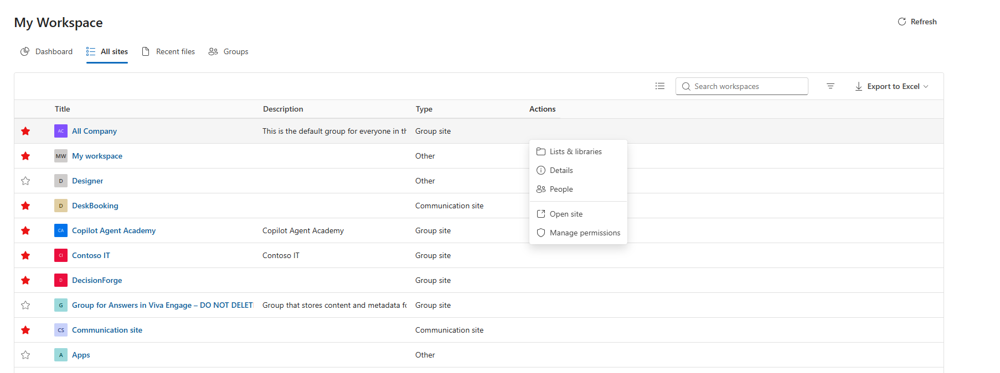
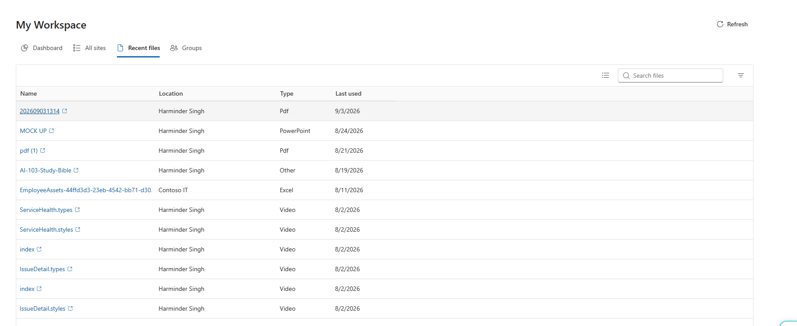
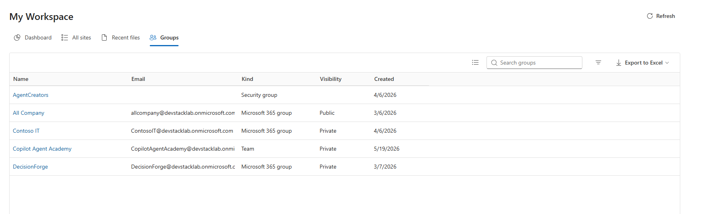
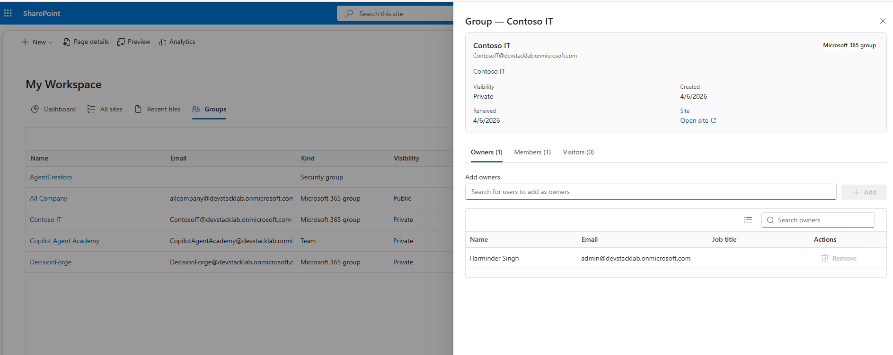
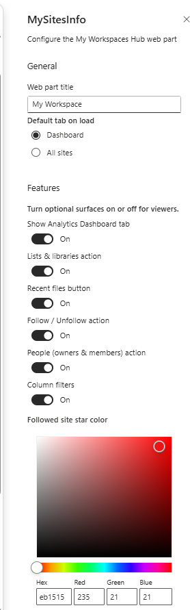

# My Workspaces Hub

## Summary

**My Workspaces Hub** is SharePoint Framework (SPFx) web part that gives the signed-in user a single, sleek place to explore, monitor, and navigate every site, team, group space they can access. It pairs a fast, virtualized catalog with an analytics dashboard and rich on-demand detail drawers - all built on Fluent UI v9 and fully theme-aware across SharePoint Online and Microsoft Teams.

1. **Analytics Dashboard** - stat cards, sites-by-type donut chart, volume bar, 12-month activity trend, and recently-modified list.
2. **Virtualized All Sites Catalog** - high-performance list showing Title, Description, and Type with on-demand drawers for deep metadata.
3. **Search, Filter, Sort & Export** - top-right live search, column sort, column filter, column chooser, and Excel (.xlsx) / CSV export.
4. **On-Demand Detail Drawers** - Lists & libraries (with drive details), Details (storage used, quota, lifecycle), and People (owners & members).
5. **Cross-Site Recent Files** - unified view of files recently accessed across all workspaces using Microsoft Graph Insights with a search fallback.
6. **Groups & Teams Management** - dedicated Groups tab to browse joined teams, group spaces, and membership details.
7. **Follow / Unfollow Workspaces** - instant follow/unfollow toggle with optimistic UI updates, customizable star colors, and toast notifications.
8. **Governed by SharePoint Permissions** - all data is fetched using delegated user context; security trimming is fully respected.








## Compatibility

| :warning: Important                                                                                                                                                                                                                                                                           |
| :-------------------------------------------------------------------------------------------------------------------------------------------------------------------------------------------------------------------------------------------------------------------------------------------- |
| Every SPFx version is only compatible with specific version(s) of Node.js. In order to be able to build this sample, please ensure that the version of Node on your workstation matches one of the versions listed in this section. This sample will not work on a different version of Node. |
| Refer to <https://aka.ms/spfx-matrix> for more information on SPFx compatibility.                                                                                                                                                                                                             |

This sample is optimally compatible with the following environment configuration:


-Incompatible-red.svg> "SharePoint Server 2016 Feature Pack 2 requires SPFx 1.1")


For more information about SPFx compatibility, please refer to <https://aka.ms/spfx-matrix>

## Applies to

- [SharePoint Framework](https://learn.microsoft.com/sharepoint/dev/spfx/sharepoint-framework-overview)
- [Microsoft 365 tenant](https://learn.microsoft.com/sharepoint/dev/spfx/set-up-your-development-environment)

> Get your own free development tenant by subscribing to [Microsoft 365 developer program](https://aka.ms/m365/devprogram)

## Prerequisites

You have to provide permission in the SharePoint admin center for accessing Microsoft Graph APIs on behalf of users. You can do it before deployment as a proactive step, or after deployment. Refer to [steps on how to grant permissions post-deployment](https://learn.microsoft.com/sharepoint/dev/spfx/use-aad-tutorial#deploy-the-solution-and-grant-permissions). Go to the **API access** page in the SharePoint admin center and approve the following delegated permissions declared in `config/package-solution.json`:

```json
"webApiPermissionRequests": [
  { "resource": "Microsoft Graph", "scope": "Sites.Read.All" },
  { "resource": "Microsoft Graph", "scope": "Group.Read.All" },
  { "resource": "Microsoft Graph", "scope": "GroupMember.ReadWrite.All" },
  { "resource": "Microsoft Graph", "scope": "Directory.Read.All" },
  { "resource": "Microsoft Graph", "scope": "Files.Read.All" },
  { "resource": "Microsoft Graph", "scope": "People.Read" }
]
```

## Contributors

- [Harminder Singh](https://github.com/HarminderSethi)

## Version history

| Version | Date               | Comments        |
| ------- | ------------------ | --------------- |
| 1.0     | September 12, 2026 | Initial release |

## Minimal Path to Awesome

- Clone this repository (or [download this solution as a .ZIP file](https://pnp.github.io/download-partial/?url=https://github.com/pnp/sp-dev-fx-webparts/tree/main/samples/react-my-workspaces-hub) then unzip it)
- From your command line, change your current directory to the directory containing this sample (`react-my-workspaces-hub`, located under `samples`)
- In the command line run:
  - `npm install`
  - `npm run build`
  - `npm run start`

> **Note:** This solution uses **Heft** (SPFx 1.23 build rig), not gulp. Use `npm run build` / `npm run start`.
>
> To deploy to your tenant, upload `sharepoint/solution/react-my-workspaces-hub.sppkg` to your tenant App Catalog, then approve the API permission requests in the SharePoint admin center.
>
> This sample can also be opened with [VS Code Remote Development](https://code.visualstudio.com/docs/remote/remote-overview). Visit <https://aka.ms/spfx-devcontainer> for further instructions.

## Features

- **Analytics Dashboard**:
  - Summary stat cards displaying total accessible workspaces, Teams, group spaces.
  - Activity trend chart and storage used vs. quota bar chart.
  - Interactive drill-down: clicking chart segments instantly filters the All Sites list.
- **Virtualized All Sites View**:
  - Search by site title or description with real-time feedback.
  - Multi-column sorting and filtering (by Site Type: Communication, Team, Group, Personal).
  - Column chooser to customize visible columns.
  - Built-in Excel (.xlsx) and CSV export with full formatting.
- **On-Demand Detail Drawers**:
  - **Lists & Libraries Drawer**: Inspect all lists and document libraries with item counts, template types, and Drive ID details.
  - **Membership Drawer**: Browse owners and members of Microsoft 365 Groups and Teams.
- **Cross-Site Recent Files**:
  - Direct access to recently modified documents across all workspaces via Graph Insights with Search fallback.
- **Groups & Teams Tab**:
  - Dedicated view displaying joined Microsoft Teams and M365 Groups with quick access links and membership management.
- **Follow & Unfollow Actions**:
  - Follow or unfollow workspaces with optimistic UI updates and toast notifications.
  - Author-configurable star highlight color via the property pane.
- **Theming & Multi-Host Readiness**:
  - Built on Fluent UI v9 with full theme awareness (SharePoint section themes, dark mode, high contrast).
  - Compatible with SharePoint Web Parts, Full Page apps, Microsoft Teams personal apps, and Teams tabs.
- **Author-Configurable Property Pane**:
  - Default tab selection (`Dashboard` vs `All sites`).
  - Granular toggles for Dashboard, Lists & Libraries, Recent Files, Follow, Membership, and Type Filters.
  - Custom color picker for followed site star indicator.
  - Optional full-width canvas mode toggle.

## References

- [Getting started with SharePoint Framework](https://docs.microsoft.com/en-us/sharepoint/dev/spfx/set-up-your-developer-tenant)
- [Building for Microsoft Teams](https://docs.microsoft.com/en-us/sharepoint/dev/spfx/build-for-teams-overview)
- [Use Microsoft Graph in your solution](https://docs.microsoft.com/en-us/sharepoint/dev/spfx/web-parts/get-started/using-microsoft-graph-apis)
- [Publish SharePoint Framework applications to the Marketplace](https://docs.microsoft.com/en-us/sharepoint/dev/spfx/publish-to-marketplace-overview)
- [Microsoft 365 Patterns and Practices](https://aka.ms/m365pnp) - Guidance, tooling, samples, and open-source controls for your Microsoft 365 development

## Help

We do not support samples, but this community is always willing to help, and we want to improve these samples. We use GitHub to track issues, which makes it easy for community members to volunteer their time and help resolve issues.

If you're having issues building the solution, please run [spfx doctor](https://pnp.github.io/cli-microsoft365/cmd/spfx/spfx-doctor/) from within the solution folder to diagnose incompatibility issues with your environment.

You can try looking at [issues related to this sample](https://github.com/pnp/sp-dev-fx-webparts/issues?q=label%3A%22sample%3A%20REACT-MY-WORKSPACES-HUB%22) to see if anybody else is having the same issues.

You can also try looking at [discussions related to this sample](https://github.com/pnp/sp-dev-fx-webparts/discussions?discussions_q=REACT-MY-WORKSPACES-HUB) and see what the community is saying.

If you encounter any issues using this sample, [create a new issue](https://github.com/pnp/sp-dev-fx-webparts/issues/new?assignees=&labels=Needs%3A+Triage+%3Amag%3A%2Ctype%3Abug-suspected%2Csample%3A%20REACT-MY-WORKSPACES-HUB&template=bug-report.yml&sample=REACT-MY-WORKSPACES-HUB&authors=@HarminderSethi&title=REACT-MY-WORKSPACES-HUB%20-%20).

For questions regarding this sample, [create a new question](https://github.com/pnp/sp-dev-fx-webparts/issues/new?assignees=&labels=Needs%3A+Triage+%3Amag%3A%2Ctype%3Aquestion%2Csample%3A%20REACT-MY-WORKSPACES-HUB&template=question.yml&sample=REACT-MY-WORKSPACES-HUB&authors=@HarminderSethi&title=REACT-MY-WORKSPACES-HUB%20-%20).

Finally, if you have an idea for improvement, [make a suggestion](https://github.com/pnp/sp-dev-fx-webparts/issues/new?assignees=&labels=Needs%3A+Triage+%3Amag%3A%2Ctype%3Aenhancement%2Csample%3A%20REACT-MY-WORKSPACES-HUB&template=suggestion.yml&sample=REACT-MY-WORKSPACES-HUB&authors=@HarminderSethi&title=REACT-MY-WORKSPACES-HUB%20-%20).

## Disclaimer

**THIS CODE IS PROVIDED _AS IS_ WITHOUT WARRANTY OF ANY KIND, EITHER EXPRESS OR IMPLIED, INCLUDING ANY IMPLIED WARRANTIES OF FITNESS FOR A PARTICULAR PURPOSE, MERCHANTABILITY, OR NON-INFRINGEMENT.**


