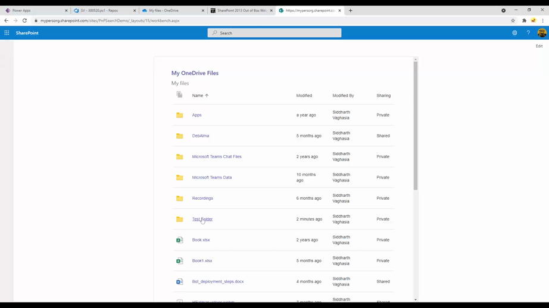

# My OneDrive

## Summary

This is a sample web part that displays currently logged in user's OneDrive's file,
This web part can be useful on the Intranet home page which can be added as My OneDrive files for quick reference of user's OneDrive files.




## Features

* Show current user's OneDrive Files
* Browseable folder and files
* Support to display icons for most known file types.
* Breadcrum as in OneDrive App to quickly navigate
* Sorting based on Name and Modified Date column
* Options to choose fields to be displayed from Name, Modified, Modified By, File Size,Sharing
* Option to make web part title link clickalbe to send to OneDrive URL

## Compatibility


 

 


## Applies to

- [SharePoint Framework](https://aka.ms/spfx)
- [Microsoft 365 tenant](https://docs.microsoft.com/en-us/sharepoint/dev/spfx/set-up-your-developer-tenant)

> Get your own free development tenant by subscribing to [Microsoft 365 developer program](http://aka.ms/o365devprogram)

## Prerequisites

* SharePoint Online tenant
* You have provided permission in SharePoint admin for accessing Graph API on behalf of your solution. We can do it before deployment as proactive steps, or after deployment. You can refer to [steps about how to do this post-deployment](https://docs.microsoft.com/en-us/sharepoint/dev/spfx/use-aad-tutorial#deploy-the-solution-and-grant-permissions). Basically you have to use API Access Page of SharePoint admin and add below permission for our use case. 

```
 "webApiPermissionRequests": [
      {
        "resource": "Microsoft Graph",
        "scope": "Files.Read"
      },
      {
        "resource": "Microsoft Graph",
        "scope": "Files.Read.All"
      }
    ]

```

## Solution

Solution|Author(s)
--------|---------
react-myonedrive | [Siddharth Vaghasia](https://github.com/siddharth-vaghasia) ([@siddh_me](https://twitter.com/siddh_me))

## Version history

Version|Date|Comments
-------|----|--------
1.0|Aug 12, 2021|Initial release


## Minimal Path to Awesome

- Clone this repository
- Ensure that you are at the solution folder
- in the command-line run:
  - `npm install`
  - `gulp serve`

>  This sample can also be opened with [VS Code Remote Development](https://code.visualstudio.com/docs/remote/remote-overview). Visit https://aka.ms/spfx-devcontainer for further instructions.


## References

- [Getting started with SharePoint Framework](https://docs.microsoft.com/en-us/sharepoint/dev/spfx/set-up-your-developer-tenant)
- [Building for Microsoft teams](https://docs.microsoft.com/en-us/sharepoint/dev/spfx/build-for-teams-overview)
- [Use Microsoft Graph in your solution](https://docs.microsoft.com/en-us/sharepoint/dev/spfx/web-parts/get-started/using-microsoft-graph-apis)
- [Publish SharePoint Framework applications to the Marketplace](https://docs.microsoft.com/en-us/sharepoint/dev/spfx/publish-to-marketplace-overview)
- [Microsoft 365 Patterns and Practices](https://aka.ms/m365pnp) - Guidance, tooling, samples and open-source controls for your Microsoft 365 development
- [Drive Graph END Point](https://docs.microsoft.com/en-us/graph/api/resources/driveitem?view=graph-rest-1.0)

## Help

We do not support samples, but we this community is always willing to help, and we want to improve these samples. We use GitHub to track issues, which makes it easy for  community members to volunteer their time and help resolve issues.

If you're having issues building the solution, please run [spfx doctor](https://pnp.github.io/cli-microsoft365/cmd/spfx/spfx-doctor/) from within the solution folder to diagnose incompatibility issues with your environment.

If you encounter any issues while using this sample, [create a new issue](https://github.com/pnp/sp-dev-fx-webparts/issues/new?assignees=&labels=Needs%3A+Triage+%3Amag%3A%2Ctype%3Abug-suspected%2Csample%3A%20react-myonedrive&template=bug-report.yml&sample=react-myonedrive&authors=@YOURGITHUBUSERNAME&title=react-myonedrive%20-%20).

For questions regarding this sample, [create a new question](https://github.com/pnp/sp-dev-fx-webparts/issues/new?assignees=&labels=Needs%3A+Triage+%3Amag%3A%2Ctype%3Aquestion%2Csample%3A%20react-myonedrive&template=question.yml&sample=react-myonedrive&authors=@YOURGITHUBUSERNAME&title=react-myonedrive%20-%20).

Finally, if you have an idea for improvement, [make a suggestion](https://github.com/pnp/sp-dev-fx-webparts/issues/new?assignees=&labels=Needs%3A+Triage+%3Amag%3A%2Ctype%3Aenhancement%2Csample%3A%20react-myonedrive&template=question.yml&sample=react-myonedrive&authors=@YOURGITHUBUSERNAME&title=react-myonedrive%20-%20).


## Disclaimer

**THIS CODE IS PROVIDED *AS IS* WITHOUT WARRANTY OF ANY KIND, EITHER EXPRESS OR IMPLIED, INCLUDING ANY IMPLIED WARRANTIES OF FITNESS FOR A PARTICULAR PURPOSE, MERCHANTABILITY, OR NON-INFRINGEMENT.**


