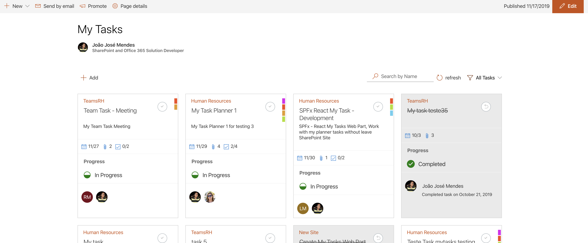
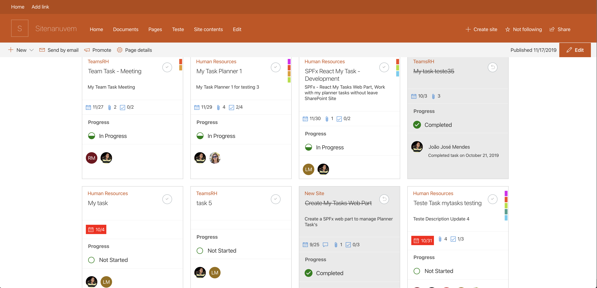
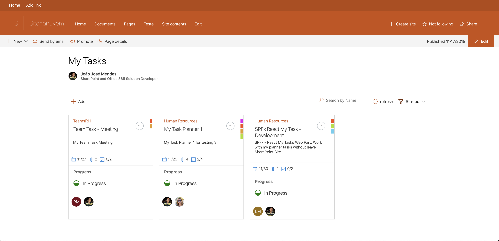
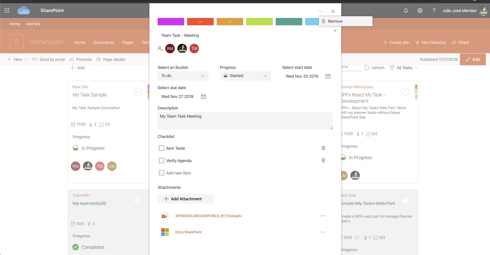
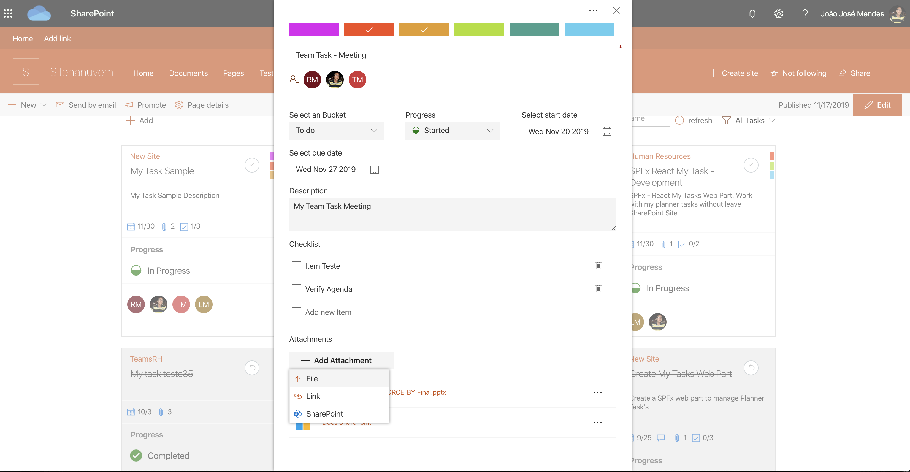
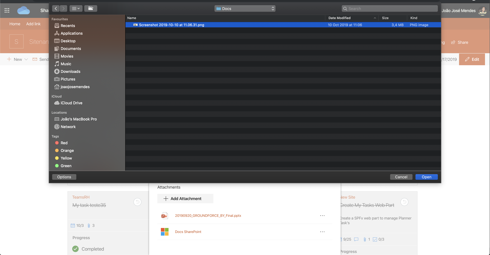
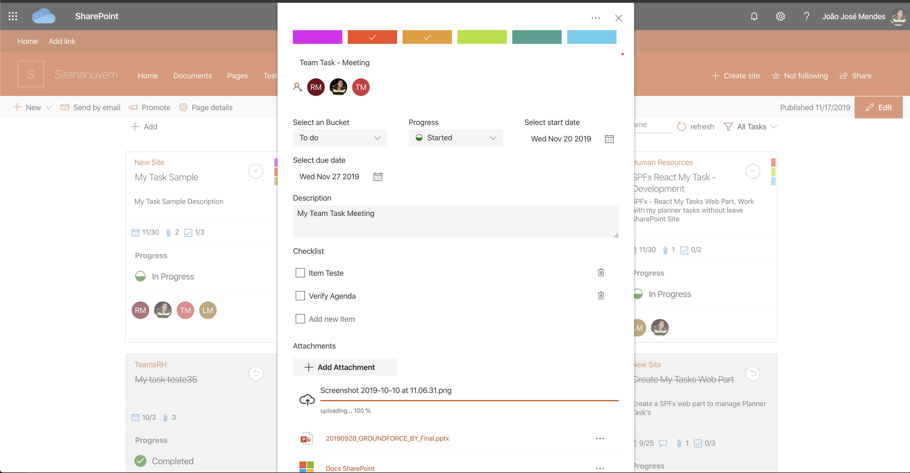

# My Tasks 

## Summary

This web part allows user to manage planner tasks in SharePoint Site. The UI was inspired on Planner UI, it is full implemented with Office-UI-Fabric Components. Use MSGraph API's and PnPjs to data access.

The user can search task by name, can filter by progress status, all data are dynamic updated on change.

## List of Task Cards

## Filter Tasks

  

  

 

  

## Add Task  
  

  

  

## Edit Tasks

  
  
  
  
  

  

  

  

  
 

## Compatibility

-Incompatible-red.svg "SharePoint Server 2016 Feature Pack 2 requires SPFx 1.1")

## Applies to

* [SharePoint Framework](https://docs.microsoft.com/sharepoint/dev/spfx/sharepoint-framework-overview)
* [Office 365 tenant](https://docs.microsoft.com/sharepoint/dev/spfx/set-up-your-development-environment)

## Web Part Properties
 
Property |Type|Required| comments
--------------------|----|--------|----------
WebPart Title| Text| no|
 

## Solution

The Web Part Use PnPjs library, Office-ui-fabric-react components and MSGraph API's

Solution|Author(s)
--------|---------
My Tasks |[João Mendes](https://github.com/joaojmendes)
My Tasks |[Swaminathan Sriram](https://github.com/Swaminathan-Sriram)

## Version history

Version|Date|Comments
-------|----|--------
1.0.0|November 17, 2019|Initial release
1.0.1|September 9, 2020|Upgraded to SPFx 1.11.

## Minimal Path to Awesome

- Clone this repository
- Move to sample folder
- in the command line run:
  - `npm install`
  - `gulp build`
  - `gulp bundle --ship`
  - `gulp package-solution --ship`
  - Add to AppCatalog and deploy
  - go to **SharePoint Admin Center** and approve required API Permissions

>  This sample can also be opened with [VS Code Remote Development](https://code.visualstudio.com/docs/remote/remote-overview). Visit https://aka.ms/spfx-devcontainer for further instructions.

## Help

We do not support samples, but we this community is always willing to help, and we want to improve these samples. We use GitHub to track issues, which makes it easy for  community members to volunteer their time and help resolve issues.

If you're having issues building the solution, please run [spfx doctor](https://pnp.github.io/cli-microsoft365/cmd/spfx/spfx-doctor/) from within the solution folder to diagnose incompatibility issues with your environment.

If you encounter any issues while using this sample, [create a new issue](https://github.com/pnp/sp-dev-fx-webparts/issues/new?assignees=&labels=Needs%3A+Triage+%3Amag%3A%2Ctype%3Abug-suspected%2Csample%3A%20react-mytasks&template=bug-report.yml&sample=react-mytasks&authors=@joaojmendes%20@Swaminathan-Sriram&title=react-mytasks%20-%20).

For questions regarding this sample, [create a new question](https://github.com/pnp/sp-dev-fx-webparts/issues/new?assignees=&labels=Needs%3A+Triage+%3Amag%3A%2Ctype%3Aquestion%2Csample%3A%20react-mytasks&template=question.yml&sample=react-mytasks&authors=@joaojmendes%20@Swaminathan-Sriram&title=react-mytasks%20-%20).

Finally, if you have an idea for improvement, [make a suggestion](https://github.com/pnp/sp-dev-fx-webparts/issues/new?assignees=&labels=Needs%3A+Triage+%3Amag%3A%2Ctype%3Aenhancement%2Csample%3A%20react-mytasks&template=question.yml&sample=react-mytasks&authors=@joaojmendes%20@Swaminathan-Sriram&title=react-mytasks%20-%20).

## Disclaimer

**THIS CODE IS PROVIDED *AS IS* WITHOUT WARRANTY OF ANY KIND, EITHER EXPRESS OR IMPLIED, INCLUDING ANY IMPLIED WARRANTIES OF FITNESS FOR A PARTICULAR PURPOSE, MERCHANTABILITY, OR NON-INFRINGEMENT.**

