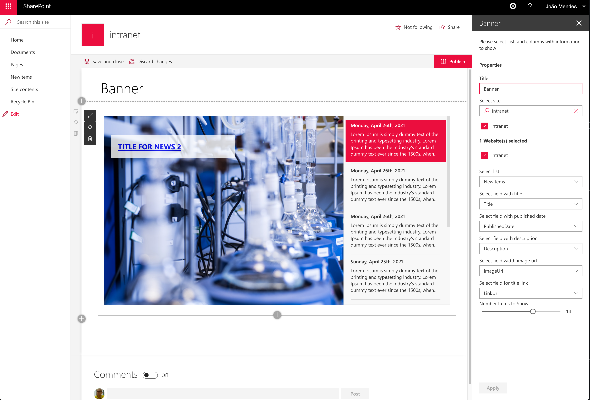

# News Banner

## Summary

This web part shows news information as a Banner, this information come from a list defined in any site, this web part can be installed on 2019, and SharePoint Online.

## Compatibility

## Applies to

- [SharePoint Framework](https://aka.ms/spfx)

## Solution

Solution|Author(s)
--------|---------
react-news-banner |[João Mendes](https://github.com/joaojmendes), Storm Technology, ([@joaojmendes](https://twitter.com/joaojmendes))

## Version history

Version|Date|Comments
-------|----|--------
1.0|May, 2021|Initial release

## Prerequisites

No pre-requisites

## Minimal Path to Awesome

- Clone this repository
- Ensure that you are at the solution folder
- in the command-line run:
  - `npm install`
  - `gulp serve`

## Features

This web part shows how to use PnPjs, Office-ui-fabric-react, @pnp/spfx-controls-react, @pnp/spfx-property-controls to create an News Banner

## Disclaimer

**THIS CODE IS PROVIDED *AS IS* WITHOUT WARRANTY OF ANY KIND, EITHER EXPRESS OR IMPLIED, INCLUDING ANY IMPLIED WARRANTIES OF FITNESS FOR A PARTICULAR PURPOSE, MERCHANTABILITY, OR NON-INFRINGEMENT.**

## Support

We do not support samples, but we do use GitHub to track issues and constantly want to improve these samples.

If you encounter any issues while using this sample, [create a new issue](https://github.com/pnp/sp-dev-fx-webparts/issues/new?assignees=&labels=Needs%3A+Triage+%3Amag%3A%2Ctype%3Abug-suspected&template=bug-report.yml&sample=react-news-banner&authors=@joaojmendes&title=react-news-banner%20-%20).

For questions regarding this sample, [create a new question](https://github.com/pnp/sp-dev-fx-webparts/issues/new?assignees=&labels=Needs%3A+Triage+%3Amag%3A%2Ctype%3Abug-suspected&template=question.yml&sample=react-news-banner&authors=@joaojmendes&title=react-news-banner%20-%20).

Finally, if you have an idea for improvement, [make a suggestion](https://github.com/pnp/sp-dev-fx-webparts/issues/new?assignees=&labels=Needs%3A+Triage+%3Amag%3A%2Ctype%3Abug-suspected&template=suggestion.yml&sample=react-news-banner&authors=@joaojmendes&title=react-news-banner%20-%20).

