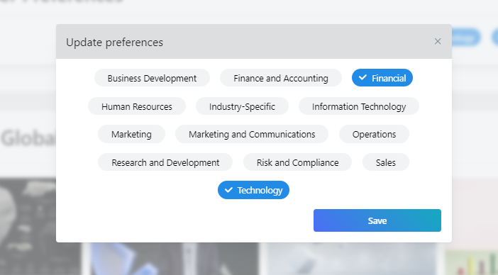
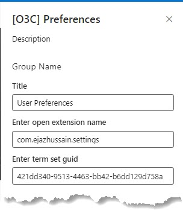
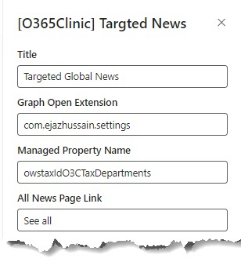

# Targeted News using Microsoft Graph Open Extension

## Summary

This sample contains two SPFx web parts:

### User preferences web part

This web part allows users to save their preferences in the Microsoft Graph Open Extension. This means that users can access their preferences from any device or application that uses the Microsoft Graph.

### Curated news web part

This web part allows users to view news topics they care about based on the selected preferences. This is a great way to help users stay informed about the topics that are most important to them.





## Compatibility

| :warning: Important                                                                                                                                                                                                                                                                           |
| :-------------------------------------------------------------------------------------------------------------------------------------------------------------------------------------------------------------------------------------------------------------------------------------------- |
| Every SPFx version is only compatible with specific version(s) of Node.js. In order to be able to build this sample, please ensure that the version of Node on your workstation matches one of the versions listed in this section. This sample will not work on a different version of Node. |
| Refer to <https://aka.ms/spfx-matrix> for more information on SPFx compatibility.                                                                                                                                                                                                             |


-Incompatible-red.svg> "SharePoint Server 2016 Feature Pack 2 requires SPFx 1.1")


## Applies to

- [SharePoint Framework](https://aka.ms/spfx)
- [Microsoft 365 tenant](https://learn.microsoft.com/sharepoint/dev/spfx/set-up-your-developer-tenant)

> Get your own free development tenant by subscribing to [Microsoft 365 developer program](http://aka.ms/m365devprogram)

## Prerequisites

Access to a SharePoint online site with various tenant users granted access to various site resources directly, via AAD groups and via SharePoint groups.

> User Preferences web part configurations

1. Provide name for Microsoft Graph Open Extension

2. Provide Term Set ID for terms you would like to use for user preferences



> Targeted news web part configurations

1. Provide name for Microsoft Graph Open Extension.

2. Provide Search managed property which you want to use to filter results. For example department or topic, etc.



## Contributors

- [Ejaz Hussain](https://github.com/ejazhussain)

## Version history

| Version | Date             | Comments        |
| ------- | ---------------- | --------------- |
| 1.0.0   | October 04, 2023 | Initial release |

## Minimal Path to Awesome

1. Clone this repository
2. From your command line, change your current directory to the directory containing this sample (`react-news-extension`, located under `samples`)
3. In the command line run:

  ```cmd
    `npm install`
    `gulp bundle`
    `gulp package-solution`
  ```

4. Deploy the package to your app catalog
5. Approve the following API permission request from the SharePoint admin

  ```JSON
        {
          "resource": "Microsoft Graph",
          "scope": "User.ReadWrite"
        }
  ```

6. In the command-line run:

  ```cmd
    gulp serve --nobrowser
  ```

7. Open the hosted workbench on a SharePoint site - i.e. https://_tenant_.sharepoint.com/site/_sitename_/_layouts/workbench.aspx
8. Configure user preferences and targeted news web parts as per above configurations

## Features

- User preferences web part allows users to save their preferences in the Microsoft Graph Open Extension. This means that users can access their preferences from any device or application that uses the Microsoft Graph.

- This web part allows users to view news topics they care about based on the selected preferences. This is a great way to help users stay informed about the topics that are most important to them.

## Help

We do not support samples, but this community is always willing to help, and we want to improve these samples. We use GitHub to track issues, which makes it easy for  community members to volunteer their time and help resolve issues.

If you're having issues building the solution, please run [spfx doctor](https://pnp.github.io/cli-microsoft365/cmd/spfx/spfx-doctor/) from within the solution folder to diagnose incompatibility issues with your environment.

You can try looking at [issues related to this sample](https://github.com/pnp/sp-dev-fx-webparts/issues?q=label%3A%22sample%3A%20react-news-extension%22) to see if anybody else is having the same issues.

You can also try looking at [discussions related to this sample](https://github.com/pnp/sp-dev-fx-webparts/discussions?discussions_q=react-news-extension) and see what the community is saying.

If you encounter any issues using this sample, [create a new issue](https://github.com/pnp/sp-dev-fx-webparts/issues/new?assignees=&labels=Needs%3A+Triage+%3Amag%3A%2Ctype%3Abug-suspected%2Csample%3A%20react-news-extension&template=bug-report.yml&sample=react-news-extension&authors=@ejazhussain&title=react-news-extension%20-%20).

For questions regarding this sample, [create a new question](https://github.com/pnp/sp-dev-fx-webparts/issues/new?assignees=&labels=Needs%3A+Triage+%3Amag%3A%2Ctype%3Aquestion%2Csample%3A%20react-news-extension&template=question.yml&sample=react-news-extension&authors=@ejazhussain&title=react-news-extension%20-%20).

Finally, if you have an idea for improvement, [make a suggestion](https://github.com/pnp/sp-dev-fx-webparts/issues/new?assignees=&labels=Needs%3A+Triage+%3Amag%3A%2Ctype%3Aenhancement%2Csample%3A%20react-news-extension&template=suggestion.yml&sample=react-news-extension&authors=@ejazhussain&title=react-news-extension%20-%20).

## Disclaimer

**THIS CODE IS PROVIDED _AS IS_ WITHOUT WARRANTY OF ANY KIND, EITHER EXPRESS OR IMPLIED, INCLUDING ANY IMPLIED WARRANTIES OF FITNESS FOR A PARTICULAR PURPOSE, MERCHANTABILITY, OR NON-INFRINGEMENT.**


