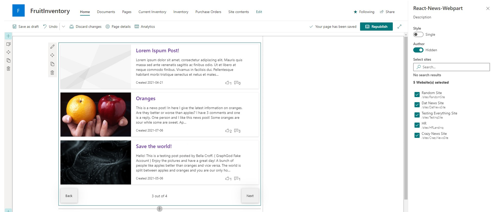
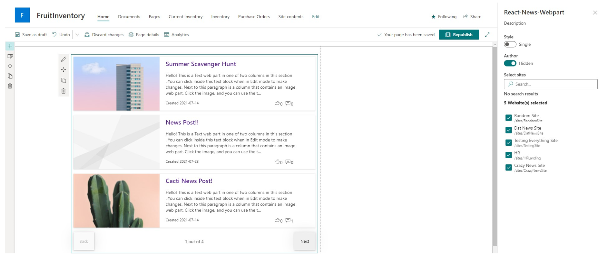
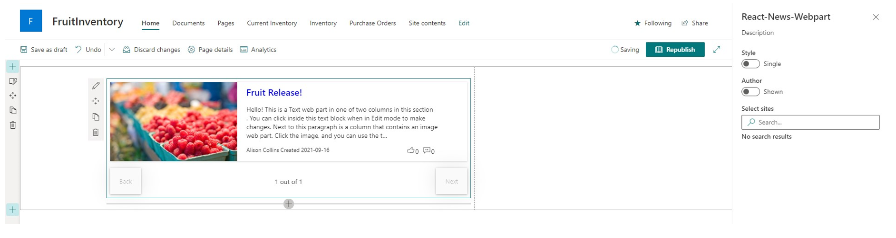
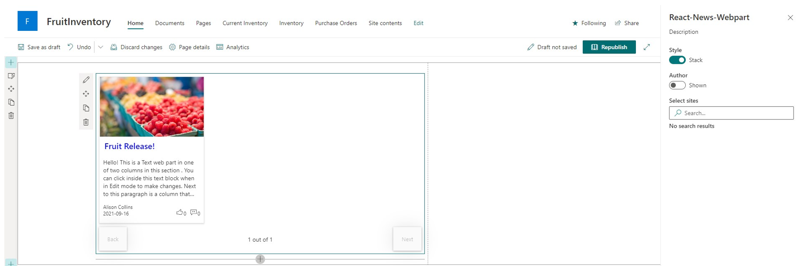

# News

SPFx Webpart to display News from SharePoint site(s)

## SharePoint News Posts with SPFx

### Summary
Web part pulls all SharePoint News Posts that the logged in user has access to view.
 - Pagination ( Back/Next ) and Page Display ( n out of n )
 - Select Multiple Sites ( Defaults to site webpart is deployed to )
 - Two styling options, Stack or Single
 - News Title as link ( Click to go to post )
 - News Thumbnail Image
 - Preview of Description
 - Author ( Can toggle visibility in Property Pane )
 - Created Date
 - Likes with Office UI Fabric Icons
 - Comments with Office UI Fabric Icons ( Also retrieves nested comments )
 





## Compatibility


## Applies to

* [SharePoint Framework Developer Preview](https://docs.microsoft.com/sharepoint/dev/spfx/sharepoint-framework-overview)
* [SharePoint Framework](https://docs.microsoft.com/sharepoint/dev/spfx/sharepoint-framework-overview)

## Solution

Solution|Author(s)
--------|---------
React-News | [Alison Collins](https://github.com/ReactIntern) ([Blog](https://graphgod.dev), [LinkedIn](https://www.linkedin.com/in/alison-collins-53192b219/))  |

# Prerequisites

- Administrative access to Azure AD of Microsoft 365 tenant
- SharePoint Online tenant
- You need following set of permissions in order to manage React News Posts

```json
"webApiPermissionRequests": [
  {
    "resource": "Microsoft Graph",
    "scope": "Groups.Read.All"
  },
]
```

# Minimal Path to Awesome

- Clone this repo
- Navigate to the folder with current sample
- Restore dependencies: `$ npm i`
- Bundle the solution: `$ gulp bundle --ship`
- Package the solution: `$ gulp package-solution --ship`
- Upload to SharePoint tenant app catalog
- You will see a message saying that solution has pending permissions which need to be approved
- Approve the permission requests.
- Run `$ gulp serve --nobrowser`
- Open hosted workbench, i.e. `https://<tenant>.sharepoint.com/sites/<your site>/_layouts/15/workbench.aspx`
- Search and add `React News` web part to see it in action

# Features

This project contains sample client-side web part built on the SharePoint Framework illustrating possibilities to quickly gain access to News Posts in SharePoint site(s) using SharePoint Rest API.

This sample illustrates the following concepts on top of the SharePoint Framework:

- Explore SharePoint REST APIs for News Posts from SharePoint site(s)
- Requesting API permissions in a SharePoint Framework package
- Communicating with the SharePoint API using its REST API
- Using Office UI Fabric controls for building SharePoint Framework client-side web parts
- Passing web part properties to React components

# Disclaimer

**THIS CODE IS PROVIDED _AS IS_ WITHOUT WARRANTY OF ANY KIND, EITHER EXPRESS OR IMPLIED, INCLUDING ANY IMPLIED WARRANTIES OF FITNESS FOR A PARTICULAR PURPOSE, MERCHANTABILITY, OR NON-INFRINGEMENT.**

## Support

We do not support samples, but we do use GitHub to track issues and constantly want to improve these samples.

If you encounter any issues while using this sample, [create a new issue](https://github.com/pnp/sp-dev-fx-webparts/issues/new?assignees=&labels=Needs%3A+Triage+%3Amag%3A%2Ctype%3Abug-suspected&template=bug-report.yml&sample=react-news&authors=@ReactIntern&title=react-news%20-%20).

For questions regarding this sample, [create a new question](https://github.com/pnp/sp-dev-fx-webparts/issues/new?assignees=&labels=Needs%3A+Triage+%3Amag%3A%2Ctype%3Abug-suspected&template=question.yml&sample=react-news&authors=@ReactIntern&title=react-news%20-%20).

Finally, if you have an idea for improvement, [make a suggestion](https://github.com/pnp/sp-dev-fx-webparts/issues/new?assignees=&labels=Needs%3A+Triage+%3Amag%3A%2Ctype%3Abug-suspected&template=suggestion.yml&sample=react-news&authors=@ReactIntern&title=react-news%20-%20).


